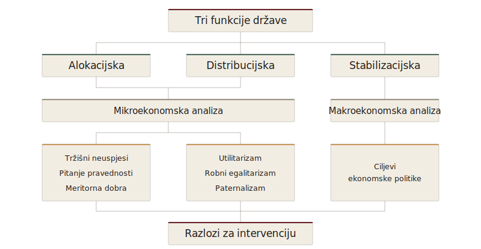

::: {.vodic-panel}
## Vodič kroz poglavlje

1. Zašto tržišnom gospodarstvu uopće treba država?
2. Kako Musgraveov okvir razvrstava alokacijsku, distribucijsku i stabilizacijsku zadaću države?
3. Zašto je konkurentsko tržište učinkovit mehanizam alokacije resursa?
4. Što znači Pareto učinkovitost i koje su njezine granice?
5. Što teoremi ekonomike blagostanja govore o odnosu učinkovitosti i pravednosti?
:::

Uvod je državu, tržište i institucije postavio kao pojmove iz kojih izrastaju svi kasniji argumenti, ali ih je zadržao na razini načela. Prvi dio knjige spušta prvi od njih na tlo ekonomske analize, a ovo poglavlje postavlja njegov temelj. Ono kreće od pitanja koje zvuči gotovo provokativno u društvu naviknutom na tržište, a to je zašto takvu gospodarstvu uopće treba država. Odgovor ne tražimo u političkom ukusu, nego u tome što tržište objektivno radi dobro i gdje su granice te sposobnosti.

Do odgovora dolazimo postupno. Tržište najprije promatramo kao snažan mehanizam koordinacije, jer se uloga države ne može ocrtati dok se ne vidi što ono postiže samo. Tek na toj podlozi Musgraveova podjela na alokacijsku, distribucijsku i stabilizacijsku funkciju dobiva smisao, kao tri različita razloga zbog kojih država ulazi u gospodarstvo, od kojih svaki u nastavku knjige dobiva vlastito poglavlje. Srž poglavlja čine Pareto učinkovitost i teoremi ekonomike blagostanja, mjerila koja precizno kažu što znači da tržište daje dobar ishod, ali i koliko malo time govore o pravednosti raspodjele. Poglavlje se zatvara pitanjem koliko su stvarna tržišta blizu tom idealu, jer razmak između idealnog i stvarnog tržišta otvara analizu funkcija države koja slijedi.

## Zašto tržišnom gospodarstvu treba država

U demokratskim društvima koja se temelje na slobodnom tržištu prirodno se postavlja pitanje zašto nam država uopće treba. Ako pojedinci mogu slobodno donositi odluke, ako poduzeća mogu proizvoditi i nuditi dobra i usluge, ako se cijene oblikuju na tržištu, a potrošači svojim izborima odlučuju što žele kupovati, zašto bi država trebala intervenirati? Ne bi li tržište samo, kroz konkurenciju, poduzetništvo i slobodnu razmjenu, trebalo dovesti do najboljih mogućih ishoda?

To je jedno od temeljnih pitanja javnih financija i ekonomike javnog sektora. U tržišnom gospodarstvu većina odluka doista se donosi decentralizirano. Kućanstva odlučuju koliko će raditi, što će kupovati, koliko će štedjeti i u što će ulagati. Poduzeća odlučuju što će proizvoditi, koje će radnike zaposliti, koje će tehnologije koristiti i po kojim će cijenama nuditi svoje proizvode. Tržište povezuje te odluke kroz sustav cijena. Ako potrošači više žele neki proizvod, potražnja raste, cijena šalje signal proizvođačima, a oni imaju poticaj povećati proizvodnju. Ako se neko dobro proizvodi neučinkovito, konkurencija pritišće proizvođače da smanje troškove, poboljšaju kvalitetu ili izađu s tržišta.

Upravo je u tome velika snaga tržišta. Ono omogućuje koordinaciju golemog broja pojedinačnih odluka bez središnjeg planera. Tržište potiče inovacije, nagrađuje uspješnost, omogućuje izbor i koristi raspršeno znanje pojedinaca i poduzeća. Zato se u modernim demokratskim društvima tržište smatra temeljnim mehanizmom organizacije gospodarskog života.

Međutim, iz činjenice da je tržište snažan mehanizam koordinacije ne proizlazi da ono uvijek daje društveno najbolji ishod. Tržište može biti učinkovito u mnogim situacijama, ali postoje okolnosti u kojima zakazuje, proizvodi premalo ili previše određenih dobara, ne uzima u obzir sve društvene troškove i koristi, dopušta preveliku tržišnu moć pojedinih aktera ili stvara raspodjelu dohotka koju društvo ne smatra prihvatljivom. Upravo se u tim situacijama otvara prostor za državu.

Država u demokratskom tržišnom gospodarstvu zato nije zamišljena kao zamjena za tržište, nego kao institucija koja treba osigurati pravila igre, ispraviti tržišne neuspjehe, pružiti dobra i usluge koje tržište ne može učinkovito osigurati, ublažiti pretjerane nejednakosti i stabilizirati gospodarstvo kada se pojave velike krize. Država ne postoji zato da bi ukinula tržište, nego zato da bi omogućila da tržište funkcionira unutar šireg društvenog i institucionalnog okvira. Važno je, međutim, naglasiti da ova normativna slika same mogućnosti državne intervencije nije neosporena. Teorija javnog izbora i austrijska škola upozoravaju da država sama može zakazati jednako sustavno kao i tržište, pa pravo pitanje nije treba li intervenirati, nego može li konkretna javna intervencija biti učinkovitija od alternativnog tržišnog rješenja.

Sam prijelaz s opisa na preporuku zaslužuje oprez. Tvrdnja da tržište negdje zakazuje pripada pozitivnoj analizi koja predviđa kako se tržište ponaša pod danim pretpostavkama, dok tvrdnja da država tu treba djelovati pripada normativnom sudu koji ishode vrednuje prema nekom društvenom cilju [@friedman1953]. Iz prve ne slijedi druga automatski, nego tek kada se izrijekom izabere mjerilo blagostanja i pokaže da izvediva državna alternativa doista nadmašuje izvedivi tržišni ishod. Taj je razdvojeni korak lako previdjeti jer se u svakodnevnoj raspravi opis i preporuka stapaju, pa se tvrdnja da tržište ovdje zakazuje nesvjesno čita kao tvrdnja da država ovdje mora intervenirati, premda druga traži vlastito opravdanje.

Ovdje se pojavljuje klasična logika javnih financija. Država je potrebna onda kada slobodno tržište samo ne može ostvariti učinkovite, pravedne ili stabilne ishode. U tom smislu javne financije ne počinju pitanjem koliko država treba trošiti, nego pitanjem koje funkcije država treba obavljati. Tek nakon toga možemo raspravljati o porezima, javnoj potrošnji, javnom dugu, subvencijama, regulaciji i drugim instrumentima javne politike.

## Musgraveov okvir

Najpoznatiji okvir za takvo razumijevanje uloge države dao je Richard A. Musgrave. On je tu ulogu sistematizirao kroz **alokacijsku**, **distribucijsku** i **stabilizacijsku** funkciju [@musgrave1959]. Te tri funkcije pokazuju da država intervenira iz različitih razloga. Ponekad intervenira zato što tržište ne osigurava određena dobra ili ih osigurava u pogrešnoj količini. Ponekad intervenira zato što društvo želi pravedniju raspodjelu dohotka i životnih šansi. Ponekad intervenira zato što gospodarstvo prolazi kroz recesiju, inflaciju, nezaposlenost ili druge makroekonomske nestabilnosti.

Musgraveov okvir daje početni odgovor na pitanje zašto demokratskom društvu sa slobodnim tržištem ipak treba država. Tržište može biti iznimno moćan mehanizam stvaranja bogatstva, ali nije dovoljno za rješavanje svih društvenih problema. Ono može dobro koordinirati privatne odluke, no ne može uvijek samo osigurati javna dobra, riješiti eksternalije, spriječiti monopole, nadoknaditi informacijske neravnoteže, zaštititi najugroženije ili stabilizirati gospodarstvo u velikim krizama.

Snaga te podjele leži u tome što tri funkcije odgovaraju na tri različita pitanja, a ne na isto pitanje iz tri kuta. Alokacijska funkcija pita proizvodi li gospodarstvo prava dobra u pravim količinama, pa polazi od slučajeva u kojima tržište zakaže i ishod nije učinkovit. Distribucijska funkcija ostavlja po strani učinkovitost i pita je li raspodjela dohotka i prilika koju tržište proizvodi društveno prihvatljiva. Stabilizacijska funkcija napušta razinu pojedinog tržišta i promatra gospodarstvo u cjelini, jer i kada svako tržište radi ispravno, ukupna proizvodnja, zaposlenost i cijene mogu zapasti u recesiju, inflaciju ili krizu.

Razdvajanje je važno jer svaka funkcija traži vlastiti analitički aparat i vlastito mjerilo uspjeha, pa se njima u ovoj knjizi bavimo zasebno. Alokacijska i distribucijska funkcija pripadaju mikroekonomskoj analizi pojedinih tržišta i raspodjele, dok stabilizacijska počiva na makroekonomskoj analizi agregata. Ista mjera koja popravlja jednu funkciju može pritom opteretiti drugu, jer porez koji ublažava nejednakost može oslabiti poticaje na koje se oslanja učinkovita alokacija, što čini odnos među trima funkcijama trajnom temom javnih financija, a ne tek načinom njihova nabrajanja.

{#fig-tri-funkcije .infographic fig-alt="Hijerarhijski dijagram triju funkcija države — alokacijske, distribucijske i stabilizacijske — povezan s mikroekonomskom i makroekonomskom analizom te normativnim osnovama državne intervencije." width=92%}

## Tržište kao mehanizam učinkovite alokacije

Prije nego što objasnimo zašto država intervenira u tržište, važno je razumjeti zašto tržište uopće ima tako važno mjesto u ekonomskoj analizi. U tržišnom gospodarstvu odluke o proizvodnji, potrošnji, radu, štednji i investicijama ne donosi jedan središnji planer, nego milijuni pojedinaca i poduzeća. Potrošači odlučuju što žele kupiti, poduzeća odlučuju što će proizvoditi, radnici odlučuju gdje će raditi, a investitori gdje će usmjeriti kapital. Sve te odluke međusobno se povezuju kroz sustav cijena.

U idealnim uvjetima cijene imaju vrlo važnu informacijsku i koordinacijsku funkciju. One govore proizvođačima što potrošači žele, potrošačima koliko su dobra relativno oskudna, a svima zajedno gdje se resursi mogu koristiti produktivnije. Ako potražnja za nekim dobrom raste, cijena raste i šalje signal proizvođačima da povećaju proizvodnju. Ako se neko dobro proizvodi preskupo, konkurencija pritišće proizvođače da smanje troškove ili poboljšaju kvalitetu. Upravo zato tržište može biti iznimno snažan mehanizam alokacije resursa.

Snagu cijena kao mehanizma koordinacije najlakše je vidjeti u usporedbi s alternativama. Sustav racioniranja dijeli unaprijed određene količine bez obzira na to tko ih najviše cijeni, pa se često događa da je netko spreman platiti više od svoga sljedovanja, dok drugi prodaje svoje. Sustav anketa o potrebama ovisi o iskrenom otkrivanju preferencija, što ispitanici nemaju razloga činiti ako anketa nije obvezujuća, a ako jest, ona se prebraja u prikriveni oblik racioniranja. Centralno planiranje pokušava obje zamijeniti administrativnim odlukama, ali pritom traži informaciju koju cijene daju gotovo besplatno.

Cijena ne traži od pojedinca da otkrije svoje preferencije riječima, nego ih razotkriva kroz ponašanje. Ona je istodobno mjera oskudice, signal proizvođačima, kazna za neučinkovite uporabe i nagrada za inovacije, sve to jednim mjernim instrumentom koji se neprestano ažurira, a čije su pogreške decentralizirane i samokorektivne.

Informacijska funkcija cijena dublja je od posrednog signaliziranja oskudice. Cijena svakog dobra istodobno sažima ono što stotine tisuća pojedinaca pojedinačno znaju o uvjetima ponude, lokalnoj potražnji, dostupnosti supstituta i očekivanjima budućih kretanja. Kada se rudnik bakra zatvori na drugom kraju svijeta, ostali proizvođači ne moraju znati zašto. Promjena cijene koja do njih stigne dovoljna je informacija za prilagodbu tehnologije, supstituciju ulaznih sirovina ili promjenu količine proizvodnje.

Takvu informaciju nijedan središnji planer ne može prikupiti unaprijed. Znanje koje cijene koordiniraju je raspršeno, kontekstualno i često prešutno da bi se moglo prenijeti nekom statističkom uredu ili planskom tijelu. Tržište zato nije samo mehanizam alokacije, nego i mehanizam stvaranja i agregacije znanja koje bi bez njega ostalo neiskorišteno. Razumijevanje cijena kao informacijskog sustava jedan je od najsnažnijih argumenata u korist decentraliziranih tržišnih institucija i ujedno objašnjava zašto centralno planiranje proizvodnje gotovo redovito zakazuje [@hayek1945].

Sve dosad navedeno govori u prilog tržištu na temelju učinkovitosti, no postoji i drugi, neovisni razlog zbog kojeg društvo povlači granice tržištu. Neke se razmjene odbacuju i kad bi obje strane na njih pristale i kad bi povećale ukupnu korisnost, jer se smatra da novčana cijena izopačuje samo dobro o kojem je riječ ili da spremnost na plaćanje tek prikriva nejednake polazne položaje [@sandel2012]. Prodaja glasova, ljudskih organa ili mjesta na listi za presađivanje primjeri su razmjena koje većina društava zabranjuje iz razloga koji nemaju veze s učinkovitošću. Time se otvara pitanje na koje sama Pareto logika ne može odgovoriti, a to je gdje leže granice onoga što uopće smije postati predmet tržišne razmjene, pitanje koje pripada demokratskoj zajednici, a ne tržištu.

## Pareto učinkovitost i mjerila blagostanja

Kada ekonomisti procjenjuju je li neka raspodjela resursa dobra, polaze od skromnog mjerila. Ne pitaju je li alokacija savršena ni je li pravedna, nego je li u njoj ostalo neiskorištenih prilika za poboljšanje. To je mjerilo Pareto učinkovitosti.

::: {#def-pareto-ucinkovitost}
Alokacija je **Pareto učinkovita** ako nije moguće poboljšati položaj jedne osobe, a da se pritom ne pogorša položaj barem jedne druge osobe.
:::

Društvo se nalazi u takvom stanju kada su iscrpljene sve mogućnosti za međusobno korisnu razmjenu i bolju uporabu resursa. Sve dok je nekoga moguće učiniti boljestojećim, a da nitko drugi ne bude lošije, početna alokacija nije učinkovita i postoji promjena koju je teško odbiti. Upravo zato Pareto kriterij ima snagu minimalnog mjerila. Ako neka promjena nekome koristi, a nikome ne šteti, malo je razloga da se ne provede. No ta je snaga ujedno i granica kriterija. On ne govori ništa o pravednosti raspodjele, pa društvo može biti Pareto učinkovito, a istodobno duboko nejednako. Ako jedna osoba posjeduje gotovo sve resurse, a druga vrlo malo, takva alokacija ostaje Pareto učinkovita sve dok se položaj siromašne osobe ne može poboljšati bez smanjenja bogatstva bogate. Pareto učinkovitost zato nije isto što i društvena pravednost.

Drugo, ozbiljnije ograničenje pokazuje se čim se kriterij pokuša primijeniti na stvarne odluke. Gotovo svaka mjera, od strukturne reforme do promjene poreznog razreda, stvara dobitnike i gubitnike, pa stroga Pareto poboljšanja u praksi gotovo da ne postoje. Da bi se okvir ekonomike blagostanja uopće mogao primijeniti na konkretne politike, ekonomisti se služe slabijim Kaldor-Hicksovim kriterijem.

::: {#def-kaldor-hicks}
Prema **Kaldor-Hicksovu kriteriju** promjena je društveno opravdana ako su agregatni dobici dobitnika dovoljni da bi se u načelu mogli kompenzirati gubici gubitnika, čak i ako se kompenzacija stvarno ne provede.
:::

Na tom kriteriju počiva analiza troškova i koristi kao standardni alat javnog odlučivanja [@boardman2018]. Pristup ima svoju cijenu. Sažimanjem dobitaka i gubitaka u zajedničku novčanu mjeru implicitno se pretpostavlja da je dodatni euro jednako vrijedan svima, čime se zaobilazi pitanje raspodjele dohotka. Kaldor-Hicksov kriterij zato olakšava donošenje odluka, ali ne uklanja političku odgovornost za to tko stvarno gubi, a tko dobiva.

## Edgeworthova kutija i krivulja ugovora

Pareto kriterij dosad je ostao apstraktan, pa ga vrijedi vidjeti na slici koja ga čini opipljivim. Edgeworthova kutija upravo to omogućuje jer na jednom dijagramu pokazuje sve načine na koje se dva dobra mogu podijeliti između dvoje ljudi i točno ondje gdje razmjena više nikoga ne može poboljšati bez da nekoga ošteti.

Edgeworthova kutija prikazuje sve moguće raspodjele dvaju dobara između dvaju potrošača. Svaka točka u kutiji označava jednu alokaciju. Ono što dobije potrošač A mjeri se od donjeg lijevog ishodišta, a ono što dobije potrošač B iz suprotnog, gornjeg desnog ishodišta.

Alokacija je Pareto učinkovita kada više nije moguće poboljšati položaj jednog potrošača bez pogoršanja položaja drugog. Izvan ugovorne krivulje takve preraspodjele postoje i krivulje indiferencije dvaju potrošača se sijeku. Na samoj ugovornoj krivulji krivulje indiferencije su tangentne, pa su granične stope supstitucije obaju potrošača jednake i daljnja preraspodjela može poboljšati položaj jednog samo uz pogoršanje položaja drugog.

Krivulja ugovora prolazi kroz sve točke u kojima se krivulje indiferencije dvaju potrošača dodiruju. Točke A, B i C primjeri su takvih Pareto učinkovitih alokacija. Graf koji slijedi prikazuje upravo tu kutiju s krivuljom ugovora, a interaktivan je, pa klizači mijenjaju položaj točke A te naklonost svakog potrošača jednom od dvaju dobara.

::: {.content-visible when-format="html"}
```{ojs}
//| echo: false
viewof eb_controls = Inputs.form({
  alpha: Inputs.range([0.25, 0.75], {value: 0.6,  step: 0.05, label: "A-ova naklonost dobru X (α):"}),
  beta:  Inputs.range([0.25, 0.75], {value: 0.4,  step: 0.05, label: "B-ova naklonost dobru X (β):"}),
  pA:    Inputs.range([0.10, 0.40], {value: 0.20, step: 0.02, label: "Položaj točke A:"}),
  pB:    Inputs.range([0.35, 0.65], {value: 0.50, step: 0.02, label: "Položaj točke B:"}),
  pC:    Inputs.range([0.60, 0.90], {value: 0.80, step: 0.02, label: "Položaj točke C:"})
})
```

```{ojs}
//| echo: false
eb_alpha = eb_controls.alpha
```

```{ojs}
//| echo: false
eb_beta = eb_controls.beta
```

```{ojs}
//| echo: false
eb_pA = eb_controls.pA
```

```{ojs}
//| echo: false
eb_pB = eb_controls.pB
```

```{ojs}
//| echo: false
eb_pC = eb_controls.pC
```

```{ojs}
//| echo: false
//| label: fig-edgeworth
//| fig-cap: "Točke na krivulji ugovora predstavljaju Pareto učinkovite alokacije."
//| fig-alt: "Edgeworthova kutija s krivuljom ugovora (zelena) i krivuljama indiferencije dvaju potrošača (plava za potrošača A, crvena za B). Tri označene točke A, B i C leže na krivulji ugovora gdje se krivulje indiferencije dvaju potrošača međusobno tangiraju."
{
  const W = 10, H = 6;
  const alpha = eb_alpha, beta = eb_beta;

  // Contract curve (Cobb-Douglas closed form)
  const CC = (x) => {
    const num = beta * H * (1 - alpha) * x;
    const den = alpha * (1 - beta) * (W - x) + beta * (1 - alpha) * x;
    return num / den;
  };

  // Sampling grid for the contract curve
  const N = 240;
  const dx = (W - 0.1) / N;
  const xsCC = d3.range(0.05, W - 0.05 + dx * 0.5, dx);
  const cc  = xsCC.map(x => ({Q: x, P: CC(x)})).filter(p => p.P >= 0.02 && p.P <= H - 0.02);

  // Tangent points on the contract curve
  const points = [
    {label: "A", x: eb_pA * W},
    {label: "B", x: eb_pB * W},
    {label: "C", x: eb_pC * W}
  ].map(p => ({...p, y: CC(p.x)}));

  // Short IC arc through a tangent point (x in [xp - span, xp + span])
  const arcSpan = 1.7;
  const arcSteps = 60;

  const aArcs = points.map(p => {
    const U = Math.pow(p.x, alpha) * Math.pow(p.y, 1 - alpha);
    const xLo = Math.max(0.05, p.x - arcSpan);
    const xHi = Math.min(W - 0.05, p.x + arcSpan);
    const step = (xHi - xLo) / arcSteps;
    return d3.range(xLo, xHi + step * 0.5, step)
      .map(x => ({Q: x, P: Math.pow(U / Math.pow(x, alpha), 1 / (1 - alpha)), id: p.label}))
      .filter(d => d.P >= 0.05 && d.P <= H - 0.05);
  });

  const bArcs = points.map(p => {
    const U = Math.pow(W - p.x, beta) * Math.pow(H - p.y, 1 - beta);
    const xLo = Math.max(0.05, p.x - arcSpan);
    const xHi = Math.min(W - 0.05, p.x + arcSpan);
    const step = (xHi - xLo) / arcSteps;
    return d3.range(xLo, xHi + step * 0.5, step)
      .map(x => ({Q: x, P: H - Math.pow(U / Math.pow(W - x, beta), 1 / (1 - beta)), id: p.label}))
      .filter(d => d.P >= 0.05 && d.P <= H - 0.05);
  });

  const boxOutline = [
    {Q: 0, P: 0}, {Q: W, P: 0}, {Q: W, P: H}, {Q: 0, P: H}, {Q: 0, P: 0}
  ];

  // Legend swatches (inside box, bottom-right)
  const legXa = W - 3.1, legXb = W - 2.55;
  const legY1 = 0.85, legY2 = 0.45;
  const legendBlue = [{Q: legXa, P: legY1}, {Q: legXb, P: legY1}];
  const legendRed  = [{Q: legXa, P: legY2}, {Q: legXb, P: legY2}];

  // Choose contract-curve label position near midpoint
  const labelX = Math.min(W - 1.2, points[1].x + 1.4);
  const labelY = Math.max(0.4, CC(labelX) - 0.55);

  return Plot.plot({
    width: 800,
    height: 500,
    marginLeft: 85,
    marginRight: 95,
    marginTop: 55,
    marginBottom: 60,
    style: {fontSize: "12px", fontFamily: "Public Sans, system-ui, sans-serif", color: "#3A332D"},
    x: {axis: null, domain: [-0.6, W + 0.6]},
    y: {axis: null, domain: [-0.6, H + 0.8]},
    marks: [
      // Box outline
      Plot.line(boxOutline, {x: "Q", y: "P", stroke: "#3A332D", strokeWidth: 1.5}),

      // Contract curve
      Plot.line(cc, {x: "Q", y: "P", stroke: "#1C7C54", strokeWidth: 2.5}),

      // A's IC arcs (blue) — one per tangent point, grouped by id
      ...aArcs.map(arc =>
        Plot.line(arc, {x: "Q", y: "P", stroke: "#2D5A8E", strokeWidth: 2})
      ),

      // B's IC arcs (red) — one per tangent point
      ...bArcs.map(arc =>
        Plot.line(arc, {x: "Q", y: "P", stroke: "#C53030", strokeWidth: 2})
      ),

      // Tangent point dots
      Plot.dot(points, {x: "x", y: "y", r: 5, fill: "#1C1916", stroke: "white", strokeWidth: 2}),

      // Point labels A, B, C
      Plot.text(points, {x: "x", y: "y", text: "label",
        fill: "#1C1916", fontSize: 13, fontWeight: 700, dx: -10, dy: -8}),

      // Contract curve label
      Plot.text([{x: labelX, y: labelY, label: "Krivulja ugovora"}],
        {x: "x", y: "y", text: "label", fill: "#1C7C54",
         fontSize: 12, fontWeight: 600, fontStyle: "italic", textAnchor: "start"}),

      // Corner labels
      Plot.text([{x: 0.2, y: -0.3, label: "Potrošač A"}],
        {x: "x", y: "y", text: "label", fill: "#2D5A8E",
         fontSize: 13, fontWeight: 700, textAnchor: "start"}),
      Plot.text([{x: W - 0.2, y: H + 0.3, label: "Potrošač B"}],
        {x: "x", y: "y", text: "label", fill: "#C53030",
         fontSize: 13, fontWeight: 700, textAnchor: "end"}),

      // Axis labels (dual perspective)
      Plot.text([{x: W / 2, y: -0.35, label: "Više dobra X za A →"}],
        {x: "x", y: "y", text: "label", fill: "#3A332D",
         fontSize: 12, textAnchor: "middle"}),
      Plot.text([{x: W / 2, y: H + 0.65, label: "← Više dobra X za B"}],
        {x: "x", y: "y", text: "label", fill: "#3A332D",
         fontSize: 12, textAnchor: "middle"}),
      Plot.text([{x: -0.4, y: H / 2, label: "↑ Više dobra Y za A"}],
        {x: "x", y: "y", text: "label", fill: "#3A332D",
         fontSize: 12, textAnchor: "middle", rotate: -90}),
      Plot.text([{x: W + 0.45, y: H / 2, label: "↓ Više dobra Y za B"}],
        {x: "x", y: "y", text: "label", fill: "#3A332D",
         fontSize: 12, textAnchor: "middle", rotate: -90}),

      // Legend swatches
      Plot.line(legendBlue, {x: "Q", y: "P", stroke: "#2D5A8E", strokeWidth: 3}),
      Plot.line(legendRed,  {x: "Q", y: "P", stroke: "#C53030", strokeWidth: 3}),
      Plot.text([{x: legXb + 0.15, y: legY1, label: "Krivulje indiferencije A"}],
        {x: "x", y: "y", text: "label", fill: "#3A332D",
         fontSize: 11, textAnchor: "start"}),
      Plot.text([{x: legXb + 0.15, y: legY2, label: "Krivulje indiferencije B"}],
        {x: "x", y: "y", text: "label", fill: "#3A332D",
         fontSize: 11, textAnchor: "start"})
    ]
  });
}
```

**Što isprobati.** (1) Pomaknite klizač Položaj točke A udesno i točka A klizi po zelenoj krivulji ugovora, no plavi i crveni luk kroz nju ostaju tangentni, što potvrđuje da je svaka točka na krivulji Pareto učinkovita bez obzira na to koliko je nejednaka raspodjela dobra X. (2) Postavite A-ovu naklonost dobru X ([α]{.var}) i B-ovu naklonost dobru X ([β]{.var}) na blisku vrijednost oko 0,5 i zelena krivulja gotovo se izravna u dijagonalu kutije, jer su pri sličnim preferencijama učinkovite alokacije raspoređene ravnomjerno. (3) Razdvojite α prema 0,75 i β prema 0,25 i krivulja ugovora se snažno iskrivi prema rubu, pa Pareto učinkovite točke postaju izrazito asimetrične iako nijedna od njih nije ništa manje učinkovita od ostalih.
:::

::: {.content-visible when-format="pdf"}
```{r}
#| label: fig-edgeworth-print
#| echo: false
#| fig-cap: "Točke na krivulji ugovora predstavljaju Pareto učinkovite alokacije."
#| fig-alt: "Edgeworthova kutija s krivuljom ugovora (zelena) i krivuljama indiferencije dvaju potrošača (plava za potrošača A, crvena za B). Tri označene točke A, B i C leže na krivulji ugovora gdje se krivulje indiferencije dvaju potrošača međusobno tangiraju."
#| fig-width: 8
#| fig-height: 5
# Statički PDF blizanac interaktivnog OJS grafa (zadane vrijednosti klizača).
source("R/setup.R")

# Zadane vrijednosti klizača (viewof eb_controls)
alpha <- 0.6   # A-ova naklonost dobru X (α)
beta  <- 0.4   # B-ova naklonost dobru X (β)
pA    <- 0.20  # frakcijski položaj točke A duž širine kutije
pB    <- 0.50  # frakcijski položaj točke B
pC    <- 0.80  # frakcijski položaj točke C

# Fiksne konstante kutije
W <- 10  # širina kutije (dobro X)
H <- 6   # visina kutije (dobro Y)

# Krivulja ugovora (Cobb-Douglas zatvoreni oblik), identično OJS-u
CC <- function(x) {
  num <- beta * H * (1 - alpha) * x
  den <- alpha * (1 - beta) * (W - x) + beta * (1 - alpha) * x
  num / den
}

# Uzorkovanje krivulje ugovora (N = 240), filtrirano na P u [0.02, H-0.02]
N  <- 240
dx <- (W - 0.1) / N
xsCC <- seq(0.05, W - 0.05, by = dx)
cc <- data.frame(Q = xsCC, P = CC(xsCC))
cc <- cc[cc$P >= 0.02 & cc$P <= H - 0.02, ]

# Tangentne točke na krivulji ugovora
points <- data.frame(
  label = c("A", "B", "C"),
  x = c(pA * W, pB * W, pC * W)
)
points$y <- CC(points$x)

# Kratki luk krivulje indiferencije kroz tangentnu točku (x u [xp - span, xp + span])
arcSpan  <- 1.7
arcSteps <- 60

# A-ovi lukovi (plavi), mjereni iz A-ova ishodišta (donji lijevi kut)
# U = x^alpha * y^(1-alpha);  P(x) = (U / x^alpha)^(1/(1-alpha))
aArcs <- do.call(rbind, lapply(seq_len(nrow(points)), function(i) {
  p   <- points[i, ]
  U   <- p$x^alpha * p$y^(1 - alpha)
  xLo <- max(0.05, p$x - arcSpan)
  xHi <- min(W - 0.05, p$x + arcSpan)
  step <- (xHi - xLo) / arcSteps
  xs  <- seq(xLo, xHi, by = step)
  d   <- data.frame(Q = xs, P = (U / xs^alpha)^(1 / (1 - alpha)), id = p$label)
  d[d$P >= 0.05 & d$P <= H - 0.05, ]
}))

# B-ovi lukovi (crveni), mjereni iz B-ova ishodišta (gornji desni kut)
# U = (W-x)^beta * (H-y)^(1-beta);  P(x) = H - (U / (W-x)^beta)^(1/(1-beta))
bArcs <- do.call(rbind, lapply(seq_len(nrow(points)), function(i) {
  p   <- points[i, ]
  U   <- (W - p$x)^beta * (H - p$y)^(1 - beta)
  xLo <- max(0.05, p$x - arcSpan)
  xHi <- min(W - 0.05, p$x + arcSpan)
  step <- (xHi - xLo) / arcSteps
  xs  <- seq(xLo, xHi, by = step)
  d   <- data.frame(Q = xs, P = H - (U / (W - xs)^beta)^(1 / (1 - beta)), id = p$label)
  d[d$P >= 0.05 & d$P <= H - 0.05, ]
}))

# Obris kutije
boxOutline <- data.frame(
  Q = c(0, W, W, 0, 0),
  P = c(0, 0, H, H, 0)
)

# Položaj oznake krivulje ugovora
labelX <- min(W - 1.2, points$x[2] + 1.4)
labelY <- max(0.4, CC(labelX) - 0.55)

# Legenda (unutar kutije, dolje desno)
legXa <- W - 3.1; legXb <- W - 2.55
legY1 <- 0.85;    legY2 <- 0.45

# Boje preuzete doslovno iz OJS Plot oznaka
col_box   <- "#1A1A1A"  # obris kutije, oznake osi, tekst legende
col_cc    <- "#5C5C5C"  # krivulja ugovora (zelena)
col_a     <- "#1A1A1A"  # krivulje indiferencije A (plava)
col_b     <- "#262626"  # krivulje indiferencije B (crvena)
col_dot   <- "#000000"  # tangentne točke i oznake A/B/C

ggplot() +
  # Obris kutije
  geom_path(data = boxOutline, aes(Q, P),
            color = col_box, linewidth = 0.6) +
  # Krivulja ugovora
  geom_line(data = cc, aes(Q, P), color = col_cc, linewidth = 1.0) +
  # A-ovi lukovi indiferencije (plavi), po tangentnoj točki
  geom_line(data = aArcs, aes(Q, P, group = id), color = col_a, linewidth = 0.8) +
  # B-ovi lukovi indiferencije (crveni), po tangentnoj točki
  geom_line(data = bArcs, aes(Q, P, group = id), color = col_b, linewidth = 0.8) +
  # Tangentne točke
  geom_point(data = points, aes(x, y), size = 2.8,
             fill = col_dot, color = "white", shape = 21, stroke = 0.8) +
  # Oznake točaka A, B, C
  geom_text(data = points, aes(x, y, label = label),
            color = col_dot, fontface = "bold", size = 4.6,
            hjust = 1, vjust = 0, nudge_x = -0.18, nudge_y = 0.16) +
  # Oznaka krivulje ugovora
  annotate("text", x = labelX, y = labelY, label = "Krivulja ugovora",
           color = col_cc, fontface = "italic", size = 4.2, hjust = 0) +
  # Oznake kutova
  annotate("text", x = 0.2, y = -0.3, label = "Potrošač A",
           color = col_a, fontface = "bold", size = 4.6, hjust = 0) +
  annotate("text", x = W - 0.2, y = H + 0.3, label = "Potrošač B",
           color = col_b, fontface = "bold", size = 4.6, hjust = 1) +
  # Oznake osi (bez Unicode strelica)
  annotate("text", x = W / 2, y = -0.35, label = "Više dobra X za A",
           color = col_box, size = 4.2, hjust = 0.5) +
  annotate("text", x = W / 2, y = H + 0.65, label = "Više dobra X za B",
           color = col_box, size = 4.2, hjust = 0.5) +
  annotate("text", x = -0.4, y = H / 2, label = "Više dobra Y za A",
           color = col_box, size = 4.2, hjust = 0.5, angle = 90) +
  annotate("text", x = W + 0.45, y = H / 2, label = "Više dobra Y za B",
           color = col_box, size = 4.2, hjust = 0.5, angle = 90) +
  # Legenda — uzorci linija
  annotate("segment", x = legXa, xend = legXb, y = legY1, yend = legY1,
           color = col_a, linewidth = 1.2) +
  annotate("segment", x = legXa, xend = legXb, y = legY2, yend = legY2,
           color = col_b, linewidth = 1.2) +
  annotate("text", x = legXb + 0.15, y = legY1, label = "Krivulje indiferencije A",
           color = col_box, size = 3.6, hjust = 0) +
  annotate("text", x = legXb + 0.15, y = legY2, label = "Krivulje indiferencije B",
           color = col_box, size = 3.6, hjust = 0) +
  scale_x_continuous(limits = c(-0.6, W + 0.6), expand = c(0, 0)) +
  scale_y_continuous(limits = c(-0.6, H + 0.8), expand = c(0, 0)) +
  coord_fixed() +
  theme_void()
```
:::

Kutija tako pokazuje da učinkovitost ne određuje jednu raspodjelu, nego cijeli niz njih duž krivulje ugovora, od kojih su neke vrlo nejednake. Ostaje pitanje može li tržište samo, bez vanjskog usmjeravanja, dovesti gospodarstvo do neke od tih učinkovitih točaka. Upravo na to odgovaraju dva teorema ekonomike blagostanja.

## Teoremi ekonomike blagostanja

Na temelju tog pojma razvijena su dva temeljna teorema ekonomike blagostanja. **Prvi teorem ekonomike blagostanja** kaže da, pod određenim uvjetima, konkurentsko tržište vodi do Pareto učinkovite alokacije resursa. Ti uvjeti uključuju savršenu konkurenciju, potpune informacije, jasno definirana vlasnička prava, nepostojanje eksternalija, nepostojanje javnih dobara i nepostojanje tržišne moći. Ako su ti uvjeti zadovoljeni, pojedinci i poduzeća, slijedeći vlastite interese, kroz tržišnu razmjenu mogu dovesti do učinkovite alokacije resursa [@arrow1954].

Ovaj teorem pruža snažan argument u korist tržišta. On pokazuje da tržište, u idealnim uvjetima, ne mora biti kaotičan ili sebičan sustav koji vodi društvenom neredu. Naprotiv, decentralizirane odluke pojedinaca i poduzeća mogu, kroz cijene i konkurenciju, dovesti do učinkovite uporabe društvenih resursa. To je jedan od razloga zašto se tržište smatra temeljnim mehanizmom alokacije u modernim gospodarstvima.

Međutim, prvi teorem ekonomike blagostanja nije tvrdnja da su stvarna tržišta uvijek učinkovita. On vrijedi samo ako su zadovoljeni strogi uvjeti. Upravo tu nastaje prostor za raspravu o državnoj intervenciji. Ako postoje javna dobra, eksternalije, asimetrične informacije, monopol ili druga odstupanja od savršene konkurencije, tada tržište više ne mora voditi do Pareto učinkovite alokacije. Tržišni neuspjesi su upravo situacije u kojima uvjeti prvog teorema ekonomike blagostanja nisu zadovoljeni.

::: {.callout-praksa}
Temeljna znanstvena istraživanja dobar su primjer dobra koje tržište sustavno podproizvodi. Otkriće poput strukture molekule ili matematičkog algoritma koristi svima, a onaj tko ga financira teško prisvaja njegovu punu vrijednost, pa privatna ulaganja zaostaju za društveno poželjnom razinom. Zbog toga gotovo sve razvijene zemlje javno financiraju sveučilišta i nacionalne zaklade za znanost te agencije poput američkog NIH-a ili Europskog istraživačkog vijeća. Tržište ovdje ne zakazuje zato što je neučinkovito, nego zato što priroda dobra onemogućuje da izumitelj naplati sve koristi koje stvara. Procjene društvenog povrata na temeljna istraživanja redovito su znatno više od privatnog povrata, što upravo objašnjava sustavno podulaganje prepušteno samom tržištu. Zbog toga javno financiranje znanosti nije iznimka od tržišne logike, nego njezina izravna posljedica jer ispravlja jaz između privatne i društvene koristi.[^wp-ch01]
:::

[^wp-ch01]: Daljnje čitanje: Bloom i dr. (2020), [*Are Ideas Getting Harder to Find?*](https://www.nber.org/papers/w23782); Fieldhouse i Mertens (2025), [*The Social Returns to Public R&D*](https://www.nber.org/papers/w33780).

**Drugi teorem ekonomike blagostanja** kaže da se, pod određenim uvjetima, svaka Pareto učinkovita alokacija može postići konkurentskim tržištem ako se prethodno na odgovarajući način preraspodijele početna prava ili resursi [@arrow1954]. Ovaj teorem je važan jer razdvaja pitanje učinkovitosti od pitanja pravednosti. U idealnom svijetu društvo bi prvo moglo odlučiti kakvu početnu raspodjelu resursa smatra pravednom, a zatim prepustiti tržištu da iz te raspodjele proizvede učinkovit ishod.

Drugi teorem time sugerira da se pravednost i učinkovitost mogu analitički odvojiti. Država bi se mogla baviti preraspodjelom početnih resursa, dok bi tržište nakon toga osiguralo učinkovitu alokaciju. No i taj teorem počiva na vrlo snažnim pretpostavkama. U stvarnosti preraspodjela nije jednostavna, informacije nisu potpune, porezi i transferi stvaraju poticaje, tržišta nisu savršena, a politički proces ima vlastita ograničenja. Zato u praksi nije moguće jednostavno „namjestiti" početnu raspodjelu i zatim pustiti tržište da bez problema odradi ostatak.

Glavna teorijska prepreka takvom razdvajanju leži u problemu informacija. Drugi teorem pretpostavlja da država može preraspodijeliti početne resurse jednokratnim transferima koji ne ovise o naknadnim odlukama pojedinaca. U stvarnosti država ne može izravno promatrati sposobnosti ili produktivnost, nego samo opažene zarade. Svaki realan instrument preraspodjele zato djeluje preko zarada i time mijenja poticaje za rad, štednju i ulaganje u ljudski kapital.

Iz tog uvida razvio se istraživački program optimalnog oporezivanja koji eksplicitno modelira kompromis između jednakosti i učinkovitosti uz ograničenje da je individualna sposobnost privatna informacija pojedinca [@mirrlees1971]. Glavni rezultat te literature je da optimalna stopa graničnog poreza ne ovisi samo o vrijednosnim sudovima društva, nego i o tome koliko jako porez utječe na ponudu rada. Drugi teorem zato ne propada zbog administrativnih poteškoća preraspodjele, nego zato što sama informacijska struktura gospodarstva čini idealne paušalne instrumente nedostupnima.

Druga, jednako važna prepreka tiče se same izvedivosti preraspodjele kao odvojenog političkog čina. Drugi teorem implicitno pretpostavlja političkog aktera koji može jednom obaviti raspodjelu početnih prava i nakon toga ostaviti tržište da nesmetano radi. Stvarnost je da svaki čin preraspodjele istodobno mijenja političku moć aktera nad budućim preraspodjelama, što stvara stalan pritisak na ponovno otvaranje pitanja koje je teorem zatvorio. Tko god ima sredstva nakon prve preraspodjele, ima i sredstva utjecati na sljedeću [@acemoglu2012].

Ta dinamika pokazuje da odvajanje učinkovitosti od pravednosti nije samo administrativna pretpostavka, nego pretpostavka o postojanju depolitiziranog institucionalnog okvira koji se sam ne mijenja. Tamo gdje političke institucije nisu vjerodostojno odvojene od raspodjele dohotka, drugi teorem opisuje koristan misaoni eksperiment, ali ne i provedivu strategiju ekonomske politike.

Unatoč tim ograničenjima, oba teorema ekonomike blagostanja vrlo su važna za razumijevanje uloge države. Prvi teorem objašnjava zašto tržište može biti učinkovit mehanizam alokacije. Drugi teorem objašnjava zašto pitanje učinkovitosti nije isto što i pitanje pravednosti. Zajedno nam pokazuju temeljnu logiku klasične javne ekonomike. Tržište je važno jer može učinkovito alocirati resurse, ali država je važna jer uvjeti za savršeno funkcioniranje tržišta često nisu zadovoljeni i jer društvo može željeti drugačiju raspodjelu dohotka i životnih prilika.

## Koliko su stvarna tržišta blizu idealu

Iz takve teorijske rasprave prirodno slijedi pitanje koliko su empirijska tržišta blizu uvjetima prvog teorema. Teorijska analiza pokazuje da je pretpostavka približno učinkovite alokacije najjača u tržištima s velikim brojem aktera, niskim troškovima ulaska, jasno definiranim vlasničkim pravima i jednostavnim, ponovljivim transakcijama, kao što je veleprodaja roba široke potrošnje ili dnevna trgovina valutama [@stiglitz1995].

Najjača empirijska odstupanja pojavljuju se u tržištima s mrežnim učincima (digitalne platforme), s dugoročnim ugovorima u kojima jedna strana ne može opozvati svoj izbor (mirovinski proizvodi, dugogodišnja medicinska skrb) i u tržištima u kojima sam ulazak novog ponuđača zahtijeva velika fiksna ulaganja (telekomunikacije, lijekovi, energetski sustavi). U tim su sektorima Pareto poboljšanja rijetka bez aktivne regulacije, što čini empirijsku osnovu za većinu intervencija koje knjiga razrađuje u sljedećim poglavljima. Postojanje tržišnog neuspjeha pritom ne jamči da će regulatorni odgovor doista popraviti ishod, jer i sam regulator može zakazati ili biti zarobljen, o čemu raspravljaju poglavlja o interesnim skupinama i državnim neuspjesima.

Tome prethodi i jedan dublji, čisto ekonomski oprez. **Teorija drugog najboljeg** pokazala je da kad u gospodarstvu istodobno postoji više odstupanja od idealnih uvjeta, ispravljanje samo jednoga od njih, uz ostala koja ostaju, ne mora povećati blagostanje, a katkad ga i smanjuje [@lipseylancaster1956]. Uredan, djelomičan popravak jednog tržišnog neuspjeha zato nije automatski poboljšanje, nego ovisi o tome što se događa na povezanim, i dalje iskrivljenim tržištima. To je dodatni razlog zašto se intervencija ne može opravdati pukim postojanjem jedne nesavršenosti, nego traži procjenu cijelog sklopa u kojem djeluje.

::: {.callout-empirija}
Najveća odstupanja od prvog teorema nisu rubna iznimka, nego predvidiva značajka čitavih sektora poput zdravstva, osiguranja i mrežnih industrija, ondje gdje su informacije asimetrične, transakcije rijetke, a ulazak skup [@stiglitz1995]. U tim se sektorima učinkovitost ne postiže sama od sebe, nego ovisi o regulaciji, standardima i nadzoru koji nadomještaju uvjete koje konkurentno tržište inače osigurava. Time empirijska slika potvrđuje teorijsku poruku da prvi teorem opisuje poseban slučaj, a ne opće pravilo stvarnih tržišta.
:::

Upravo iz te logike proizlazi Musgraveova podjela funkcija države. Alokacijska funkcija odnosi se na ispravljanje situacija u kojima tržište ne daje Pareto učinkovit ishod. Distribucijska funkcija odnosi se na pitanje je li tržišna raspodjela dohotka i bogatstva društveno prihvatljiva. Stabilizacijska funkcija dodaje makroekonomsku dimenziju. Čak i ako pojedina tržišta funkcioniraju, gospodarstvo kao cjelina može prolaziti kroz recesije, nezaposlenost, inflaciju i krize.

Zato tržišni neuspjesi ne dolaze kao negacija tržišta, nego kao nastavak analize uvjeta pod kojima tržište može dobro funkcionirati. Kada uvjeti prvog teorema ekonomike blagostanja nisu zadovoljeni, tržište može zakazati. A kada tržišna raspodjela, iako učinkovita, nije društveno prihvatljiva, otvara se pitanje distribucijske funkcije države. U tom smislu ekonomika blagostanja daje teorijski most između tržišta, države, učinkovitosti i pravednosti.

::: {.sazetak-panel}
## Sažetak

Tržište je snažan mehanizam koji kroz cijene koordinira raspršeno znanje i, dok vrijede pretpostavke prvog teorema ekonomike blagostanja, alocira resurse učinkovito. Kada tih pretpostavki nema, u slučaju javnih dobara, eksternalija, asimetričnih informacija ili tržišne moći, otvara se prostor za državu, što Musgraveov okvir sažima kroz alokacijsku, distribucijsku i stabilizacijsku funkciju. Pareto učinkovitost i Kaldor-Hicksov kriterij pokazuju da se ishodi tržišta mogu ocijeniti, ali da učinkovitost nije isto što i pravednost, pa razdvajanje tih dvaju pitanja ostaje polazište za sve što u knjizi slijedi. Pitanje učinkovitosti time traži prvo produbljenje, popis okolnosti u kojima stvarna tržišta odstupaju od tog ideala i u kojima cijene prestaju nositi sve društvene troškove i koristi.
:::

::: {.callout-vjezba}
Promotrite reformu javne nabave koja snižava cijene za poreznog obveznika, ali zatvara skupinu zaštićenih dobavljača. Reforma donosi godišnju uštedu od 90 milijuna eura, koja se raspodjeljuje na velik broj poreznih obveznika, dok pet istisnutih dobavljača gubi ukupno 40 milijuna eura godišnje.

a. Izračunajte neto agregatni učinak reforme.
b. Utvrdite je li reforma Pareto poboljšanje i obrazložite odgovor pozivajući se na položaj dobavljača.
c. Pretpostavite da bi se gubitnicima moglo jednokratno isplatiti 40 milijuna eura, a da dobitnici i dalje ostanu na dobitku. Prolazi li reforma Kaldor-Hicksov kriterij i mijenja li se odgovor ako se kompenzacija stvarno ne isplati?
d. Pretpostavite sada da su gubitnici siromašni, a dobitnici imućni. Objasnite zašto isti agregatni iznos može zadovoljiti kriterij učinkovitosti, a istodobno otvoriti pitanje pravednosti koje sam Kaldor-Hicksov račun ne razrješava.
:::
