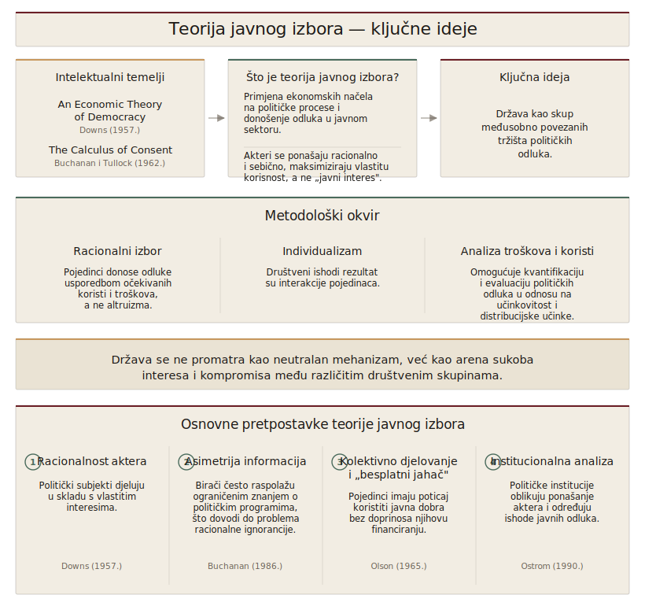

::: {.vodic-panel}
## Vodič kroz poglavlje

1. Što je teorija javnog izbora i kojom se metodologijom služi?
2. Zašto razlikujemo pravila igre od ishoda koje ona proizvode?
3. Što znači promatrati ljude kao birače, političare, birokrate i pripadnike interesnih skupina?
4. Zašto su mnoge odluke države predvidivo neintuitivne, racionalne za aktere, a štetne za društvo?
:::

U prvom smo dijelu knjige vidjeli da tržište zna zakazati i da država tada dobiva razlog za djelovanje. No iz toga ne slijedi da će država i uspjeti. Ako tržišni neuspjeh opravdava intervenciju, ostaje otvoreno hoće li sam politički proces proizvesti bolji ishod od onoga koji popravlja. Upravo to pitanje stoji u temelju ovoga dijela knjige i discipline koja mu je posvećena.

Teoriju javnog izbora (engl. *Public Choice Theory*) najlakše je razumjeti kao primjenu ekonomskih alata na pitanja koja tradicionalno pripadaju političkoj znanosti. Ona kolektivno odlučivanje analizira istim pojmovima kojima ekonomija analizira tržište, odnosno maksimizacijom korisnosti, usporedbom troškova i koristi te poticajima. Time nudi objašnjenje zašto politički ishodi često odstupaju od idealizirane slike javnog interesa i usmjerava pozornost na institucionalne poticaje koji oblikuju ponašanje državnih aktera.

Politika se tradicionalno promatra kroz idealističnu prizmu u kojoj vlada i njezini dužnosnici teže isključivo općem dobru i provode „volju" naroda. Taj pogled pruža utješan narativ, ali slabo objašnjava zašto su političke odluke u praksi često neučinkovite, zašto se donose zakoni koji pogoduju uskim skupinama na štetu većine i zašto su upravni postupci spori i nefleksibilni. James Buchanan, dobitnik Nobelove nagrade za ekonomiju, zato je javni izbor opisao kao „politiku bez romantike" [@buchanan1986]. Umjesto da politiku tretira kao područje vođeno altruizmom, ona polazi od pretpostavke da su svi sudionici, birači, političari i birokrati, racionalni pojedinci čije su motivacije slične onima na tržištu. Iz te jednostavne zamjene pretpostavke slijedi velik dio uvida ovoga dijela knjige jer naizgled iracionalni politički ishodi postaju logične posljedice interakcije samointeresnih aktera unutar zadanih institucionalnih pravila. Ipak, empirijska literatura iz organizacijske teorije i komparativnih politika upozorava da se motivacijska struktura javnih službenika može bitno razlikovati od one tržišnih aktera, jer misijsko upravljanje i institucionalni etos znaju generirati solidne javne ishode i bez pretpostavljene nultosumne igre samointeresa.

## Definicija, metodologija i osnovne pretpostavke

Prije nego razložimo pojedine pretpostavke, sljedeći prikaz sažima odakle teorija dolazi, što tvrdi i kojom se metodom služi.

{#fig-javni-izbor-kljucne-ideje .infographic fig-alt="Dijagram koji sažima teoriju javnog izbora kroz pet blokova — intelektualne temelje (Downs 1957; Buchanan i Tullock 1962), definiciju, ključnu ideju, metodološki okvir (racionalni izbor, individualizam, analiza troškova i koristi) te četiri osnovne pretpostavke." width=92%}

Intelektualni temelji teorije postavljeni su u djelima poput *An Economic Theory of Democracy* [@downs1957] i *The Calculus of Consent* [@buchanan1962]. Zajednička im je pretpostavka da se politički akteri, birači, političari i birokrati, ponašaju racionalno i da maksimiziraju vlastitu korisnost umjesto apstraktnog „javnog interesa". Na taj način teorija javnog izbora spaja ekonomsku analizu i političku znanost te promatra državu kao skup povezanih tržišta političkih odluka [@mueller1989].

::: {#def-javni-izbor}
**Javni izbor.** Primjena ekonomske logike na kolektivno odlučivanje, prema kojoj birači, političari i birokrati i u politici slijede vlastite poticaje, pa se kolektivne odluke objašnjavaju kao rezultat pojedinačnih izbora, a ne kao volja apstraktne cjeline poput „države" ili „naroda".
:::

Metodološki, teorija počiva na tri postavke. Prva je racionalni izbor, prema kojem pojedinci odlučuju usporedbom očekivanih koristi i troškova, a ne altruizmom [@downs1957]. Druga je metodološki individualizam, prema kojem kolektivni ishodi nisu odluke agregatne cjeline poput „države" ili „naroda", nego rezultat pojedinačnih izbora. Treća je shvaćanje politike kao razmjene (engl. *politics as exchange*), u kojem se politički procesi promatraju kao sustavi razmjene gdje sudionici nastoje poboljšati svoj položaj. Iz tih postavki slijede i osnovne pretpostavke teorije, od racionalnosti aktera i asimetrije informacija do problema kolektivnog djelovanja, koje u nastavku razrađujemo kroz ponašanje pojedinih skupina aktera.

**Pravila igre nasuprot ishodima.** Razlikovni doprinos teorije javnog izbora jest inzistiranje na razlici između pravila igre (engl. *rules of the game*) i ishoda koje ona proizvode. Kvaliteta kolektivnih odluka ne ovisi samo o preferencijama aktera, nego ponajprije o institucionalnim pravilima koja oblikuju proces odlučivanja, jer isti ljudi pod različitim pravilima proizvode različite rezultate. Analiza se zato odvija na dvije razine. Na ustavnoj razini biraju se pravila i ograničenja prema kojima će se donositi buduće odluke, a na operativnoj razini odlučuje se unutar tih pravila o konkretnim pitanjima. Tu granu javnog izbora, konstitucionalnu političku ekonomiju Jamesa Buchanana i Geoffreyja Brennana, zajedno s pojmom vela neizvjesnosti i logikom kojom dobro postavljena pravila obuzdavaju i samointeresnog aktera, razrađujemo u poglavlju o konstitucionalnoj ekonomici, gdje joj pripada puni prostor.

## Ljudi kao birači, političari i službenici

Temeljno polazište teorije jest da se svi sudionici političkog procesa, birači, političari i službenici, ponašaju racionalno i vode vlastitim interesima i poticajima, a ne apstraktnim „javnim dobrom" [@buchanan1962]. Taj pristup odbacuje idealiziranu sliku države kao neutralnog čuvara zajedničkih interesa i promatra je kao sustav povezanih tržišta političkih odluka [@mueller1989]. Svaka od triju skupina aktera ima vlastite ciljeve, ograničenja i informacijske asimetrije, što zajedno oblikuje stvarne ishode javnih politika.

### Trebam li i kako sudjelovati u donošenju političkih odluka?

Pitanje individualnog sudjelovanja u donošenju političkih odluka jedno je od središnjih problema teorije javnog izbora. Ono se analizira kroz prizmu racionalnog izbora, odnosno ekonomskog pristupa ponašanju birača [@downs1957]. Ako birači djeluju racionalno i nastoje maksimizirati svoju korisnost uz najmanji trošak, postavlja se pitanje zašto bi racionalan pojedinac uopće izašao na izbore kada je vjerojatnost da njegov glas promijeni ishod iznimno mala [@mueller1989].

#### Paradoks glasanja i racionalno nepoznavanje

Paradoks neglasanja (engl. *The Paradox of Not Voting*), koji je istaknuo @downs1957, nalaže da je glasanje u velikim izborima, u strogo instrumentalnom smislu, iracionalno. Ako je vjerojatnost da će jedan pojedinačni glas utjecati na ishod zanemarivo mala, gotovo jednaka nuli, i ako glasanje podrazumijeva bilo kakav, pa i minimalan trošak poput vremena, truda ili prilagodbe rasporeda, racionalni akter trebao bi ostati kod kuće. Taj se instrumentalni model glasanja formalno opisuje formulom

$$R = P \cdot B - C,$$

gdje R predstavlja nagradu za glasanje, P vjerojatnost da će glas biti odlučujući, B korist od preferiranog ishoda, a C trošak glasanja. Budući da je u velikim populacijama $P \approx 0$, tada je R negativan čim je $C > 0$. Unatoč ovoj logici, izlaznost na izbore ostaje visoka.

Graf koji slijedi prikazuje neto vrijednost glasanja R u ovisnosti o veličini biračkog tijela na logaritamskoj vodoravnoj osi, pri čemu krivulja prelazi iz pozitivnog u negativno područje kako tijelo raste. Graf je interaktivan, pa klizači mijenjaju veličinu biračkog tijela, trošak glasanja i korist od preferiranog ishoda.

```{ojs}
//| echo: false
viewof vote_controls = Inputs.form({
  N: Inputs.range([3, 8],      {value: 6,    step: 0.1, label: "Veličina biračkog tijela (log₁₀ N):"}),
  B: Inputs.range([0, 20000],  {value: 5000, step: 100, label: "Korist od preferiranog ishoda B (€):"}),
  C: Inputs.range([0, 50],     {value: 10,   step: 1,   label: "Trošak glasanja C (€):"})
})
```

```{ojs}
//| echo: false
vote_N = vote_controls.N
```

```{ojs}
//| echo: false
vote_B = vote_controls.B
```

```{ojs}
//| echo: false
vote_C = vote_controls.C
```

```{ojs}
//| echo: false
//| label: fig-paradoks-glasanja
//| fig-cap: "Neto vrijednost glasanja R = B/N − C brzo pada prema nuli kako raste biračko tijelo, jer vjerojatnost odlučujućeg glasa P ≈ 1/N postaje zanemariva; tek nerealno velika korist B može nadvladati i malen trošak glasanja."
//| fig-alt: "Graf na logaritamskoj skali osi x (veličina biračkog tijela N) i linearnoj skali osi y (neto vrijednost glasanja R). Plava silazna krivulja prelazi iz pozitivnog u negativno područje kako N raste; istaknuta točka pokazuje trenutnu veličinu biračkog tijela i njezinu neto vrijednost, a isprekidana crta označava nultu granicu isplativosti."
{
  const B = vote_B, C = vote_C;
  const Ncur = Math.pow(10, vote_N);
  const R = (N) => B / N - C;        // P ≈ 1/N, pa je R = B/N − C
  const Rcur = R(Ncur);

  const curve = d3.range(3, 8.01, 0.05).map(l => ({N: Math.pow(10, l), R: R(Math.pow(10, l))}));

  return Plot.plot({
    width: 760,
    height: 420,
    marginLeft: 72,
    marginRight: 30,
    marginTop: 64,
    marginBottom: 52,
    style: {fontSize: "12px", fontFamily: "Public Sans, system-ui, sans-serif", color: "#3A332D"},
    x: {type: "log", label: "Veličina biračkog tijela N (log) →", domain: [1e3, 1e8]},
    y: {label: "↑ Neto vrijednost glasanja R = B/N − C (€)"},
    marks: [
      Plot.ruleY([0], {stroke: "#6B6357", strokeDasharray: "4,3"}),
      Plot.line(curve, {x: "N", y: "R", stroke: "#2D5A8E", strokeWidth: 2.5}),
      Plot.dot([{N: Ncur, R: Rcur}], {x: "N", y: "R", r: 6, fill: "#1C1916", stroke: "white", strokeWidth: 2}),
      Plot.text([Rcur >= 0
        ? `R = ${Rcur.toFixed(2)} € → glasanje je instrumentalno isplativo`
        : `R = ${Rcur.toFixed(2)} € → glasanje se instrumentalno ne isplati`],
        {frameAnchor: "top", dy: -36, fontSize: 14, fontWeight: 700,
         fill: Rcur >= 0 ? "#1C7C54" : "#C53030"})
    ]
  });
}
```

**Što isprobati.** (1) Pri malenom biračkom tijelu pomaknite klizač Trošak glasanja C prema nuli i neto vrijednost glasanja ostaje pozitivna jer i sitna korist nadvlada zanemariv trošak. (2) Sada povećavajte Veličinu biračkog tijela i pratite kako krivulja strmo pada ispod nule, jer vjerojatnost odlučujućeg glasa P ≈ 1/N kopni brže nego što korist može pratiti. (3) Pokušajte tu negativnu vrijednost vratiti u plus podizanjem klizača Korist od preferiranog ishoda B do kraja i uvjerite se da pri milijunskom biračkom tijelu ni nerealno velika korist ne čini glasanje instrumentalno isplativim.

::: {#def-racionalno-nepoznavanje}
**Racionalno nepoznavanje (racionalna ignorancija).** Stanje u kojem se biraču ne isplati prikupljati političke informacije jer je trošak informiranja veći od očekivane koristi, s obzirom na zanemarivu vjerojatnost da će njegov glas utjecati na ishod.
:::

Slično tomu, koncept racionalnog nepoznavanja (engl. *Rational Ignorance*) objašnjava zašto su građani često loše informirani o političkim pitanjima. Trošak stjecanja detaljnih političkih informacija gotovo uvijek nadmašuje očekivanu instrumentalnu korist za pojedinog birača, s obzirom na zanemarivu vjerojatnost utjecaja na ishod. Racionalno nepoznavanje posljedično dovodi ne samo do nedostatnog prikupljanja političkih informacija, već i do neučinkovitog korištenja onih koje birači već posjeduju.

@caplan2001 taj koncept proširuje idejom racionalne iracionalnosti. U svom je istraživanju naglasio da birači ne samo da ne ulažu u informacije, nego si mogu priuštiti i zadržavanje sistemski pristranih, iracionalnih uvjerenja, jer je cijena takve pogreške u prosudbi za pojedinca gotovo nula. Kada ne bi bilo sistemskih pristranosti, individualna bi se iracionalnost poništila na agregatnoj razini. Postojanje sistemskih pristranosti, primjerice u ekonomskim uvjerenjima, međutim objašnjava zašto kolektivne odluke mogu biti suprotne ekonomskim dokazima.

#### Pomirenje paradoksa — instrumentalno i ekspresivno glasanje

Ako je vjerojatnost da jedan glas odluči ishod gotovo nula, troškovi izlaska na izbore veći su od očekivane instrumentalne koristi [@downs1957]. Unatoč tome, u stvarnosti velik broj ljudi ipak glasa. Objašnjenje tog paradoksa traži se u razlikovanju instrumentalnog i ekspresivnog glasanja [@brennan1993].

Instrumentalni pristup polazi od klasične ekonomske racionalnosti, gdje birači glasaju kako bi maksimizirali očekivanu korist od političkih ishoda [@downs1957]. Oni biraju opciju koja im donosi najveću korist u pogledu poreza, dohotka, javnih usluga ili drugih konkretnih učinaka. Budući da je vjerojatnost odlučujućeg glasa infinitezimalno mala, instrumentalni motiv sam po sebi ne može objasniti široku participaciju birača [@mueller1989].

Teorija ekspresivnog glasanja (engl. *expressive voting*), koju su formalizirali @brennan1993, a čiji je korijeni sežu do D-člana u Rikeru i Ordeshookovom modelu [@riker1968], nadopunjuje instrumentalni model psihološkom i simboličkom dimenzijom. Prema tom pristupu birači ne glasaju zato što očekuju da će promijeniti ishod, nego zato što im čin glasanja omogućuje izražavanje identiteta, vrijednosti ili moralnih uvjerenja. Glasanje se promatra kao akt samopotvrđivanja i društvene pripadnosti, a ne kao čisto instrumentalno sredstvo za postizanje rezultata. Pojedinac tako može glasati za stranku koja promiče ekološke politike, ne zato što očekuje izravnu korist, nego zato što mu takav izbor pruža osjećaj konzistentnosti s vlastitim uvjerenjima [@hamlin1999].

Pomirenje paradoksa glasanja postiže se kombiniranjem instrumentalnog i ekspresivnog pristupa. U suvremenim modelima korisnost sudjelovanja uključuje i instrumentalne koristi povezane s ishodima i ekspresivne koristi povezane s identitetom i vrijednostima [@feddersen2004]. Takav model proširuje pojam racionalnosti izvan uskog ekonomskog okvira i objašnjava zašto pojedinci mogu racionalno odlučiti sudjelovati čak i kad je očekivana materijalna korist zanemariva. Pokazuje se da je političko ponašanje višedimenzionalno, istodobno racionalno i simbolično, korisno i vrijednosno utemeljeno [@brennan1993; @hamlin1999].

**Političari i tržište politika.** Političari su u ovom okviru maksimizatori glasova, akteri koji na „tržištu politika" nude programe i obećanja u zamjenu za podršku [@downs1957]. Njihov cilj nije maksimizacija društvenog blagostanja, nego izborni uspjeh, održavanje vlasti i pristup resursima države. Takav sklop poticaja stvara sklonost kratkoročnim i populističkim mjerama koje dižu popularnost, a dugoročno mogu opteretiti gospodarstvo i javne financije [@nordhaus1975].

::: {.callout-empirija}
Tvrdnja da političari prilagođavaju politiku izbornom kalendaru ima teorijsku osnovu i empirijsku podlogu. Nordhaus je postavio temeljni model koji predviđa da javna potrošnja i deficiti rastu u godini uoči izbora, a fiskalna prilagodba dolazi tek nakon njih [@nordhaus1975]. Kasnija empirijska istraživanja potvrđuju taj obrazac u demokracijama, pri čemu je učinak sustavno jači u mladim demokracijama, u zemljama sa slabijim fiskalnim pravilima i ondje gdje birači teže prate dugoročne troškove odluka, dok je u zemljama s neovisnim fiskalnim vijećima i transparentnim proračunom osjetno slabiji. Empirijska je pouka da ciklus nije neizbježan, nego ovisi o institucijama koje povećavaju vidljivost budućih troškova.
:::

Da bi pridobili podršku, političari posežu za mehanizmima koji se provlače kroz cijeli ovaj dio knjige. Trgovina glasovima (engl. *logrolling*) razmjena je glasova kojom prolaze prijedlozi koji pojedinačno ne bi dobili većinu, a njezinu logiku i posljedice za kolektivni izbor razrađujemo u poglavlju o kolektivnom izboru. Lov na rentu, kojim organizirane skupine kroz političku arenu stječu povlastice umjesto da stvaraju vrijednost, te njegov nastavak u regulatornom zarobljavanju, pripadaju poglavlju o interesnim skupinama, gdje ih izlažemo u cijelosti. Na ovom je mjestu dovoljno vidjeti da političar koji odgovara na takve pritiske djeluje racionalno, čak i kada je ishod društveno štetan.

::: {.callout-praksa}
Logika regulatorne zarobljenosti vidljiva je u liberalizaciji telekomunikacija u Europi devedesetih godina. Formalna pravila nalagala su otvaranje tržišta, ali su nacionalni regulatori u nekoliko zemalja u praksi štitili dotadašnje državne operatere visokim naknadama za međusobno povezivanje i složenim uvjetima licenciranja, čime su novim ponuđačima otežavali ulazak. Tek je pritisak Europske komisije, koja je djelovala izvan dosega pojedinačnih nacionalnih regulatora, ubrzao stvarno otvaranje tržišta. Primjer potvrđuje uvid da regulacija često služi koncentriranim interesima industrije koja je „kupuje", a ne raspršenoj javnosti, te pokazuje zašto neovisnost i nadzor regulatora nisu tehnički detalj, nego uvjet da regulacija ostane u javnom interesu.
:::

**Birokrati i borba za proračun.** Isti model vrijedi i za birokrate. Za razliku od klasične, weberovske slike uprave kao nepristranog provoditelja zakona, javni izbor pretpostavlja da i službenici reagiraju na vlastite poticaje, ponajprije na veličinu proračuna kao izvor plaće, statusa, ovlasti i moći [@niskanen1971]. Budući da birokracija o stvarnom trošku vlastitih programa zna više od onih koji ih financiraju, ta informacijska prednost vodi sustavnoj sklonosti prema većim proračunima od društveno optimalnih. Taj uvid, Niskanenov model maksimizacije proračuna i njegove kasnije nadogradnje, razrađujemo u poglavlju o birokraciji, gdje weberovski i javnoizborni pogled stoje jedan uz drugi.

## Zašto su odluke države često neintuitivne?

Kada se državne odluke doimaju neintuitivnima, primjerice kada se subvencioniraju neučinkovite industrije ili financiraju skupi projekti koji koriste tek uskom krugu, teorija javnog izbora pokazuje da iza prividne iracionalnosti najčešće stoji posve racionalno ponašanje aktera. Za razliku od shvaćanja države kao jedinstvenog aktera koji djeluje u općem interesu, ona državu promatra kao skup pojedinaca koji donose odluke vođeni vlastitim interesima, informacijama i kalkulacijama [@buchanan1962; @mueller1989]. Ishodi koji se iz društvene perspektive čine neefikasnima često su, zapravo, predvidive posljedice neuspjeha države (engl. *government failure*).

Zajednički nazivnik tih ishoda jedna je asimetrija. Mnoge politike donose veliku, koncentriranu korist maloj i dobro organiziranoj skupini, dok je njihov trošak raspršen na mnoštvo poreznih obveznika tako da je pojedinačni teret malen i jedva primjetan. Organizirana manjina ima snažan poticaj izboriti se za mjeru, a raspršena većina nema poticaj ni saznati za nju. Iz te asimetrije izrastaju mehanizmi koje razrađuju poglavlja koja slijede, od logike kolektivnog djelovanja i lova na rentu u interesnim skupinama, preko trgovine glasovima u kolektivnom izboru, do birokratske ekspanzije. Korisno ih je najprije vidjeti zajedno.

| Mehanizam neuspjeha države | Glavni akteri | Racionalni cilj aktera | Rezultat za društvo (neintuitivan ishod) | Razrađeno u |
| :--- | :--- | :--- | :--- | :--- |
| Koncentrirane koristi / raspršeni troškovi | Interesne skupine, birači | Organiziranje malih skupina radi velikog dobitka, ravnodušnost većine | Usvajanje politika s neto niskim ili negativnim društvenim povratom | pogl. 8 |
| Lov na rentu | Interesne skupine | Stjecanje umjetno stvorenih povlastica (političke rente) | Rasipanje produktivnih resursa (Tullockov pravokutnik) | pogl. 8 |
| Trgovina glasovima (logrolling) | Političari | Razmjena glasova radi prolaska specifičnih zakona | Usvajanje projekata s neto negativnom društvenom vrijednošću | pogl. 6 |
| Maksimizacija proračuna | Birokrati | Povećanje proračuna i osobne moći | Prekomjerna i neučinkovita opskrba javnim dobrima | pogl. 9 |

: Tablica 1. Mehanizmi neuspjeha države. Autorska sinteza prema @olson1965, @tullock1967, @niskanen1971 i @buchanan1962. {#tbl-mehanizmi}

Pouka nije da su političari ili birokrati loši ljudi, nego da i dobronamjerni akteri pod lošim pravilima proizvode loše ishode. Time se vraćamo na razliku s početka poglavlja jer popravak takvih ishoda rjeđe dolazi od zamjene ljudi, a češće od promjene pravila pod kojima oni odlučuju.

::: {.sazetak-panel}
## Sažetak

Teorija javnog izbora ekonomskim alatima analizira političko odlučivanje i polazi od pretpostavke da i u politici djeluju pojedinci sa svojim ciljevima, a ne bestjelesni zastupnici općeg dobra. Ključno je razlikovati pravila igre od ishoda jer isti akteri pod različitim pravilima proizvode različite rezultate. Kada se ljudi promatraju kao birači, političari, birokrati i pripadnici interesnih skupina, mnogi naizgled iracionalni potezi države postaju razumljivi i predvidljivi. Ovo poglavlje postavlja taj okvir i njegove aktere, a mehanizme kroz koje nastaje neuspjeh države, od kolektivnog djelovanja i interesnih skupina, preko birokracije, do ustavnih pravila, razrađuju poglavlja koja slijede.
:::

::: {.callout-vjezba}
Otvorite interaktivni graf iznad i zadržite trošak glasanja na $C = 10$ € te korist na $B = 5000$ €, a zatim povećavajte veličinu biračkog tijela. Pri kojoj veličini $N$ neto vrijednost glasanja $R$ prelazi iz pozitivne u negativnu? Provjerite zatim računski tako da iz uvjeta $R = B/N - C = 0$ izvedete kritičnu veličinu $N^{*} = B/C$ i usporedite je s grafom. Naposljetku, koliko bi puta morala porasti korist $B$ da bi se glasanje instrumentalno „isplatilo" u biračkom tijelu od milijun ljudi uz isti trošak? Što vaš rezultat govori o tome zašto se stvarna izlaznost ne može objasniti samo instrumentalnim motivom?
:::
