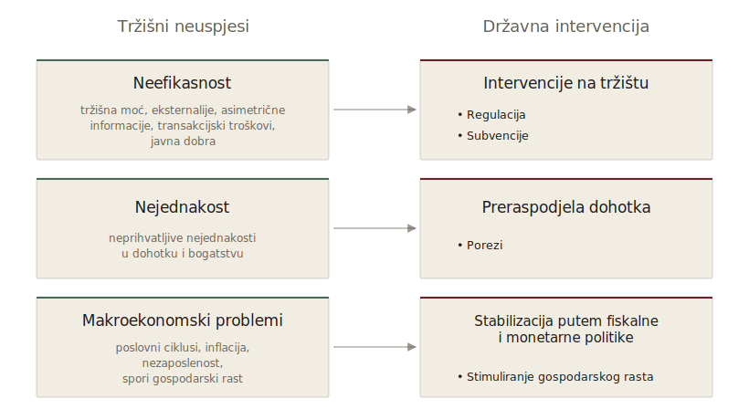

::: {.vodic-panel}
## Vodič kroz poglavlje

1. Što su instrumenti javne politike i zašto su most između cilja i rezultata?
2. Kako porezi, javna potrošnja i subvencije djeluju kroz novac i poticaje?
3. Kako regulacija djeluje kroz pravila, standarde i dozvole?
4. Kada država intervenira izravno, kroz javna poduzeća i agencije?
5. Što su informacijski i bihevioralni instrumenti i čime se razlikuju od prisile?
6. Po čemu prepoznajemo dobar izbor i kombinaciju instrumenata?
:::

Država svoju ulogu ne ostvaruje apstraktno, već kroz konkretne **instrumente javne politike**. Kada kažemo da država „intervenira", „regulira", „pomaže", „oporezuje" ili „stabilizira gospodarstvo", zapravo govorimo o različitim načinima na koje javna vlast pokušava utjecati na ponašanje pojedinaca, poduzeća, institucija i tržišta. Instrumenti javne politike su zato operativni alati kojima država pretvara ciljeve u djelovanje.

Ti instrumenti mogu biti vrlo različiti. Neki izravno uključuju novac, poput poreza, javne potrošnje, subvencija i transfera. Drugi djeluju kroz pravila, zabrane, standarde i dozvole, kao što je regulacija. Treći djeluju kroz organizaciju same države, primjerice javna poduzeća, javne ustanove i agencije. Četvrti djeluju na makroekonomskoj razini, kroz fiskalnu i monetarnu politiku. U novije vrijeme sve veću važnost imaju i informacijski te bihevioralni instrumenti, koji ne počivaju na prisili ili novcu, nego na oblikovanju izbora i informacija koje građani imaju pred sobom.

Isti javni cilj može biti ostvaren različitim instrumentima, ali ti instrumenti nemaju iste učinke, iste troškove ni iste političke posljedice. Ako država želi smanjiti zagađenje, može uvesti porez na emisije, propisati maksimalnu dopuštenu razinu zagađenja, subvencionirati čiste tehnologije, javno informirati potrošače ili kombinirati više mjera. Ako želi smanjiti siromaštvo, može povećati socijalne transfere, smanjiti poreze na niske dohotke, subvencionirati zapošljavanje, ulagati u obrazovanje ili regulirati minimalnu plaću. Zato je izbor instrumenta jedno od središnjih pitanja dizajna javnih politika.

::: {#def-nato-okvir}
**NATO okvir** Christophera Hooda klasificira državne instrumente prema četiri vrste resursa koje vlada može koristiti: *Nodality* (informacijska centralnost), *Authority* (formalna ovlast), *Treasure* (financijska moć) i *Organization* (vlastiti institucionalni kapacitet) [@hood1983].
:::

Sustavnija klasifikacija instrumenata postoji u literaturi o javnom upravljanju i naziva se **NATO okvir** [@hood1983]. Prema njemu država raspolaže s četiri vrste resursa kojima može djelovati. *Nodality* je položaj države kao informacijskog čvora kroz koji prolazi velika količina podataka i s kojeg ona može slati ili tražiti informacije. *Authority* je formalna ovlast da nešto zapovjedi, zabrani ili dopusti. *Treasure* je financijska moć da nešto plati, oporezuje ili subvencionira. *Organization* je sposobnost da nešto sama proizvede kroz vlastite institucije, zaposlenike i kapacitete.

Većina stvarnih instrumenata koristi više od jednog resursa, ali svaki ima jedan dominantan. Porezi i subvencije počivaju primarno na *treasure*, regulacija na *authority*, javna poduzeća i agencije na *organization*, a informacijske kampanje i transparentnost na *nodality*. Korist okvira nije samo taksonomska. On omogućuje da se za isti cilj razmotri više instrumenata povezanih s različitim resursima, što često otkriva alternative koje pojednostavljena „porez ili regulacija" rasprava previđa.

{#fig-trzisni-neuspjesi .infographic fig-alt="Dijagram koji povezuje tri kategorije tržišnih neuspjeha — neefikasnost, nejednakost i makroekonomske probleme — s tri tipa instrumenata državne intervencije." width=92%}

## Porezi

Porezi su najvažniji i najvidljiviji instrument države. Oni su osnovni izvor prihoda kojim se financiraju javne funkcije, ali su istodobno i snažan instrument utjecaja na ponašanje ekonomskih subjekata. Država porezima ne prikuplja samo novac. Ona porezima mijenja cijene, poticaje, raspodjelu dohotka i odluke pojedinaca i poduzeća.

U najširem smislu, porezi imaju tri velike funkcije. **Fiskalna funkcija** podrazumijeva da porezi služe za financiranje javnih dobara i usluga, poput obrazovanja, zdravstva, obrane, policije, sudstva, infrastrukture i socijalne zaštite. **Redistribucijska funkcija** omogućuje da se porezima utječe na raspodjelu dohotka i bogatstva, primjerice progresivnim oporezivanjem dohotka. **Alokacijska ili korektivna funkcija** dopušta da se porezima ispravljaju tržišni neuspjesi, primjerice oporezivanjem aktivnosti koje stvaraju negativne eksternalije [@musgrave1989; @stiglitz2015; @gruber2019].

Porezi mogu biti i instrument poticanja određenih aktivnosti. Država može koristiti porezne olakšice za ulaganja, istraživanje i razvoj, zapošljavanje određenih skupina ili energetsku obnovu. Međutim, takve olakšice treba koristiti oprezno. One mogu potaknuti poželjno ponašanje, ali mogu i smanjiti transparentnost poreznog sustava, stvoriti povlastice za određene skupine i otvoriti prostor za lobiranje. Detaljnije porezne mehanizme i teoriju oporezivanja razrađujemo u zasebnom poglavlju o porezima.

## Javna potrošnja

Drugi ključni instrument države je **javna potrošnja**, odnosno način na koji država koristi prikupljena sredstva. Ako porezi pokazuju kako država prikuplja novac, javna potrošnja pokazuje što država smatra prioritetom. Struktura javne potrošnje zato mnogo govori o društvenim izborima neke zemlje i o tome koliko ulaže u obrazovanje, zdravstvo, mirovine, socijalnu zaštitu, infrastrukturu, obranu, kulturu, znanost ili zaštitu okoliša.

Javna potrošnja može imati različite funkcije. Prvo, ona financira javna dobra i usluge koje tržište ne bi osiguralo u dovoljnoj mjeri. Drugo, omogućuje ulaganja u ljudski kapital, osobito kroz obrazovanje, zdravstvo i znanost. Treće, ima redistribucijsku funkciju kroz socijalne transfere, mirovine i naknade. Četvrto, može imati stabilizacijsku funkciju jer u recesiji država može povećati potrošnju kako bi ublažila pad dohotka i potražnje.

No javna potrošnja nosi i rizike. Ako je loše usmjerena, može financirati programe s malim društvenim učinkom. Ako se politički teško ukida, može postati trajni proračunski teret. Ako nije transparentna, može otvoriti prostor za rentijerstvo i klijentelizam. Zato se javna potrošnja ne može vrednovati samo prema veličini, jer ključno pitanje nije samo koliko država troši, nego na što troši, kako troši i kakve rezultate postiže. Toj temi posvećujemo posebno poglavlje.

## Regulacija

::: {#def-regulacija}
**Regulacija** je instrument javne politike temeljen na autoritetnom resursu (*authority*): uključuje pravila, standarde, zabrane, dozvole i nadzorne mehanizme kojima država usmjerava ponašanje subjekata bez izravnih financijskih transfera.
:::

**Regulacija** uključuje pravila, standarde, zabrane, dozvole i nadzorne mehanizme kojima država usmjerava ponašanje pojedinaca, poduzeća i institucija. Za razliku od poreza i javne potrošnje, regulacija često ne uključuje izravne financijske tokove kroz proračun, ali može imati vrlo snažan učinak na tržišta i društvene odnose.

Država regulacijom određuje pravila tržišne utakmice. Ona propisuje standarde sigurnosti hrane i lijekova, uvjete rada, zaštitu potrošača, bankarsku regulaciju, tržišno natjecanje, zaštitu okoliša, urbanistička pravila i licenciranje određenih profesija. Bez regulacije mnoga tržišta ne bi mogla funkcionirati sigurno i predvidljivo. Regulacija je osobito važna kod prirodnih monopola, gdje država mora regulirati cijene, kvalitetu usluge i uvjete pristupa infrastrukturi.

Ipak, regulacija nije bez troškova. Prekomjerna ili loše dizajnirana regulacija može povećati troškove poslovanja, smanjiti konkurenciju, usporiti inovacije i stvoriti administrativne barijere. Regulacija koja je formalno uvedena radi zaštite potrošača može u praksi zaštititi postojeće ponuđače od konkurencije [@stigler1971; @stiglitz2015]. Poseban problem je regulatorno zarobljavanje. Zato bi svaka regulacija trebala odgovoriti na nekoliko pitanja, počevši od toga koji problem rješava, zašto tržište samo ne može riješiti problem, postoje li blaži instrumenti, koliko regulacija košta, tko snosi trošak, tko ima korist i kako će se mjeriti njezina učinkovitost.

## Subvencije

::: {#def-subvencija}
**Subvencija** je izravna ili neizravna financijska potpora koju država dodjeljuje određenim sektorima, poduzećima, kućanstvima ili aktivnostima — kao porezna olakšica, povlašteni kredit, jamstvo ili proračunska isplata — radi poticanja poželjnog ponašanja ili nadoknade pozitivnih eksternalija.
:::

**Subvencije** su oblik financijske potpore koju država dodjeljuje određenim sektorima, poduzećima, kućanstvima ili aktivnostima. One mogu biti izravne, primjerice isplata potpore iz proračuna, ili neizravne, primjerice porezne olakšice, povlašteni krediti, državna jamstva ili niže cijene javnih usluga.

Subvencije se najčešće opravdavaju trima argumentima. Prvo, mogu se koristiti za poticanje aktivnosti koje imaju pozitivne eksternalije, primjerice ulaganja u istraživanje i razvoj, obrazovanje ili zelene tehnologije. Drugo, koriste se za zaštitu određenih skupina ili sektora, primjerice poljoprivrede. Treće, koriste se kao instrument industrijske politike, kada država želi potaknuti razvoj novih sektora ili strateških industrija.

Međutim, subvencije su jedan od instrumenata s najvećim rizikom državnog neuspjeha. Ako su loše dizajnirane, mogu dovesti do neefikasne alokacije resursa, stvaranja ovisnosti o državnoj pomoći i očuvanja poduzeća koja dugoročno nisu konkurentna. Mogu potaknuti poduzeća da više ulažu u lobiranje nego u produktivnost i mogu postati politički teško ukidive [@tullock1967; @krueger1974; @musgrave1989]. Zato je ključno pitanje dodatnosti, odnosno toga je li subvencija potaknula aktivnost koja se inače ne bi dogodila ili je samo financirala ono što bi se dogodilo i bez nje. Dobra subvencija mora biti jasno ciljana, vremenski ograničena, transparentna i evaluirana.

::: {#def-kombinacija-instrumenata}
**Kombinacija instrumenata** (*policy mix*) je skup različitih instrumenata koji se istodobno primjenjuju radi ostvarivanja jednog ili više srodnih ciljeva; analiza mixa otkriva da isti cilj može biti postignut različitim rasporedom troškova, vidljivosti i administrativnih kapaciteta.
:::

Komparativni podaci OECD-a pokazuju da različite zemlje rješavaju isti tip problema različitim kombinacijama instrumenata. U klimatskoj politici sjeverna Europa pretežno koristi cijenu ugljika i naknade, dok dio kontinentalnih zemalja oslanja se više na regulatorne standarde i subvencije, a anglosaksonski sustavi naglašavaju tržišta prava emisija. Konačni ekološki ishodi se približavaju, ali fiskalni i distribucijski profil tih putova razlikuje se značajno. Cjenovni instrumenti prenose veći vidljivi teret na potrošača, regulatorni ga sakrivaju u cijenu proizvoda, a subvencije ga prebacuju na opću populaciju kroz proračun.

Ista logika vrijedi za politiku rada. Nordijske zemlje kombiniraju visoke aktivne politike zapošljavanja (treasure + organization) s relativno slabom zaštitom od otkaza (manje authority), dok mediteranske ekonomije naglašavaju zaštitu radnog mjesta kroz regulaciju s manjom potrošnjom na aktivne mjere. Empirijska usporedba pokazuje slično ukupno ulaganje u radnu integraciju, ali drugačiji raspored troškova i različite ishode po dobnoj i obrazovnoj skupini. Izbor instrumenata zato nije samo tehničko pitanje učinkovitosti, nego i institucionalni izbor o tome čije će se opterećenje vidjeti, a čije ne.

## Javna poduzeća

::: {#def-javno-poduzece}
**Javno poduzeće** je organizacija u (pretežno) državnom vlasništvu koja izravno pruža dobra ili usluge, najčešće u sektorima s prirodnim monopolom ili strateškim interesom; kombinira poslovnu logiku s javnim ciljevima, što stvara rizik miješanja ciljeva i slabijih poticaja za učinkovitost.
:::

U određenim sektorima država ne djeluje samo kao regulator, financijer ili naručitelj, nego i kao izravni proizvođač putem **javnih poduzeća**. Javna poduzeća najčešće djeluju u sektorima energetike, prometa, komunalnih usluga, voda, šuma, infrastrukture ili drugih područja od strateškog interesa.

Razlozi za javno vlasništvo mogu biti različiti, od prirodnih monopola i strateške važnosti sektora do potrebe da se osigura univerzalna usluga svim građanima neovisno o lokaciji ili platežnoj sposobnosti. Javna poduzeća mogu imati važnu razvojnu i društvenu ulogu, no često se suočavaju s problemima učinkovitosti i političkog utjecaja. Budući da nisu uvijek izložena tržišnoj konkurenciji, mogu imati slabije poticaje za smanjenje troškova, a budući da su u javnom vlasništvu, mogu biti izložena političkom kadroviranju i investicijama s političkim motivima.

Zato kod javnih poduzeća nije dovoljno pitati trebaju li biti javna ili privatna. Važno je pitati kako se njima upravlja. Problem često nije samo vlasništvo, nego miješanje ciljeva. Ako se od poduzeća istodobno očekuje da posluje profitabilno, zapošljava višak radnika, održava niske cijene i provodi socijalnu politiku, teško je procijeniti njegovu stvarnu učinkovitost. Ako država želi da javno poduzeće pruža uslugu ispod tržišne cijene zbog socijalnih razloga, taj trošak treba biti transparentno prikazan i financiran, a ne skriven u poslovanju poduzeća.

## Informacijski instrumenti

Osim poreza, javne potrošnje, regulacije i subvencija, država koristi i **informacijske instrumente**. Njima ne mijenja izravno cijene niti propisuje obvezno ponašanje, nego pokušava utjecati na odluke građana i poduzeća kroz informacije, upozorenja, preporuke, edukaciju i transparentnost.

Primjeri uključuju kampanje javnog zdravlja, oznake nutritivnih vrijednosti na hrani, energetske certifikate zgrada, upozorenja na duhanskim proizvodima, javne registre i usporedne prikaze kvalitete škola ili bolnica. Takvi instrumenti polaze od ideje da građani ne donose odluke uvijek s potpunim informacijama. Informacijski instrumenti često su manje prisilni i manje skupi od regulacije ili subvencija, no njihova učinkovitost ovisi o tome jesu li informacije jasne, vjerodostojne i korisne. Samo objavljivanje podataka nije dovoljno ako građani ne razumiju što oni znače ili ako im ne vjeruju.

## Bihevioralni i „nudge" instrumenti

U novije vrijeme sve veću važnost dobivaju **bihevioralni instrumenti**, često povezani s pojmom *nudge*. Ti instrumenti temelje se na spoznajama bihevioralne ekonomije, koja pokazuje da ljudi ne donose uvijek odluke kao savršeno racionalni pojedinci s potpunim informacijama. Ljudi često odgađaju odluke, precjenjuju kratkoročne koristi, podcjenjuju dugoročne rizike, oslanjaju se na navike i često prihvaćaju zadane opcije.

Nudge instrumenti ne zabranjuju ponašanje i ne nameću izravne financijske poticaje, nego oblikuju okruženje izbora tako da poželjno ponašanje postane lakše ili vjerojatnije. Najpoznatiji primjer je automatsko uključivanje zaposlenika u mirovinsku štednju uz mogućnost izlaska iz sustava [@thaler2008]. Prednost je u tome što često mogu postići promjenu ponašanja uz relativno niske fiskalne troškove i bez tvrde prisile. Međutim, nisu prikladni za sve probleme. Ako je problem siromaštvo, nedostatak infrastrukture ili snažna tržišna moć, nudge neće biti dovoljan. Bihevioralni instrumenti zato ne zamjenjuju tradicionalne instrumente, nego ih nadopunjuju.

::: {.callout-empirija}
Bihevioralni instrumenti mogu imati velik učinak uz mali trošak, što potvrđuju podaci o automatskom uključivanju u mirovinsku štednju. U klasičnim studijama američkih poslodavaca prelazak sa sustava u kojem se zaposlenik mora sam prijaviti na sustav u kojem je automatski uključen uz mogućnost izlaska podigao je sudjelovanje s otprilike polovice na više od devet desetina zaposlenika [@thaler2008]. Pritom nitko nije izgubio slobodu izbora jer je odjava ostala dostupna. Učinak pokazuje koliko su odluke osjetljive na zadanu opciju, ali i granicu nudgea jer on mijenja ponašanje ondje gdje je problem inercija, a ne ondje gdje je problem nedostatak novca ili tržišna moć.
:::

## Kombiniranje instrumenata

U praksi se javne politike rijetko oslanjaju na samo jedan instrument. Najčešće se koristi kombinacija instrumenata. Klimatska politika može uključivati porez na ugljik, subvencije za obnovljive izvore energije, regulaciju emisija, javna ulaganja u mrežu i informacijske kampanje. Zdravstvena politika može uključivati javno financiranje, regulaciju lijekova, poreze na štetne proizvode i preventivne kampanje.

Zato je važno razumjeti da instrumenti nisu izolirani i da međusobno djeluju. Porez može biti učinkovitiji ako ga prati informiranje. Regulacija može biti prihvatljivija ako je kombinirana sa subvencijama za prilagodbu. Dobar dizajn javne politike zato ne znači samo odabrati jedan instrument, nego oblikovati koherentan paket mjera koji odgovara problemu, fiskalno je održiv, administrativno provediv, politički legitiman i otvoren evaluaciji.

Izbor instrumenta nije neutralan analitički postupak nego trgovina između nekoliko stalno suprotstavljenih svojstava. Tržišni instrumenti (porezi, naknade, kvote koje se mogu prodavati) ostvaruju cilj uz najmanji ekonomski trošak jer dopuštaju akterima da sami pronađu najjeftiniji put usklađivanja, ali rijetko djeluju trenutno i često su politički vidljiviji od regulacije iste težine. Regulacija ostvaruje brzu i izvjesnu reakciju jer ograničava sam prostor izbora, ali nameće isti zahtjev različitim akterima čije su krivulje troška različite, što ga čini ekonomski skupljim za isti efekt. Subvencije politički su najlakše prihvatljive jer izravno nude korist, ali su fiskalno najsumnjivije i najpodložnije zarobljavanju.

Iz toga slijedi pravilo dizajna koje nadilazi pojedinačni izbor. Instrument koji minimizira ekonomski trošak često maksimizira politički, i obratno. Najbolji odabir rijetko je čisti optimum jedne dimenzije, nego najbolja izvediva ravnoteža unutar konkretnog institucionalnog konteksta.

::: {.callout-praksa}
Kanadska pokrajina Britanska Kolumbija 2008. je uvela porez na ugljik koji dobro pokazuje razliku između instrumenata. Umjesto da zabrani ili propiše tehnologije, porez je podigao cijenu emisija i prepustio poduzećima i kućanstvima da sami pronađu najjeftiniji način smanjenja, a prihod je vraćen kroz niže poreze na dohodak i dobit. Emisije po stanovniku pale su, dok je gospodarski rast pratio prosjek ostatka Kanade, čime je oslabljen strah da cjenovni instrument nužno koči gospodarstvo. Primjer ilustrira opću pouku da tržišni instrumenti ostvaruju cilj uz niži ekonomski trošak, ali su politički vidljiviji jer teret prikazuju otvoreno, za razliku od regulacije koja ga skriva u cijeni proizvoda.
:::

## Most između ciljeva i rezultata

Instrumenti javne politike predstavljaju most između državnih ciljeva i stvarnih društvenih ishoda. Država može imati plemenit cilj poput smanjenja siromaštva, povećanja zaposlenosti, zaštite okoliša ili poticanja rasta, ali cilj sam po sebi nije politika. Politika nastaje tek kada se odabere instrument, osigura provedba, definiraju odgovornosti i mjere rezultati.

Zato je izbor instrumenta jedno od najvažnijih pitanja javnih politika. Porezi prikupljaju prihode i mijenjaju poticaje. Javna potrošnja financira usluge, transfere i investicije. Regulacija postavlja pravila ponašanja. Subvencije potiču određene aktivnosti, ali mogu stvoriti rente. Javna poduzeća omogućuju izravnu državnu proizvodnju u strateškim sektorima, ali traže dobro upravljanje. Informacijski i bihevioralni instrumenti pokušavaju promijeniti ponašanje bez izravne prisile. Dobra javna politika ne pita samo što država želi postići, nego i kojim instrumentom, uz koje troškove, s kakvim poticajima, preko kojih institucija i s kakvom mogućnošću evaluacije.

::: {.sazetak-panel}
## Sažetak

Država svoje ciljeve ostvaruje kroz konkretne instrumente, pa cilj sam po sebi nije politika dok se ne odabere alat i osigura provedba. Jedni instrumenti djeluju kroz novac, poput poreza, potrošnje, subvencija i transfera, drugi kroz pravila i standarde, treći kroz izravnu državnu organizaciju u obliku javnih poduzeća i agencija. Sve veću ulogu imaju informacijski i bihevioralni instrumenti, koji oblikuju izbore bez prisile i novca. Izbor i kombinacija instrumenata zato su među najvažnijim pitanjima javnih politika jer svaki alat nosi vlastite troškove, poticaje i zahtjeve za provedbom.
:::

::: {.callout-vjezba}
Pretpostavite da neka vlada želi smanjiti potrošnju jednog štetnog proizvoda za 20 posto u odnosu na današnju razinu. Na raspolaganju su joj instrumenti iz sve četiri kategorije NATO okvira.

(a) Predložite po jedan konkretan instrument iz svake od četiri kategorije (*nodality*, *authority*, *treasure*, *organization*) kojim bi se taj cilj mogao adresirati. Za svaki ukratko objasnite kroz koji resurs države djeluje.

(b) Odaberite dva od predloženih instrumenta i usporedite ih po dvije dimenzije, po ekonomskom trošku ostvarenja istog smanjenja i po političkoj izvedivosti. Obrazložite zašto se te dvije dimenzije često kreću u suprotnim smjerovima.

(c) Pretpostavite sada dva instrumenta koja postižu isti cilj. Porez na proizvod smanjuje potrošnju za 4 postotna boda po jedinici poreznog opterećenja uz administrativni trošak od 10 novčanih jedinica, dok regulatorni standard smanjuje potrošnju za 5 postotnih bodova po stupnju strogosti uz administrativni trošak od 30 novčanih jedinica po stupnju. Izračunajte koliko je jedinica poreznog opterećenja, odnosno stupnjeva strogosti, potrebno za ciljanih 20 postotnih bodova i koji instrument ostvaruje cilj uz niži ukupni administrativni trošak.

(d) Procijenite zašto instrument koji je u (c) jeftiniji ne mora biti i onaj koji će vlada odabrati te objasnite zašto vlade tako često posežu za kombinacijom instrumenata umjesto za jednim najjeftinijim alatom. Što taj rascjep između tehnički najjeftinijeg i politički najprihvatljivijeg rješenja otkriva o naravi izbora instrumenata?
:::
