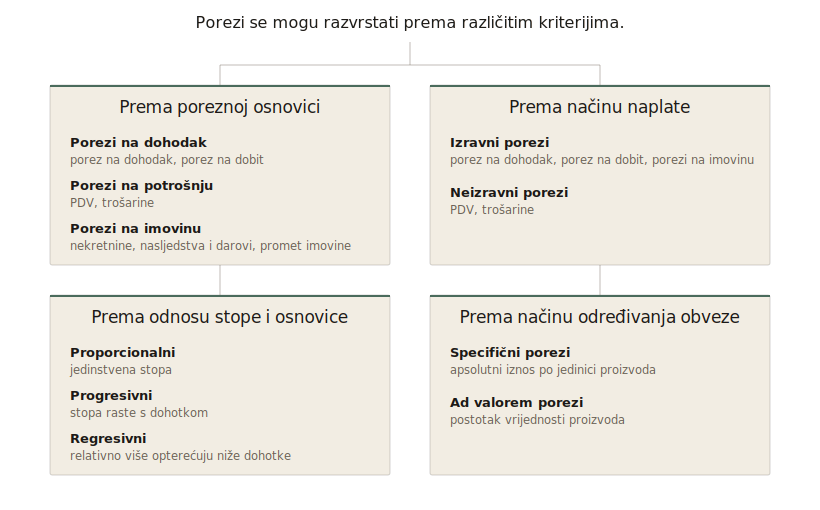

::: {.vodic-panel}
## Vodič kroz poglavlje

1. Što su porezi i po čemu se razlikuju od naknada, pristojbi i doprinosa?
2. Koje su glavne vrste poreza i na čemu se temelje?
3. Koja načela razlikuju dobar od lošeg poreznog sustava?
4. Što teorija govori o poreznom opterećenju, učinkovitosti i pravednosti?
5. Što znači optimalno oporezivanje i gdje su njegove granice?
6. Kako se porezni sustavi razlikuju u svijetu te u EU i Hrvatskoj?
7. Kako digitalizacija i umjetna inteligencija mijenjaju budućnost poreza?
:::

Ako prethodno poglavlje opisuje kako država troši, ovo opisuje odakle taj novac dolazi. Porezi su druga strana iste proračunske jednadžbe, ali nisu samo tehnika prikupljanja prihoda. Kroz njih društvo odlučuje tko snosi teret zajedničkih funkcija i kako se taj teret raspoređuje, pa porezna pitanja brzo postaju pitanja pravednosti, učinkovitosti i političkog izbora.

## Što su porezi?

Porezi su temeljni instrument javnih financija i ključni izvor prihoda moderne države. U najširem smislu, porezi se definiraju kao obvezna, nepovratna davanja državi bez izravne protuusluge [@musgrave1989; @rosen2014]. Ta definicija sadrži nekoliko važnih elemenata koje treba jasno razumjeti.

Porezi su prije svega **obvezni** jer njihovo plaćanje proizlazi iz zakona i ne ovisi o volji pojedinca. Oni su i **nepovratni**, što znači da se sredstva ne vraćaju onome tko ih je uplatio. Najvažnija karakteristika poreza jest činjenica da se plaćaju **bez izravne protuusluge**. Porezni obveznik ne dobiva konkretan proizvod ili uslugu u trenutku plaćanja poreza. Porezi umjesto toga služe za financiranje javnih dobara i usluga poput obrazovanja, zdravstva, sigurnosti, pravosuđa ili infrastrukture, koje koristi društvo u cjelini [@stiglitz2015]. Upravo zbog te kolektivne dimenzije porezi imaju ključnu ulogu u funkcioniranju moderne države.

Iako se u svakodnevnom govoru svi oblici uplata državi često nazivaju porezima, u ekonomskoj teoriji važno je razlikovati različite vrste javnih davanja.

**Naknade i pristojbe** povezane su s konkretnom uslugom ili pravom. Primjerice, plaćanje upravne pristojbe za izdavanje osobne iskaznice ili komunalne naknade za održavanje lokalne infrastrukture oblik je plaćanja za određenu uslugu. Za razliku od poreza, ovdje postoji relativno jasna veza između uplate i koristi. Iako ta veza nije uvijek savršena, ona je znatno izravnija nego kod poreza.

**Doprinosi za socijalno osiguranje** (mirovinsko i zdravstveno osiguranje) također su obvezni, ali su vezani uz određena prava koja pojedinac stječe uplatom [@simovic2022]. Uplate u mirovinski sustav stvaraju pravo na buduću mirovinu. Ipak, i ovdje postoji određena redistribucija, pa odnos između uplata i koristi nije potpuno proporcionalan.

Razlikovanje između poreza, naknada i doprinosa važno je jer utječe na percepciju pravednosti sustava, ekonomske učinke pojedinih davanja i strukturu javnih prihoda. U analizi javnih financija porezi se smatraju čistim fiskalnim instrumentom, dok ostali oblici davanja imaju elemente osiguranja ili razmjene.

## Porezi kroz povijest

Porezi nisu moderna pojava, već prate razvoj organiziranih društava gotovo od samih početaka civilizacije. Čim su se pojavile prve složenije zajednice s hijerarhijom vlasti i javnim projektima, pojavila se i potreba za prikupljanjem resursa koji će omogućiti njihovo funkcioniranje. Porezi se time mogu promatrati kao jedan od najstarijih društvenih mehanizama za organizaciju zajedničkog života i financiranje javnih potreba.

Najraniji oblici oporezivanja zabilježeni su u starim civilizacijama poput Mezopotamije i Egipta prije više od četiri tisuće godina [@adams2001; @webber1986]. U tim društvima porezi nisu postojali u današnjem novčanom obliku, već su se najčešće prikupljali u naturi. Poljoprivrednici su dio svojih prinosa u žitaricama, ulju ili stoci predavali vlastima, dok su drugi oblici oporezivanja uključivali obvezni rad na velikim javnim projektima poput izgradnje kanala, hramova ili piramida. Takvi sustavi bili su usko povezani s prirodnim ciklusima, osobito u agrarnim društvima. U starom Egiptu visina poreza često je ovisila o razini poplava rijeke Nil, koja je određivala plodnost tla i očekivane prinose. Razvoj administracije i pisma omogućio je vođenje evidencija i organizaciju prikupljanja poreza, čime se postavljaju temelji kasnijih fiskalnih sustava [@webber1986].

S razvojem složenijih političkih zajednica u antičkom svijetu porezni sustavi postaju razrađeniji i institucionalno organiziraniji. Posebno se ističe Rimsko Carstvo, koje je razvilo jedan od prvih sofisticiranijih poreznih sustava. Rimljani su oporezivali različite oblike ekonomske aktivnosti, uključujući imovinu, trgovinu, promet robe i nasljedstva [@adams2001]. Uvedeni su i popisi stanovništva i imovine, odnosno cenzusi, koji su omogućili preciznije određivanje porezne obveze. Porezna administracija postaje važan dio državnog aparata, a stabilni porezni prihodi ključni su za financiranje vojske, infrastrukture i funkcioniranje carstva. U tom razdoblju porezi postaju ne samo fiskalni instrument, već i sredstvo političke moći i teritorijalne kontrole.

U **srednjem vijeku** dolazi do fragmentacije poreznih sustava. Umjesto centraliziranog oporezivanja, prevladavaju različiti oblici lokalnih i feudalnih obveza. Seljaci su bili dužni davati dio svojih prinosa feudalnim gospodarima, obavljati radne obveze ili plaćati različite pristojbe. Takav sustav bio je neujednačen i često neefikasan, a porezna opterećenja uvelike su ovisila o lokalnim odnosima moći i društvenoj hijerarhiji [@webber1986]. Upravo zbog te neujednačenosti i arbitrarne prirode poreza, porezni sustavi ovog razdoblja često su bili izvor društvenih napetosti i pobuna.

**Razvoj moderne države** od 17. stoljeća nadalje označava prekretnicu u povijesti oporezivanja. Jačanjem središnje vlasti dolazi do postupne centralizacije poreznih sustava i stvaranja profesionalne porezne administracije. U tom razdoblju uvode se i prvi moderni porezi, uključujući porez na dohodak, koji se temelji na ideji da porezna obveza treba odražavati ekonomsku snagu pojedinca. Ove promjene povezane su s razvojem tržišnog gospodarstva, monetizacijom ekonomije i rastom državnih funkcija [@musgrave1989].

**Industrijska revolucija** dodatno transformira porezne sustave. S rastom industrijske proizvodnje, urbanizacijom i razvojem financijskih tržišta, države uvode sve sofisticiranije oblike oporezivanja dohotka, dobiti i potrošnje. U 20. stoljeću, osobito nakon Velike depresije i Drugog svjetskog rata, dolazi do snažnog širenja uloge države i razvoja socijalne države. Porezi tada dobivaju ne samo fiskalnu, već i redistributivnu i stabilizacijsku funkciju, što ih čini ključnim instrumentom ekonomske politike [@stiglitz2015].

U suvremenim ekonomijama porezni sustavi postaju iznimno složeni, ali i neizostavni za funkcioniranje države. Oni više nisu samo alat za prikupljanje prihoda, već i mehanizam kojim se oblikuju ekonomski poticaji, raspodjela dohotka i ukupna razina društvenog blagostanja. Povijesni razvoj poreza od naturalnih davanja u ranim civilizacijama do današnjih kompleksnih sustava jasno pokazuje koliko su porezi duboko ukorijenjeni u samoj strukturi modernih društava i koliko su povezani s razvojem države i ekonomije.

## Vrste poreza

Porezi se u suvremenim ekonomijama mogu klasificirati na različite načine, ovisno o kriteriju koji se koristi. Najčešće se razlikuju prema poreznoj osnovici (što se oporezuje) i prema načinu naplate (tko snosi teret poreza i kako se on prikuplja). Te klasifikacije pomažu u razumijevanju strukture poreznog sustava i njegovih ekonomskih učinaka [@stiglitz2015; @gruber2019].

{#fig-vrste-poreza .infographic fig-alt="Dijagram koji prikazuje četiri klasifikacije poreza — prema poreznoj osnovici, načinu naplate, odnosu stope i osnovice te načinu određivanja obveze." width=92%}

### Porezi prema poreznoj osnovici

Jedan od najvažnijih načina klasifikacije poreza temelji se na pitanju što se oporezuje. U tom smislu razlikuju se porezi na dohodak, porezi na potrošnju i porezi na imovinu [@musgrave1989].

**Porezi na dohodak** odnose se na oporezivanje prihoda koje ostvaruju pojedinci i poduzeća. Kod pojedinaca se radi o porezu na dohodak, koji obuhvaća plaće, dohotke od samostalne djelatnosti, kapitala i druge oblike prihoda. Kod poduzeća se radi o porezu na dobit, koji se obračunava na ostvarenu dobit nakon odbitka troškova. Ta skupina poreza često se povezuje s načelom sposobnosti plaćanja jer porezna obveza raste s razinom dohotka. Zbog toga su porezi na dohodak često progresivni, osobito kod fizičkih osoba, čime se ostvaruje redistributivna funkcija poreznog sustava [@stiglitz2015].

**Porezi na potrošnju** odnose se na oporezivanje trošenja dohotka. Najvažniji primjer je porez na dodanu vrijednost (PDV), koji se obračunava u svakoj fazi proizvodnje i distribucije, ali u konačnici pada na krajnjeg potrošača. Uz PDV, važnu ulogu imaju i trošarine, koje se primjenjuju na specifične proizvode poput goriva, alkohola i duhana. Tu skupinu poreza karakterizira relativna jednostavnost i stabilnost prihoda, ali i činjenica da može imati regresivan učinak jer kućanstva s nižim dohotkom troše veći dio svog dohotka.

**Porezi na imovinu** odnose se na oporezivanje vlasništva nad imovinom ili prijenosa imovine. U tu skupinu ubrajaju se porezi na nekretnine, porezi na nasljedstva i darove te porezi na promet imovine. Ti porezi često imaju manji fiskalni značaj, ali su važni s aspekta dugoročne raspodjele bogatstva [@stiglitz2015].

### Izravni i neizravni porezi

Druga važna podjela poreza temelji se na načinu naplate i prijenosu poreznog tereta, odnosno na razlikovanju izravnih i neizravnih poreza [@musgrave1989].

**Izravni porezi** su oni koji se neposredno nameću poreznom obvezniku i ne mogu se jednostavno prenijeti na drugu osobu. Primjeri uključuju porez na dohodak, porez na dobit i poreze na imovinu. Kod tih poreza postoji jasna veza između obveznika i poreznog tereta, zbog čega se često smatraju pravednijima.

**Neizravni porezi**, s druge strane, uključeni su u cijene dobara i usluga te ih u konačnici plaćaju potrošači, iako ih formalno uplaćuju poduzeća. Najvažniji primjeri su PDV i trošarine. Kod te skupine poreza dolazi do prijenosa poreznog tereta, odnosno porezne incidencije, što znači da stvarni teret može snositi netko drugi, a ne formalni obveznik [@gruber2019].

### Proporcionalni, progresivni i regresivni porezi

Porezi se mogu klasificirati i prema odnosu između porezne stope i porezne osnovice.

**Proporcionalni porezi** imaju jedinstvenu stopu bez obzira na visinu osnovice. Primjer je porez na dobit u mnogim zemljama.

**Progresivni porezi** karakterizirani su rastom porezne stope s povećanjem dohotka. Taj oblik oporezivanja najčešće se primjenjuje kod poreza na dohodak i povezan je s ciljem smanjenja nejednakosti.

Suprotno tome, **regresivni porezi** imaju takav učinak da relativno više opterećuju osobe s nižim dohotkom. Iako formalno ne moraju imati regresivne stope, njihov učinak može biti regresivan, što se vidi kod potrošnih poreza [@stiglitz2015].

### Specifični i ad valorem porezi

Još jedna važna podjela odnosi se na način određivanja porezne obveze.

**Specifični porezi** određeni su u apsolutnom iznosu po jedinici proizvoda, primjerice po litri goriva ili pakiranju cigareta.

**Ad valorem porezi** određuju se kao postotak vrijednosti proizvoda. PDV je tipičan primjer te vrste poreza.

Ta razlika važna je jer utječe na način na koji porezi reagiraju na promjene cijena i na njihove učinke na tržište [@gruber2019].

## Osnovna načela oporezivanja

Kako bi porezni sustav bio funkcionalan, društveno prihvatljiv i ekonomski održiv, njegovo oblikovanje mora se temeljiti na određenim općim pravilima ili načelima. Ta načela čine normativni okvir porezne politike i određuju kriterije prema kojima ocjenjujemo je li neki porezni sustav „dobar". Iako su još u 18. stoljeću formulirana u klasičnom obliku kod Adama Smitha, ona su i danas temelj suvremene teorije javnih financija [@stiglitz2015]. U nastavku se razmatraju najvažnija načela oporezivanja, pri čemu treba naglasiti da ona u praksi često dolaze u međusobni sukob, pa je porezna politika uvijek rezultat kompromisa između različitih ciljeva.

**Načelo pravednosti** (equity) jedno je od najvažnijih, ali i najkompleksnijih načela oporezivanja. Ono se odnosi na pitanje kako raspodijeliti porezni teret među građanima na način koji se smatra društveno prihvatljivim. U teoriji se razlikuju dvije osnovne dimenzije pravednosti. *Horizontalna pravednost* podrazumijeva da osobe s istom ekonomskom snagom trebaju plaćati isti porez. Ako dvije osobe ostvaruju jednak dohodak, očekuje se da njihovo porezno opterećenje bude jednako. S druge strane, *vertikalna pravednost* polazi od ideje da osobe s većom ekonomskom snagom trebaju snositi veći porezni teret. To je temelj progresivnog oporezivanja, u kojem se porezne stope povećavaju s rastom dohotka [@musgrave1989]. Treba naglasiti da ne postoji jedinstven odgovor na pitanje koliko sustav treba biti progresivan. To ovisi o društvenim preferencijama prema nejednakosti i redistribuciji.

**Načelo učinkovitosti** (efficiency) odnosi se na to da porezni sustav treba što manje narušavati ekonomske odluke pojedinaca i poduzeća. Svaki porez mijenja relativne cijene i time utječe na ponašanje, što dovodi do takozvanog mrtvog tereta poreza, odnosno gubitka ukupnog blagostanja u gospodarstvu [@gruber2019]. Visoki porezi na rad mogu smanjiti ponudu rada, dok porezi na kapital mogu smanjiti štednju i investicije. Cilj učinkovitog poreznog sustava jest minimizirati takve distorzije. U teoriji optimalnog oporezivanja pokazuje se da učinkovit sustav treba imati široke porezne osnovice, izbjegavati visoke marginalne porezne stope i oporezivati aktivnosti koje su manje osjetljive na promjene cijena [@ramsey1927]. Potpuno učinkovit sustav često bi bio u sukobu s načelom pravednosti, što naglašava potrebu za kompromisom.

**Načelo jednostavnosti i transparentnosti** ključno je za učinkovito funkcioniranje poreznog sustava. Porezni obveznici trebaju razumjeti koliko poreza plaćaju, na temelju kojih pravila i u koje svrhe se sredstva koriste. Složeni porezni sustavi povećavaju administrativne troškove i stvaraju prostor za izbjegavanje i utaju poreza. Također smanjuju povjerenje građana u porezni sustav i državne institucije [@simovic2022]. Transparentnost je posebno važna jer omogućuje građanima da procijene je li porezni sustav pravedan i učinkovit.

**Načelo sigurnosti i predvidivosti** (certainty) podrazumijeva da porezni obveznici trebaju unaprijed znati koliko poreza moraju platiti, kada ga moraju platiti i na koji način. Neizvjesnost u poreznom sustavu povećava rizik i troškove poslovanja te može negativno utjecati na investicije. Stabilan i predvidiv porezni sustav stoga je važan preduvjet gospodarskog razvoja [@stiglitz2015].

**Načelo pogodnosti** (convenience) odnosi se na način prikupljanja poreza. Porezi bi se trebali naplaćivati u trenutku i na način koji je što pogodniji za porezne obveznike. Primjeri uključuju automatsku naplatu poreza na dohodak kroz plaću i uključivanje PDV-a u cijenu proizvoda. Takav pristup smanjuje administrativne troškove i povećava vjerojatnost dobrovoljnog poštivanja poreznih obveza.

**Načelo izdašnosti i stabilnosti** (revenue adequacy) podrazumijeva da porezni sustav mora osigurati dovoljne i stabilne prihode za financiranje javnih rashoda. Porezi trebaju biti izdašni (generirati dovoljno prihoda), stabilni kroz vrijeme i relativno otporni na ekonomske cikluse. Upravo zbog toga države često kombiniraju različite vrste poreza, jer neki porezi (npr. PDV) pružaju stabilnije prihode od drugih.

**Načelo neutralnosti** podrazumijeva da porezni sustav ne bi trebao nepotrebno utjecati na ekonomske odluke, odnosno ne bi trebao favorizirati određene sektore, aktivnosti ili oblike ponašanja. U idealnom slučaju isti dohodak i iste aktivnosti trebali bi imati isti porezni tretman. U praksi, međutim, države često odstupaju od neutralnosti kako bi ostvarile određene ciljeve, primjerice kroz porezne olakšice za investicije, subvencije ili „zelene poreze".

Iako su ta načela jasno definirana, u praksi ih nije moguće istovremeno u potpunosti ostvariti. Povećanje pravednosti često dolazi uz smanjenje učinkovitosti, dok pojednostavljenje sustava može smanjiti njegovu preciznost. Zbog toga je porezni sustav uvijek rezultat kompromisa između učinkovitosti, pravednosti i administrativne izvedivosti [@atkinson1980].

## Osnove teorije oporezivanja

Pitanje kako dizajnirati porezni sustav jedno je od središnjih pitanja javnih financija. Teorije oporezivanja nastoje odgovoriti na nekoliko temeljnih pitanja o tome tko treba plaćati poreze, koliko i na koji način. U tom kontekstu razvijene su različite teorijske perspektive koje se međusobno nadopunjuju, ali i često dolaze u sukob. U suvremenoj ekonomiji posebno se ističu tri pristupa, a to su teorija koristi (*benefit principle*), teorija sposobnosti plaćanja (*ability-to-pay*) i teorija optimalnog oporezivanja koja pokušava formalno modelirati kompromis između učinkovitosti i pravednosti [@stiglitz2015; @gruber2019].

**Teorija koristi** (benefit principle) polazi od ideje da bi pojedinci trebali plaćati poreze u skladu s koristima koje ostvaruju od javnih dobara i usluga. Porezi se promatraju kao svojevrsna „cijena" javnih usluga. Taj pristup ima intuitivnu privlačnost jer povezuje plaćanje poreza s primljenim koristima. Financiranje cesta putem trošarina na gorivo može se interpretirati upravo kroz tu logiku. U praksi se taj pristup ipak suočava s ozbiljnim ograničenjima. Javna dobra su često neisključiva i ne-rivalna, što znači da je teško utvrditi individualnu korist. Pristup zanemaruje i redistributivnu funkciju poreza jer ne uzima u obzir razlike u ekonomskoj snazi pojedinaca [@musgrave1989].

**Teorija sposobnosti plaćanja** (ability-to-pay) polazi, za razliku od teorije koristi, od ideje da porezni teret treba raspodijeliti prema ekonomskoj snazi pojedinaca. Ona čini temelj suvremenih poreznih sustava, osobito u kontekstu progresivnog oporezivanja dohotka. Ključna implikacija te teorije jest da osobe s većim dohotkom trebaju plaćati veći udio poreza. Koncept polazi od ideje **opadajuće granične korisnosti dohotka**, pri kojoj svaka dodatna jedinica dohotka donosi manju dodatnu korist pojedincu.

Graf koji slijedi prikazuje tu logiku na konkavnoj krivulji korisnosti. Sive točke označavaju početne dohotke siromašnijeg i bogatijeg pojedinca, zelena točka siromašnijeg nakon primljenog transfera, a crvena bogatijeg nakon plaćenog poreza. Zelena vertikalna crta mjeri dobitak korisnosti siromašnijeg, crvena gubitak korisnosti bogatijeg, a u vrhu grafa ispisuje se neto promjena ukupne korisnosti društva. Graf je interaktivan, pa klizači mijenjaju dohotke obaju pojedinaca, iznos transfera i konkavnost krivulje korisnosti.

```{ojs}
//| echo: false
viewof controls = Inputs.form({
  y_poor:  Inputs.range([5, 50],  {value: 20, step: 1,   label: "Dohodak siromašnijeg (Yp):"}),
  y_rich:  Inputs.range([50, 95], {value: 80, step: 1,   label: "Dohodak bogatijeg (Yr):"}),
  transfer:Inputs.range([0, 30],  {value: 10, step: 1,   label: "Transfer (T):"}),
  rho:     Inputs.range([0.2, 1.8],{value: 0.5, step: 0.1, label: "Konkavnost (ρ):"})
})
```

```{ojs}
//| echo: false
y_poor = controls.y_poor
```

```{ojs}
//| echo: false
y_rich = controls.y_rich
```

```{ojs}
//| echo: false
transfer = controls.transfer
```

```{ojs}
//| echo: false
rho = controls.rho
```

```{ojs}
//| echo: false
//| label: fig-opadajuca-korisnost
//| fig-cap: "Opadajuća granična korisnost dohotka i učinak redistribucijskog transfera: pomak siromašnijeg pojedinca desno povećava korisnost više nego što ga smanjuje bogatijemu."
//| fig-alt: "Graf prikazuje konkavnu krivulju korisnosti U(Y) u ovisnosti o dohotku Y. Sive točke označavaju početne dohotke dvaju pojedinaca. Zelena točka prikazuje siromašnijeg nakon transfera, crvena bogatijeg nakon plaćenog poreza, a vertikalne crte mjere promjenu korisnosti za svakoga od njih."
{
  const Ymax = 100;
  const U = y => (rho === 1)
    ? 10 * Math.log(y)
    : 10 * (Math.pow(y, 1 - rho) - 1) / (1 - rho);

  const yp = Math.min(y_poor, y_rich - 1);
  const yr = Math.max(y_rich, y_poor + 1);
  const T = Math.min(transfer, yr - yp - 1);

  const ypNew = yp + T;
  const yrNew = yr - T;

  const Up = U(yp), Ur = U(yr);
  const UpNew = U(ypNew), UrNew = U(yrNew);

  const dUp = UpNew - Up;
  const dUr = UrNew - Ur;
  const dUtot = dUp + dUr;

  const xs = d3.range(1, Ymax + 1);
  const curve = xs.map(y => ({Y: y, U: U(y)}));

  const Umax = U(Ymax);

  return Plot.plot({
    width: 760,
    height: 500,
    marginLeft: 65,
    marginBottom: 55,
    style: {fontSize: "12px", fontFamily: "Public Sans, system-ui, sans-serif", color: "#3A332D"},
    x: {label: "Dohodak (Y) →", domain: [0, Ymax], grid: false},
    y: {label: "↑ Ukupna korisnost (U)", domain: [Math.min(0, U(1)), Umax * 1.08], grid: true},
    marks: [
      Plot.ruleY([0], {stroke: "#C9C3B8"}),
      Plot.line(curve, {x: "Y", y: "U", stroke: "#2D5A8E", strokeWidth: 2.5}),

      // Original positions (faded)
      Plot.dot([{Y: yp, U: Up}, {Y: yr, U: Ur}],
        {x: "Y", y: "U", r: 5, fill: "#6B6357", stroke: "white", strokeWidth: 1.5}),
      Plot.ruleX([yp, yr], {y1: 0, y2: d => d === yp ? Up : Ur, stroke: "#C9C3B8", strokeDasharray: "2,2"}),

      // New positions after transfer
      Plot.dot([{Y: ypNew, U: UpNew}], {x: "Y", y: "U", r: 6, fill: "#4A6B5C", stroke: "white", strokeWidth: 2}),
      Plot.dot([{Y: yrNew, U: UrNew}], {x: "Y", y: "U", r: 6, fill: "#6B1F26", stroke: "white", strokeWidth: 2}),

      // Lines showing the transfer movement on the x axis
      Plot.link(
        [{x1: yp, y1: Umax * 0.04, x2: ypNew, y2: Umax * 0.04}],
        {x1: "x1", y1: "y1", x2: "x2", y2: "y2",
         stroke: "#4A6B5C", strokeWidth: 2.5, markerEnd: "arrow"}),
      Plot.link(
        [{x1: yr, y1: Umax * 0.04, x2: yrNew, y2: Umax * 0.04}],
        {x1: "x1", y1: "y1", x2: "x2", y2: "y2",
         stroke: "#6B1F26", strokeWidth: 2.5, markerEnd: "arrow"}),

      // Vertical brackets showing utility change
      Plot.ruleX([ypNew], {y1: Up, y2: UpNew, stroke: "#4A6B5C", strokeWidth: 3}),
      Plot.ruleX([yrNew], {y1: UrNew, y2: Ur, stroke: "#6B1F26", strokeWidth: 3}),

      // Labels
      Plot.text([{x: ypNew, y: UpNew, label: `+${dUp.toFixed(2)}`}],
        {x: "x", y: "y", text: "label", textAnchor: "start", dx: 8, dy: -8,
         fontSize: 13, fill: "#4A6B5C", fontWeight: 700}),
      Plot.text([{x: yrNew, y: UrNew, label: `${dUr.toFixed(2)}`}],
        {x: "x", y: "y", text: "label", textAnchor: "start", dx: 8, dy: 14,
         fontSize: 13, fill: "#6B1F26", fontWeight: 700}),

      Plot.text([{x: 2, y: Umax * 1.04, label: `Δ Ukupna korisnost: ${dUtot >= 0 ? "+" : ""}${dUtot.toFixed(2)}`}],
        {x: "x", y: "y", text: "label", textAnchor: "start",
         fontSize: 14, fill: dUtot >= 0 ? "#4A6B5C" : "#6B1F26", fontWeight: 700}),

      Plot.text([{x: Ymax * 0.55, y: Umax * 0.20,
         label: rho === 1 ? "U(Y) = 10·ln(Y)" : `U(Y) ∝ Y^(1−${rho.toFixed(1)})`}],
        {x: "x", y: "y", text: "label", fill: "#2D5A8E", fontSize: 12, fontWeight: 600})
    ]
  });
}
```

**Što isprobati.** (1) Pri umjerenoj konkavnosti (ρ ≈ 0,5) već mali transfer obično daje pozitivnu neto promjenu, što je klasični argument za redistribuciju. (2) Smanjite ρ prema 0,2 tako da korisnost postane gotovo linearna i vidjet ćete da su zelena i crvena traka približno jednake, a redistribucija gubi normativno opravdanje. (3) Povećajte ρ prema 1,8 tako da korisnost postane snažno konkavna i mali transfer drastično povećava ukupno blagostanje, što opravdava izrazito progresivan sustav. Koliko progresivan porezni sustav „treba" biti ne ovisi samo o etičkim sudovima, nego i o pretpostavci o obliku funkcije korisnosti, što je empirijsko pitanje koje teorija optimalnog oporezivanja [@mirrlees1971; @atkinson1980] eksplicitno modelira.

To znači da siromašniji pojedinci imaju višu graničnu korisnost dohotka, dok bogatiji imaju nižu. Ako društvo želi maksimizirati ukupno blagostanje, tada redistribucija dohotka (npr. kroz poreze i transfere) može povećati ukupnu korisnost jer gubitak korisnosti kod bogatijih manji je od dobitka korisnosti kod siromašnijih [@stiglitz2015; @gruber2019]. Ta teorija ima snažnu normativnu osnovu, ali otvara pitanja o tome koliko progresivan sustav treba biti i kako izbjeći negativne učinke na ekonomske poticaje.

**Teorija porezne incidencije** odnosi se na pitanje tko stvarno snosi teret poreza, bez obzira na to tko ga formalno plaća. Raspodjela poreznog tereta ovisi o elastičnosti ponude i potražnje. Strana tržišta koja je manje elastična snosi veći dio poreznog opterećenja [@gruber2019].

Graf koji slijedi prikazuje to na tržištu s plavom krivuljom potražnje i zelenom krivuljom ponude koja se nakon poreza pomiče u isprekidani položaj. Crveni okomiti odsječak je ukupni iznos poreza t, plavi pravokutnik udio tereta koji snose kupci kroz razliku cijena Pc i P\*, a žuti pravokutnik udio koji snose prodavači kroz razliku P\* i Pp. U vrhu grafa ispisani su postotni udjeli poreznog tereta. Graf je interaktivan, pa klizači mijenjaju elastičnost potražnje i ponude te iznos poreza.

```{ojs}
//| echo: false
viewof inc_controls = Inputs.form({
  eps_d: Inputs.range([0.2, 2.5], {value: 1.0, step: 0.05, label: "Elastičnost potražnje |εD|:"}),
  eps_s: Inputs.range([0.2, 2.5], {value: 1.0, step: 0.05, label: "Elastičnost ponude εS:"}),
  t_inc: Inputs.range([0, 30],    {value: 15,  step: 1,    label: "Iznos poreza (t):"})
})
```

```{ojs}
//| echo: false
eps_d = inc_controls.eps_d
```

```{ojs}
//| echo: false
eps_s = inc_controls.eps_s
```

```{ojs}
//| echo: false
t_inc = inc_controls.t_inc
```

```{ojs}
//| echo: false
//| label: fig-porezna-incidencija
//| fig-cap: "Porezna incidencija: raspodijela poreznog tereta između kupaca i prodavača ovisi o relativnoj elastičnosti potražnje i ponude."
//| fig-alt: "Graf prikazuje krivulju potražnje, originalnu krivulju ponude i krivulju ponude pomaknutu gore za iznos poreza. Plavi pravokutnik prikazuje udio poreza koji snose kupci (razlika između cijena Pc i P*), a žuti pravokutnik udio koji snose prodavači (razlika P* i Pp). Strana s manjom elastičnošću snosi veći udio tereta."
{
  // Pre-tax equilibrium fixed at (Q*, P*) = (50, 50).
  // At equilibrium: |εD| = (P/Q)·(1/b)  ⇒  b = 1/|εD|;  εS = (P/Q)·(1/d)  ⇒  d = 1/εS.
  const Qstar = 50;
  const Pstar = 50;
  const Qmax = 110;
  const Pmax = 110;

  const b = 1 / eps_d;
  const d_slope = 1 / eps_s;
  const a = Pstar + b * Qstar;
  const c = Pstar - d_slope * Qstar;

  const t = t_inc;

  const Qt = Math.max(0, (a - c - t) / (b + d_slope));
  const Pc = a - b * Qt;
  const Pp = Pc - t;

  // Incidence shares
  const buyerShare  = (Pc - Pstar) / t;
  const sellerShare = (Pstar - Pp) / t;

  const Qs = d3.range(0, Qmax + 1);
  const demand    = Qs.map(q => ({Q: q, P: a - b * q})).filter(p => p.P >= 0 && p.P <= Pmax);
  const supply    = Qs.map(q => ({Q: q, P: c + d_slope * q})).filter(p => p.P >= 0 && p.P <= Pmax);
  const supplyTax = Qs.map(q => ({Q: q, P: c + t + d_slope * q})).filter(p => p.P >= 0 && p.P <= Pmax);

  // Buyer's burden rectangle: 0..Qt × Pstar..Pc
  const buyerRect = [
    {Q: 0,  P: Pstar},
    {Q: Qt, P: Pstar},
    {Q: Qt, P: Pc},
    {Q: 0,  P: Pc}
  ];
  // Seller's burden rectangle: 0..Qt × Pp..Pstar
  const sellerRect = [
    {Q: 0,  P: Pp},
    {Q: Qt, P: Pp},
    {Q: Qt, P: Pstar},
    {Q: 0,  P: Pstar}
  ];

  return Plot.plot({
    width: 760,
    height: 500,
    marginLeft: 60,
    marginBottom: 55,
    style: {fontSize: "12px", fontFamily: "Public Sans, system-ui, sans-serif", color: "#3A332D"},
    x: {label: "Količina (Q) →", domain: [0, Qmax], grid: false},
    y: {label: "↑ Cijena (P)",    domain: [0, Pmax], grid: true},
    marks: [
      Plot.ruleY([0], {stroke: "#C9C3B8"}),

      // Burden rectangles
      Plot.line([...buyerRect, buyerRect[0]],
        {x: "Q", y: "P", stroke: "#2D5A8E", strokeWidth: 1, fill: "#CBD8D2", fillOpacity: 0.55, curve: "linear"}),
      Plot.line([...sellerRect, sellerRect[0]],
        {x: "Q", y: "P", stroke: "#C8985E", strokeWidth: 1, fill: "#E8D6B8", fillOpacity: 0.55, curve: "linear"}),

      // Curves
      Plot.line(demand,    {x: "Q", y: "P", stroke: "#2D5A8E", strokeWidth: 2.5}),
      Plot.line(supply,    {x: "Q", y: "P", stroke: "#4A6B5C", strokeWidth: 2}),
      Plot.line(supplyTax, {x: "Q", y: "P", stroke: "#4A6B5C", strokeWidth: 2, strokeDasharray: "6,4"}),

      // Price guides
      Plot.ruleY([Pc],    {stroke: "#6B6357", strokeDasharray: "2,2"}),
      Plot.ruleY([Pp],    {stroke: "#6B6357", strokeDasharray: "2,2"}),
      Plot.ruleY([Pstar], {stroke: "#3A332D", strokeDasharray: "4,3", strokeWidth: 1}),

      // Tax wedge
      Plot.ruleX([Qt], {y1: Pp, y2: Pc, stroke: "#6B1F26", strokeWidth: 3}),

      // Equilibrium markers
      Plot.dot([{Q: Qstar, P: Pstar}], {x: "Q", y: "P", r: 5, fill: "#3A332D", stroke: "white", strokeWidth: 2}),
      Plot.dot([{Q: Qt, P: Pc}, {Q: Qt, P: Pp}],
        {x: "Q", y: "P", r: 4, fill: "#6B1F26", stroke: "white", strokeWidth: 1.5}),

      // Labels on the curves
      Plot.text([{x: Qmax * 0.85, y: a - b * Qmax * 0.85, label: `D (|εD|=${eps_d.toFixed(2)})`}],
        {x: "x", y: "y", text: "label", fill: "#2D5A8E", fontSize: 12, fontWeight: 600, dy: -8}),
      Plot.text([{x: Qmax * 0.85, y: c + d_slope * Qmax * 0.85, label: `S (εS=${eps_s.toFixed(2)})`}],
        {x: "x", y: "y", text: "label", fill: "#4A6B5C", fontSize: 12, fontWeight: 600, dy: -8}),
      Plot.text([{x: Qmax * 0.85, y: c + t + d_slope * Qmax * 0.85, label: "S + t"}],
        {x: "x", y: "y", text: "label", fill: "#4A6B5C", fontSize: 12, fontWeight: 600, dy: -8}),

      // Price labels
      Plot.text([{x: 2, y: Pc, label: `Pc = ${Pc.toFixed(1)}`}],
        {x: "x", y: "y", text: "label", textAnchor: "start", dy: -8, fontSize: 12, fill: "#1C1916"}),
      Plot.text([{x: 2, y: Pp, label: `Pp = ${Pp.toFixed(1)}`}],
        {x: "x", y: "y", text: "label", textAnchor: "start", dy: 14, fontSize: 12, fill: "#1C1916"}),
      Plot.text([{x: 2, y: Pstar, label: `P* = ${Pstar.toFixed(1)}`}],
        {x: "x", y: "y", text: "label", textAnchor: "start", dy: -6, fontSize: 11, fill: "#3A332D"}),

      // Top readouts
      Plot.text([{x: 2, y: Pmax * 0.97, label: `Teret kupaca: ${(buyerShare * 100).toFixed(0)} %`}],
        {x: "x", y: "y", text: "label", textAnchor: "start",
         fontSize: 14, fill: "#1E3F63", fontWeight: 700}),
      Plot.text([{x: 2, y: Pmax * 0.91, label: `Teret prodavača: ${(sellerShare * 100).toFixed(0)} %`}],
        {x: "x", y: "y", text: "label", textAnchor: "start",
         fontSize: 14, fill: "#9A6F38", fontWeight: 700})
    ]
  });
}
```

**Što isprobati.** (1) Postavite |εD| na nisku vrijednost oko 0,3, a εS na visoku oko 2,0 tako da potražnja bude strma a ponuda položena i vidjet ćete da kupci snose gotovo cijeli porez, što je klasičan slučaj duhana ili goriva. (2) Obrnite odnos tako da |εD| bude visoka a εS niska i većinu tereta sada snose prodavači, primjerice na kratkoročnom tržištu nekretnina gdje je ponuda neelastična. (3) Postavite obje elastičnosti na slične vrijednosti i teret se otprilike polovi. Pravilo koje iz toga slijedi jest da strana tržišta koja je manje elastična ne može pobjeći porezu i zato snosi veći dio njegova tereta neovisno o tome koga zakon formalno proglašava obveznikom.

Incidencija govori tko snosi teret, no porez stvara i čisti društveni gubitak jer sprječava transakcije koje bi inače obostrano koristile kupcima i prodavačima. Taj gubitak prikazuje graf koji slijedi, na kojem je crveni trokut mrtvi teret poreza, crveni okomiti odsječak visina poreza t, a tamni horizontalni odsječak pad količine ΔQ. U vrhu grafa ispisuje se rastav formule DWL = ½ · t · ΔQ te usporedba s mrtvim teretom pri malom referentnom porezu t jednakom 4, čime se vidi kako gubitak raste brže od same stope. Graf je interaktivan, pa klizači mijenjaju elastičnost potražnje i iznos poreza.

```{ojs}
//| echo: false
viewof dwl2_controls = Inputs.form({
  eps_dwl: Inputs.range([0.2, 2.5], {value: 1.0, step: 0.05, label: "Elastičnost potražnje |ε|:"}),
  t_dwl:   Inputs.range([0, 30],    {value: 12,  step: 1,    label: "Iznos poreza (t):"})
})
```

```{ojs}
//| echo: false
eps_dwl = dwl2_controls.eps_dwl
```

```{ojs}
//| echo: false
t_dwl = dwl2_controls.t_dwl
```

```{ojs}
//| echo: false
//| label: fig-mrtvi-teret-skaliranje
//| fig-cap: "Kvadratno skaliranje mrtvog tereta poreza: udvostručenje porezne stope t uzrokuje četverostruko povećanje gubitka blagostanja DWL ∝ t²."
//| fig-alt: "Graf prikazuje krivulju potražnje, ponudu i ponudu nakon poreza. Crveni trokut DWL omeđen je tržišnom ravnotežom, ravnotežom nakon poreza i iznosom poreznog klina. Širina i visina trokuta rastu s povećanjem poreza, a natpis prikazuje numerički iznos DWL i usporedbu s referentnim porezom."
{
  // Same calibration as Ramsey graph: equilibrium fixed at (50, 50), supply slope d = 0.5.
  const Qstar = 50;
  const Pstar = 50;
  const Qmax = 110;
  const Pmax = 110;

  const b = 1 / eps_dwl;
  const a = Pstar + b * Qstar;
  const d_slope = 0.5;
  const c = Pstar - d_slope * Qstar;

  const t = t_dwl;

  const Qt = Math.max(0, (a - c - t) / (b + d_slope));
  const Pc = a - b * Qt;
  const Pp = Pc - t;

  const dQ = Qstar - Qt;
  const dwl = 0.5 * t * dQ;

  // Reference DWL at small benchmark tax (t = 4) so the reader can see the t² scaling
  const tRef = 4;
  const QtRef = Math.max(0, (a - c - tRef) / (b + d_slope));
  const dwlRef = 0.5 * tRef * (Qstar - QtRef);
  const ratio = dwlRef > 0 ? dwl / dwlRef : 0;

  const Qs = d3.range(0, Qmax + 1);
  const demand    = Qs.map(q => ({Q: q, P: a - b * q})).filter(p => p.P >= 0 && p.P <= Pmax);
  const supply    = Qs.map(q => ({Q: q, P: c + d_slope * q})).filter(p => p.P >= 0 && p.P <= Pmax);
  const supplyTax = Qs.map(q => ({Q: q, P: c + t + d_slope * q})).filter(p => p.P >= 0 && p.P <= Pmax);

  // DWL triangle vertices
  const dwlTriangle = [
    {Q: Qt,    P: Pc},
    {Q: Qt,    P: Pp},
    {Q: Qstar, P: Pstar}
  ];

  return Plot.plot({
    width: 760,
    height: 500,
    marginLeft: 60,
    marginBottom: 55,
    style: {fontSize: "12px", fontFamily: "Public Sans, system-ui, sans-serif", color: "#3A332D"},
    x: {label: "Količina (Q) →", domain: [0, Qmax], grid: false},
    y: {label: "↑ Cijena (P)",    domain: [0, Pmax], grid: true},
    marks: [
      Plot.ruleY([0], {stroke: "#C9C3B8"}),

      // DWL triangle (red filled polygon)
      Plot.line([...dwlTriangle, dwlTriangle[0]],
        {x: "Q", y: "P", stroke: "#6B1F26", strokeWidth: 2,
         fill: "#D8B5B3", fillOpacity: 0.75, curve: "linear"}),

      // Curves
      Plot.line(demand,    {x: "Q", y: "P", stroke: "#2D5A8E", strokeWidth: 2.5}),
      Plot.line(supply,    {x: "Q", y: "P", stroke: "#4A6B5C", strokeWidth: 2}),
      Plot.line(supplyTax, {x: "Q", y: "P", stroke: "#4A6B5C", strokeWidth: 2, strokeDasharray: "6,4"}),

      // Side annotations: t (vertical wedge) and ΔQ (horizontal bracket)
      Plot.ruleX([Qt],    {y1: Pp, y2: Pc, stroke: "#6B1F26", strokeWidth: 3}),
      Plot.link(
        [{x1: Qt, x2: Qstar, y1: Pmax * 0.10, y2: Pmax * 0.10}],
        {x1: "x1", x2: "x2", y1: "y1", y2: "y2",
         stroke: "#3A332D", strokeWidth: 2.5, markerStart: "dot", markerEnd: "dot"}),

      // Equilibrium dots
      Plot.dot([{Q: Qstar, P: Pstar}], {x: "Q", y: "P", r: 5, fill: "#3A332D", stroke: "white", strokeWidth: 2}),
      Plot.dot([{Q: Qt, P: Pc}, {Q: Qt, P: Pp}],
        {x: "Q", y: "P", r: 4, fill: "#6B1F26", stroke: "white", strokeWidth: 1.5}),

      // Wedge label
      Plot.text([{x: Qt, y: (Pc + Pp) / 2, label: `t = ${t}`}],
        {x: "x", y: "y", text: "label", textAnchor: "start", dx: 8,
         fontSize: 13, fill: "#6B1F26", fontWeight: 700}),
      // ΔQ label
      Plot.text([{x: (Qt + Qstar) / 2, y: Pmax * 0.10, label: `ΔQ = ${dQ.toFixed(1)}`}],
        {x: "x", y: "y", text: "label", textAnchor: "middle", dy: -8,
         fontSize: 12, fill: "#3A332D", fontWeight: 600}),

      // Curve labels
      Plot.text([{x: Qmax * 0.85, y: a - b * Qmax * 0.85, label: `D (|ε|=${eps_dwl.toFixed(2)})`}],
        {x: "x", y: "y", text: "label", fill: "#2D5A8E", fontSize: 12, fontWeight: 600, dy: -8}),
      Plot.text([{x: Qmax * 0.85, y: c + d_slope * Qmax * 0.85, label: "S"}],
        {x: "x", y: "y", text: "label", fill: "#4A6B5C", fontSize: 13, fontWeight: 600, dy: -8}),
      Plot.text([{x: Qmax * 0.85, y: c + t + d_slope * Qmax * 0.85, label: "S + t"}],
        {x: "x", y: "y", text: "label", fill: "#4A6B5C", fontSize: 12, fontWeight: 600, dy: -8}),

      // Top readouts: formula decomposition + t² scaling
      Plot.text([{x: 2, y: Pmax * 0.97,
         label: `DWL = ½ · t · ΔQ = ½ · ${t} · ${dQ.toFixed(1)} = ${dwl.toFixed(1)}`}],
        {x: "x", y: "y", text: "label", textAnchor: "start",
         fontSize: 14, fill: "#6B1F26", fontWeight: 700}),
      Plot.text([{x: 2, y: Pmax * 0.91,
         label: `Pri t = ${tRef} mrtvi teret bio bi ${dwlRef.toFixed(1)}  →  ${ratio.toFixed(1)}× više`}],
        {x: "x", y: "y", text: "label", textAnchor: "start",
         fontSize: 12, fill: "#3A332D", fontWeight: 500})
    ]
  });
}
```

**Što isprobati.** (1) Udvostručite t s 4 na 8 i omjer pokazuje da mrtvi teret raste približno četiri puta, a ne dva puta. To je takozvano kvadratno skaliranje mrtvog tereta DWL ∝ t² koje proizlazi iz toga što s povećanjem poreza rastu i t i ΔQ. (2) Pri t jednakom 12 udvostručite |ε| s 0,5 na 1,0 i ΔQ se približno udvostručuje, a s njim i mrtvi teret. (3) Postavite |ε| na vrlo nisku vrijednost oko 0,25 i povucite t do 30, pa trokut ostaje malen čak i pri visokom porezu, zbog čega porezni sustavi rado posežu za visokim trošarinama na neelastična dobra. Praktična je poruka da niski porezi po širokoj osnovici stvaraju manji ukupni gubitak blagostanja od visokih poreza po uskoj osnovici, što je temeljni princip dizajna učinkovitog poreznog sustava.

Uz incidenciju, važan je i koncept **poreznog klina**, koji označava razliku između ukupnog troška rada za poslodavca i neto plaće radnika, odnosno udio poreza i doprinosa u ukupnom trošku rada. U tu razliku ulaze porez na dohodak, prirez te doprinosi zaposlenika i poslodavca, koji zajedno stvaraju fiskalno opterećenje rada [@simovic2022]. Porezni klin znači da na tržištu rada ne postoji jedna „cijena rada", već dvije, a to su bruto nadnica (trošak rada) i neto nadnica (dohodak radnika).

::: {#def-porezni-klin}
**Porezni klin** je razlika između ukupnog troška rada za poslodavca (bruto nadnice) i neto plaće koju radnik odnese kući, izražena kao udio svih poreza i doprinosa u trošku rada; što je klin veći, to je jaz između onoga što rad košta i onoga što donosi širi, pa su i pad zaposlenosti i mrtvi teret veći.
:::

Graf koji slijedi prikazuje to tržište s plavom krivuljom potražnje poslodavaca za radom i zelenom krivuljom ponude rada koja se nakon klina pomiče u isprekidani položaj, pri čemu klin objedinjuje sva davanja koja terete plaću. Crveni okomiti odsječak je veličina klina, gornja točka označava bruto nadnicu kao trošak rada za poslodavca, a donja neto nadnicu koju radnik odnosi kući. Svjetli pravokutnik prikazuje ukupni porezni prihod države kao umnožak klina i broja zaposlenih. Graf je interaktivan, pa klizači mijenjaju veličinu poreznog klina i elastičnost ponude rada.

```{ojs}
//| echo: false
viewof wedge_controls = Inputs.form({
  tau:   Inputs.range([0, 60],   {value: 35,  step: 1,    label: "Porezni klin τ (%):"}),
  eps_L: Inputs.range([0.1, 1.5], {value: 0.4, step: 0.05, label: "Elastičnost ponude rada εL:"})
})
```

```{ojs}
//| echo: false
tau = wedge_controls.tau
```

```{ojs}
//| echo: false
eps_L = wedge_controls.eps_L
```

```{ojs}
//| echo: false
//| label: fig-porezni-klin
//| fig-cap: "Porezni klin na tržištu rada: razlika između bruto nadnice (trošak poslodavca) i neto nadnice (dohodak radnika) smanjuje zaposlenost i generira mrtvi teret."
//| fig-alt: "Graf prikazuje krivulju potražnje za radom, originalnu krivulju ponude rada i krivulju ponude pomaknutu gore za iznos poreznog klina. Pravokutnik između bruto i neto nadnice prikazuje ukupni porezni prihod. Crveni okomiti odsječak označava veličinu klina, a ravnoteža zaposlenosti pada s L* na Lt."
{
  // Labour market: equilibrium fixed at (L*, W*) = (50, 50).
  // Demand for labour: W = a - b·L, calibrated so |εD| = 1 at equilibrium → b = 1.
  // Supply of labour: W = c + d·L, with εL controlling slope: d = 1 / εL.
  const Lstar = 50;
  const Wstar = 50;
  const Lmax = 110;
  const Wmax = 110;

  const b = 1;                       // demand slope (fixed reference elasticity)
  const a = Wstar + b * Lstar;       // demand intercept
  const d_slope = 1 / eps_L;         // supply slope from labour-supply elasticity
  const c = Wstar - d_slope * Lstar; // supply intercept

  // Tax wedge as percent of gross wage. Wedge t (in absolute money) shifts supply up.
  // Solve for new equilibrium with wedge t such that t = τ · Wbruto.
  // Post-tax: a - b·L = c + t + d·L  with  t = τ · Wbruto = τ · (a - b·L)
  // ⇒ a - b·L = c + τ·(a - b·L) + d·L
  // ⇒ (a - b·L)·(1 - τ) = c + d·L
  // ⇒ a·(1 - τ) - b·(1 - τ)·L = c + d·L
  // ⇒ L_t = [a·(1 - τ) - c] / [b·(1 - τ) + d]
  const tauFrac = tau / 100;
  const Lt = Math.max(0, (a * (1 - tauFrac) - c) / (b * (1 - tauFrac) + d_slope));
  const Wbruto = a - b * Lt;
  const Wneto  = Wbruto * (1 - tauFrac);
  const wedgeAbs = Wbruto - Wneto;

  // Revenue and DWL
  const dL = Lstar - Lt;
  const revenue = wedgeAbs * Lt;
  const dwl     = 0.5 * wedgeAbs * dL;

  const Ls = d3.range(0, Lmax + 1);
  const demand    = Ls.map(l => ({L: l, W: a - b * l})).filter(p => p.W >= 0 && p.W <= Wmax);
  const supply    = Ls.map(l => ({L: l, W: c + d_slope * l})).filter(p => p.W >= 0 && p.W <= Wmax);
  const supplyTax = Ls.map(l => ({L: l, W: c + wedgeAbs + d_slope * l})).filter(p => p.W >= 0 && p.W <= Wmax);

  // Wedge revenue rectangle
  const wedgeRect = [
    {L: 0,  W: Wneto},
    {L: Lt, W: Wneto},
    {L: Lt, W: Wbruto},
    {L: 0,  W: Wbruto}
  ];

  return Plot.plot({
    width: 760,
    height: 500,
    marginLeft: 60,
    marginBottom: 55,
    style: {fontSize: "12px", fontFamily: "Public Sans, system-ui, sans-serif", color: "#3A332D"},
    x: {label: "Rad (L) →", domain: [0, Lmax], grid: false},
    y: {label: "↑ Nadnica (W)", domain: [0, Wmax], grid: true},
    marks: [
      Plot.ruleY([0], {stroke: "#C9C3B8"}),

      // Wedge rectangle (tax revenue collected from labour)
      Plot.line([...wedgeRect, wedgeRect[0]],
        {x: "L", y: "W", stroke: "#3A332D", strokeWidth: 1,
         fill: "#E0D8C8", fillOpacity: 0.6, curve: "linear"}),

      // Curves
      Plot.line(demand,    {x: "L", y: "W", stroke: "#2D5A8E", strokeWidth: 2.5}),
      Plot.line(supply,    {x: "L", y: "W", stroke: "#4A6B5C", strokeWidth: 2}),
      Plot.line(supplyTax, {x: "L", y: "W", stroke: "#4A6B5C", strokeWidth: 2, strokeDasharray: "6,4"}),

      // Wage guides
      Plot.ruleY([Wbruto], {stroke: "#6B6357", strokeDasharray: "2,2"}),
      Plot.ruleY([Wneto],  {stroke: "#6B6357", strokeDasharray: "2,2"}),

      // Vertical wedge line
      Plot.ruleX([Lt], {y1: Wneto, y2: Wbruto, stroke: "#6B1F26", strokeWidth: 3}),

      // Equilibrium dots
      Plot.dot([{L: Lstar, W: Wstar}], {x: "L", y: "W", r: 5, fill: "#3A332D", stroke: "white", strokeWidth: 2}),
      Plot.dot([{L: Lt, W: Wbruto}, {L: Lt, W: Wneto}],
        {x: "L", y: "W", r: 4, fill: "#6B1F26", stroke: "white", strokeWidth: 1.5}),

      // Curve labels
      Plot.text([{x: Lmax * 0.85, y: a - b * Lmax * 0.85, label: "Potražnja za radom (D)"}],
        {x: "x", y: "y", text: "label", fill: "#2D5A8E", fontSize: 12, fontWeight: 600, dy: -8}),
      Plot.text([{x: Lmax * 0.85, y: c + d_slope * Lmax * 0.85, label: `Ponuda rada (εL=${eps_L.toFixed(2)})`}],
        {x: "x", y: "y", text: "label", fill: "#4A6B5C", fontSize: 12, fontWeight: 600, dy: -8}),
      Plot.text([{x: Lmax * 0.85, y: c + wedgeAbs + d_slope * Lmax * 0.85, label: "Ponuda + klin"}],
        {x: "x", y: "y", text: "label", fill: "#4A6B5C", fontSize: 12, fontWeight: 600, dy: -8}),

      // Wage labels
      Plot.text([{x: 2, y: Wbruto, label: `Bruto nadnica = ${Wbruto.toFixed(1)}`}],
        {x: "x", y: "y", text: "label", textAnchor: "start", dy: -8, fontSize: 12, fill: "#1C1916", fontWeight: 600}),
      Plot.text([{x: 2, y: Wneto, label: `Neto nadnica = ${Wneto.toFixed(1)}`}],
        {x: "x", y: "y", text: "label", textAnchor: "start", dy: 14, fontSize: 12, fill: "#1C1916", fontWeight: 600}),
      Plot.text([{x: Lt, y: (Wbruto + Wneto) / 2, label: `Klin = ${wedgeAbs.toFixed(1)}`}],
        {x: "x", y: "y", text: "label", textAnchor: "start", dx: 8,
         fontSize: 13, fill: "#6B1F26", fontWeight: 700}),

      // Top readouts
      Plot.text([{x: 2, y: Wmax * 0.97,
         label: `Porezni prihod: ${revenue.toFixed(1)}   |   Mrtvi teret: ${dwl.toFixed(1)}`}],
        {x: "x", y: "y", text: "label", textAnchor: "start",
         fontSize: 13, fill: "#3A332D", fontWeight: 700}),
      Plot.text([{x: 2, y: Wmax * 0.91,
         label: `Pad zaposlenosti: ΔL = ${dL.toFixed(1)}  (${(dL / Lstar * 100).toFixed(1)}%)`}],
        {x: "x", y: "y", text: "label", textAnchor: "start",
         fontSize: 12, fill: "#3A332D", fontWeight: 500})
    ]
  });
}
```

**Što isprobati.** (1) Pri niskoj elastičnosti ponude rada εL oko 0,15, kakvu imaju radnici s niskim alternativama, i klinu od 35 % pad zaposlenosti je malen a prihod države velik, zbog čega su porezi na rad fiskalno izdašni i u zemljama s visokim opterećenjem rada. (2) Povećajte εL prema 1,0, što odgovara fleksibilnijim skupinama poput mladih, žena s djecom i radnika blizu mirovine, i isti klin sada uzrokuje znatno veći pad zaposlenosti i veći mrtvi teret, pa upravo zato moderna teorija optimalnog oporezivanja preporučuje niže efektivne stope na rad za skupine s elastičnijom ponudom rada. (3) Pri εL jednakom 0,4 povucite klin s 20 % na 50 % i prihod isprva raste, ali pri vrlo visokim klinovima može se i smanjivati jer radnici reagiraju smanjenjem ponude rada, što najavljuje Lafferovu logiku za tržište rada. Graf time konkretizira zašto je za Hrvatsku, koja ima među višim klinovima u EU, pitanje strukture poreznog opterećenja rada ključno za zaposlenost i konkurentnost [@simovic2022].

U ekonomskom smislu, porezni klin djeluje kao distorzija tržišta rada. Poslodavci donose odluke na temelju bruto troška rada, dok radnici reagiraju na neto plaću. Kada se uvedu porezi, bruto trošak raste, a neto plaća pada, što dovodi do smanjenja zaposlenosti i količine rada u odnosu na razinu bez oporezivanja. Time porezni klin izravno generira mrtvi teret poreza [@gruber2019; @stiglitz2015].

## Teorija optimalnog oporezivanja

Teorija optimalnog oporezivanja razvijena je kako bi odgovorila na temeljno pitanje javnih financija o tome kako dizajnirati porezni sustav koji maksimizira društveno blagostanje uz minimalne distorzije u gospodarstvu [@stiglitz2015; @gruber2019]. Za razliku od ranijih normativnih pristupa, ova teorija koristi formalne modele kako bi analizirala ponašanje pojedinaca i ograničenja s kojima se država suočava. U središtu cijelog pristupa nalazi se ključni problem prema kojem svaki porez istovremeno redistribuira dohodak i narušava ekonomske poticaje. Upravo zato optimalno oporezivanje nije pitanje „koliko oporezivati", već kako rasporediti porezno opterećenje tako da gubitak blagostanja bude što manji, uz ostvarenje društvenih ciljeva.

::: {#def-mrtvi-teret}
**Mrtvi teret poreza** je gubitak ukupnog blagostanja koji nastaje zato što porez mijenja relativne cijene i odvraća sudionike od razmjena koje bi inače bile uzajamno korisne. Formalno, ako je $Q^*$ ravnotežna količina prije oporezivanja, a $Q_t$ količina nakon uvođenja poreza po jedinici $t$, mrtvi teret je $DWL \approx \tfrac{1}{2}\,t\,(Q^* - Q_t)$. On raste s kvadratom porezne stope i s elastičnošću ponude i potražnje.
:::

Početak moderne teorije optimalnog oporezivanja vezuje se uz rad Franka Ramseya, koji je prvi formalno postavio pitanje o tome kako rasporediti poreze na različita dobra kako bi se minimizirao mrtvi teret uz zadane porezne prihode. Ramsey je pokazao da optimalno oporezivanje ne znači jednako oporezivanje svih dobara. Naprotiv, njegov ključni rezultat pokazuje da dobra s neelastičnom potražnjom trebaju biti relativno više oporezovana. Intuicija iza tog rezultata proizlazi iz koncepta mrtvog tereta. Kada porez povećava cijenu nekog dobra, potrošači smanjuju potražnju. Ako je ta reakcija velika (elastična potražnja), dolazi do značajnog pada količine i velikog gubitka blagostanja. Ako je reakcija mala (neelastična potražnja), porez ima manji učinak na količinu i time manji mrtvi teret. Taj rezultat ima jasne praktične implikacije i upravo zato se u stvarnim poreznim sustavima često primjenjuju visoke trošarine na proizvode poput goriva ili duhana, čija je potražnja relativno neelastična.

::: {#prp-ramsey}
**Ramseyevo pravilo.** Pri zadanom prihodu koji država treba prikupiti, mrtvi teret oporezivanja minimizira se kada se porezne stope na različita dobra postave tako da postotno smanjenje potraživane količine bude jednako za sva dobra. Dobra s relativno **neelastičnom** potražnjom posljedično trebaju biti relativno **više** oporezivana jer manje reagiraju na promjenu cijene, pa generiraju manji mrtvi teret po jedinici prihoda [@ramsey1927].
:::

Graf koji slijedi pokazuje taj odnos na jednom tržištu, s plavom krivuljom potražnje i zelenom krivuljom ponude koja se nakon poreza pomiče u isprekidani položaj. Crveni trokut je mrtvi teret, svjetloplavi pravokutnik porezni prihod države, sive točke označavaju početnu ravnotežu Q\* i P\*, a crvene ravnotežu nakon poreza. Graf je interaktivan, pa klizač mijenja elastičnost porezne osnovice i tako pokazuje zašto neelastična dobra nose manji mrtvi teret po jedinici prihoda.

```{ojs}
//| echo: false
viewof dwl_controls = Inputs.form({
  eps: Inputs.range([0.2, 2.5], {value: 1.0, step: 0.05, label: "Elastičnost potražnje |ε|:"}),
  tax: Inputs.range([0, 30],    {value: 15,  step: 1,    label: "Iznos poreza (t):"})
})
```

```{ojs}
//| echo: false
eps = dwl_controls.eps
```

```{ojs}
//| echo: false
tax = dwl_controls.tax
```

```{ojs}
//| echo: false
//| label: fig-ramsey-dwl
//| fig-cap: "Ramseyevo pravilo: mrtvi teret poreza i porezni prihod za različite razine elastičnosti potražnje — neelastičnija dobra generiraju manji DWL po jedinici prihoda."
//| fig-alt: "Graf prikazuje krivulju potražnje, ponudu i ponudu s porezom. Crveni trokut prikazuje mrtvi teret, a plavi pravokutnik porezni prihod. Pri niskoj elastičnosti trokut je uzan i visok prihod, pri visokoj elastičnosti trokut je velik i prihod manji, vizualno ilustrirajući Ramseyevo pravilo optimalnog oporezivanja."
{
  // Pre-tax equilibrium fixed at (Q*, P*) = (50, 50).
  // Demand slope b is calibrated from elasticity at (Q*, P*): |ε| = (P/Q)·(1/b)  ⇒  b = P/(Q·|ε|) = 1/|ε|.
  // Supply slope d is fixed.
  const Qstar = 50;
  const Pstar = 50;
  const Qmax = 110;
  const Pmax = 110;

  const b = 1 / eps;             // demand slope (steep when eps small → inelastic)
  const a = Pstar + b * Qstar;   // demand intercept so demand passes through (Q*, P*)
  const d = 0.5;                 // supply slope (fixed)
  const c = Pstar - d * Qstar;   // supply intercept so supply passes through (Q*, P*)

  const t = tax;

  // Post-tax equilibrium: a - b·Q = c + t + d·Q  ⇒  Q_t = (a - c - t)/(b + d)
  const Qt = Math.max(0, (a - c - t) / (b + d));
  const Pc = a - b * Qt;     // price paid by buyer
  const Pp = Pc - t;         // price received by seller

  const dQ = Qstar - Qt;
  const dwl = 0.5 * t * dQ;
  const revenue = t * Qt;

  // Curves
  const Qs = d3.range(0, Qmax + 1);
  const demand    = Qs.map(q => ({Q: q, P: a - b * q})).filter(p => p.P >= 0 && p.P <= Pmax);
  const supply    = Qs.map(q => ({Q: q, P: c + d * q})).filter(p => p.P >= 0 && p.P <= Pmax);
  const supplyTax = Qs.map(q => ({Q: q, P: c + t + d * q})).filter(p => p.P >= 0 && p.P <= Pmax);

  // Deadweight-loss triangle vertices: (Qt, Pc), (Qt, Pp), (Q*, P*)
  const dwlTriangle = [
    {Q: Qt,    P: Pc},
    {Q: Qt,    P: Pp},
    {Q: Qstar, P: Pstar}
  ];

  // Revenue rectangle: from (0..Qt) × (Pp..Pc) — drawn as a polygon for shading
  const revRect = [
    {Q: 0,  P: Pp},
    {Q: Qt, P: Pp},
    {Q: Qt, P: Pc},
    {Q: 0,  P: Pc}
  ];

  return Plot.plot({
    width: 760,
    height: 500,
    marginLeft: 60,
    marginBottom: 55,
    style: {fontSize: "12px", fontFamily: "Public Sans, system-ui, sans-serif", color: "#3A332D"},
    x: {label: "Količina (Q) →", domain: [0, Qmax], grid: false},
    y: {label: "↑ Cijena (P)",    domain: [0, Pmax], grid: true},
    marks: [
      Plot.ruleY([0], {stroke: "#C9C3B8"}),

      // Revenue rectangle (light blue fill) — closed polygon via line with fill
      Plot.line([...revRect, revRect[0]],
        {x: "Q", y: "P", stroke: "#2D5A8E", strokeWidth: 1,
         fill: "#CBD8D2", fillOpacity: 0.5, curve: "linear"}),

      // Deadweight-loss triangle (red fill) — closed polygon via line with fill
      Plot.line([...dwlTriangle, dwlTriangle[0]],
        {x: "Q", y: "P", stroke: "#6B1F26", strokeWidth: 2,
         fill: "#D8B5B3", fillOpacity: 0.7, curve: "linear"}),

      // Curves
      Plot.line(demand,    {x: "Q", y: "P", stroke: "#2D5A8E", strokeWidth: 2.5}),
      Plot.line(supply,    {x: "Q", y: "P", stroke: "#4A6B5C", strokeWidth: 2}),
      Plot.line(supplyTax, {x: "Q", y: "P", stroke: "#4A6B5C", strokeWidth: 2, strokeDasharray: "6,4"}),

      // Price guides
      Plot.ruleY([Pc], {stroke: "#6B6357", strokeDasharray: "2,2"}),
      Plot.ruleY([Pp], {stroke: "#6B6357", strokeDasharray: "2,2"}),
      Plot.ruleX([Qt], {y1: Pp, y2: Pc, stroke: "#6B1F26", strokeWidth: 3}),

      // Equilibrium dots
      Plot.dot([{Q: Qstar, P: Pstar}], {x: "Q", y: "P", r: 5, fill: "#3A332D", stroke: "white", strokeWidth: 2}),
      Plot.dot([{Q: Qt, P: Pc}, {Q: Qt, P: Pp}],
        {x: "Q", y: "P", r: 4, fill: "#6B1F26", stroke: "white", strokeWidth: 1.5}),

      // Labels
      Plot.text([{x: 2, y: Pc, label: `Pc = ${Pc.toFixed(1)}`}],
        {x: "x", y: "y", text: "label", textAnchor: "start", dy: -8, fontSize: 12, fill: "#1C1916"}),
      Plot.text([{x: 2, y: Pp, label: `Pp = ${Pp.toFixed(1)}`}],
        {x: "x", y: "y", text: "label", textAnchor: "start", dy: -8, fontSize: 12, fill: "#1C1916"}),
      Plot.text([{x: Qmax * 0.85, y: a - b * Qmax * 0.85 + 4, label: `D (|ε|=${eps.toFixed(2)})`}],
        {x: "x", y: "y", text: "label", fill: "#2D5A8E", fontSize: 12, fontWeight: 600}),
      Plot.text([{x: Qmax * 0.85, y: c + d * Qmax * 0.85, label: "S"}],
        {x: "x", y: "y", text: "label", fill: "#4A6B5C", fontSize: 13, fontWeight: 600, dy: -8}),
      Plot.text([{x: Qmax * 0.85, y: c + t + d * Qmax * 0.85, label: "S + t"}],
        {x: "x", y: "y", text: "label", fill: "#4A6B5C", fontSize: 12, fontWeight: 600, dy: -8}),

      // Top readouts
      Plot.text([{x: 2, y: Pmax * 0.97, label: `Mrtvi teret (DWL): ${dwl.toFixed(1)}`}],
        {x: "x", y: "y", text: "label", textAnchor: "start",
         fontSize: 14, fill: "#6B1F26", fontWeight: 700}),
      Plot.text([{x: 2, y: Pmax * 0.91, label: `Porezni prihod: ${revenue.toFixed(1)}`}],
        {x: "x", y: "y", text: "label", textAnchor: "start",
         fontSize: 13, fill: "#1E3F63", fontWeight: 600})
    ]
  });
}
```

**Što isprobati.** (1) Postavite |ε| na nisku vrijednost oko 0,3 tako da potražnja bude strma i neelastična, pa količina jedva pada, crveni trokut ostaje vrlo malen, a porezni prihod velik. (2) Povucite |ε| prema 2,0 tako da potražnja postane položena i elastična, pa se količina znatno smanjuje, crveni trokut naglo raste, a prihod opada. (3) Pri istoj |ε| udvostručite porez t i mrtvi teret raste približno s kvadratom poreza, što je klasični rezultat koji opravdava niske porezne stope po širokoj osnovici. Upravo iz tog odnosa proizlazi Ramseyevo pravilo iz @prp-ramsey, jer ako su društveni gubici od oporezivanja proporcionalni elastičnosti, optimalno je relativno više oporezovati dobra s neelastičnom potražnjom poput goriva i duhana, a manje ona s elastičnom potražnjom poput luksuznih dobara široke supstitucije.

Ramseyjev model ima važno ograničenje jer potpuno zanemaruje pitanje pravednosti i ne uzima u obzir tko snosi porezni teret.

**Mirrleesov model** [@mirrlees1971] proširio je teoriju s oporezivanja dobara na oporezivanje dohotka uvođenjem problema asimetričnih informacija. Temeljna ideja jest da država želi oporezivati pojedince prema njihovoj sposobnosti, ali ne može izravno promatrati tu sposobnost. Ono što država vidi jest ostvareni dohodak, koji ovisi i o produktivnosti i o uloženom radu. Time nastaje ključni problem prema kojem porezni sustav mora biti dizajniran tako da ne destimulira rad, a istovremeno omogućuje redistribuciju. Mirrlees pokazuje da optimalne porezne stope ne smiju biti previsoke jer smanjuju poticaje za rad, ali ne smiju biti ni preniske jer tada redistribucija izostaje. Optimalno rješenje ovisi o elastičnosti ponude rada i društvenim preferencijama prema nejednakosti. Porezi na rad stvaraju distorzije kroz dva kanala, kroz *supstitucijski učinak* (manje rada zbog niže neto nadnice) i *dohodovni učinak* (više rada kako bi se nadoknadio gubitak dohotka). Upravo ravnoteža između ta dva efekta određuje optimalnu razinu oporezivanja.

Graf koji slijedi prikazuje taj izbor između dokolice ℓ na vodoravnoj osi i potrošnje C na okomitoj. Zelena puna linija je proračunsko ograničenje bez poreza, a zelena isprekidana ono s porezom na rad, koji smanjuje nagib jer svaki sat rada donosi manje neto potrošnje. Plava krivulja indiferencije prolazi kroz početni optimum A, crvena kroz konačni optimum C, a siva točka B je hipotetski kompenzirani optimum koji pokazuje što bi pojedinac izabrao pri novoj nadnici da je istodobno dobio dohodovnu kompenzaciju koja ga vraća na izvornu razinu korisnosti. Graf je interaktivan, pa klizač mijenja elastičnost supstitucije između dokolice i potrošnje i tako pokazuje hoće li broj sati rada pasti, ostati isti ili porasti s porezom.

```{ojs}
//| echo: false
viewof labor_controls = Inputs.form({
  tau_l: Inputs.range([0, 60],    {value: 30,  step: 1,    label: "Porezna stopa τ (%):"}),
  sig_l: Inputs.range([0.2, 2.0], {value: 1.0, step: 0.1,  label: "Elastičnost supstitucije σ:"})
})
```

```{ojs}
//| echo: false
tau_l = labor_controls.tau_l
```

```{ojs}
//| echo: false
sig_l = labor_controls.sig_l
```

```{ojs}
//| echo: false
//| label: fig-dokolica-potrosnja
//| fig-cap: "Slutskyjeva dekompozicija učinka poreza na rad: supstitucijski učinak (A→B) povećava dokolicu, a dohodovni učinak (B→C) može djelovati u suprotnom smjeru."
//| fig-alt: "Graf prikazuje dokolicu na vodoravnoj osi i potrošnju na okomitoj. Prikazane su dvije proračunske linije (bez poreza i s porezom) i dvije krivulje indiferencije. Točka A je optimum bez poreza, B kompenzirani optimum i C optimum s porezom. Strelice između točaka vizualiziraju supstitucijski i dohodovni učinak."
{
  // Leisure-consumption choice with CES utility.
  // Time endowment T, wage w. Without tax: C = w·(T - ℓ). With tax: C = w·(1 - τ)·(T - ℓ).
  // CES utility:  U(C, ℓ) = [α·C^((σ-1)/σ) + (1-α)·ℓ^((σ-1)/σ)]^(σ/(σ-1)).
  // For σ = 1, U(C, ℓ) = C^α · ℓ^(1-α) (Cobb-Douglas).
  // Optimum at net wage w_n: ℓ* = T / (1 + (α/(1-α))^σ · w_n^(σ-1)).
  const T = 24;
  const w = 10;
  const alpha = 0.5;
  const sigma = sig_l;
  const tauFrac = tau_l / 100;
  const w0 = w;
  const w1 = w * (1 - tauFrac);

  const eps = 1e-9;

  // Utility helpers
  function U(C, ell) {
    const c = Math.max(C, eps), l = Math.max(ell, eps);
    if (Math.abs(sigma - 1) < 1e-6) {
      return Math.pow(c, alpha) * Math.pow(l, 1 - alpha);
    }
    const e = (sigma - 1) / sigma;
    const inner = alpha * Math.pow(c, e) + (1 - alpha) * Math.pow(l, e);
    if (inner <= 0) return 0;
    return Math.pow(inner, 1 / e);
  }

  // Optimum at net wage w_n
  function optimum(w_n) {
    let ell;
    if (Math.abs(sigma - 1) < 1e-6) {
      // Cobb-Douglas: ℓ* = (1-α)·T
      ell = (1 - alpha) * T;
    } else {
      const ratio = Math.pow(alpha / (1 - alpha), sigma) * Math.pow(w_n, sigma - 1);
      ell = T / (1 + ratio);
    }
    const C = w_n * (T - ell);
    return {ell, C};
  }

  // Compensated optimum B: same utility as A, but at slope w₁.
  // For CES, MRS_(C for ℓ) = ((1-α)/α)·(C/ℓ)^(1/σ) = w_n
  // ⇒ C/ℓ = (α·w_n/(1-α))^σ, i.e. C = k·ℓ with k = (α·w_n/(1-α))^σ.
  // Substitute into U(C, ℓ) = U_bar to solve for ℓ on the original indifference curve.
  function compensated(U_bar, w_n) {
    const k = Math.pow(alpha * w_n / (1 - alpha), sigma);
    let ell;
    if (Math.abs(sigma - 1) < 1e-6) {
      // U = (k·ℓ)^α · ℓ^(1-α) = k^α · ℓ
      ell = U_bar / Math.pow(k, alpha);
    } else {
      const e = (sigma - 1) / sigma;
      // U(kℓ, ℓ) = [α·(kℓ)^e + (1-α)·ℓ^e]^(1/e)
      //          = ℓ · [α·k^e + (1-α)]^(1/e)
      const factor = Math.pow(alpha * Math.pow(k, e) + (1 - alpha), 1 / e);
      ell = U_bar / factor;
    }
    const C = k * ell;
    return {ell, C};
  }

  const A = optimum(w0);
  const C_pt = optimum(w1);
  const U_A = U(A.C, A.ell);
  const B = compensated(U_A, w1);

  // Hours worked
  const hoursA = T - A.ell;
  const hoursC = T - C_pt.ell;
  const dHours = hoursC - hoursA;

  // Substitution effect on leisure: A → B (along original indifference curve).
  // Income effect on leisure: B → C (parallel shift to lower indifference curve).
  const subEffect = B.ell - A.ell;
  const incEffect = C_pt.ell - B.ell;

  // Budget lines as endpoint pairs
  const budgetNoTax = [{ell: 0, C: w0 * T}, {ell: T, C: 0}];
  const budgetTax   = [{ell: 0, C: w1 * T}, {ell: T, C: 0}];

  // Indifference curves through A and through C_pt
  function indiffCurve(U_bar) {
    const pts = [];
    const ellGrid = d3.range(0.5, T + 0.01, 0.5);
    for (const ell of ellGrid) {
      // Solve U(C, ell) = U_bar for C numerically (closed-form for CES is tractable):
      // [α·C^e + (1-α)·ell^e]^(1/e) = U_bar
      // ⇒ α·C^e = U_bar^e - (1-α)·ell^e
      // ⇒ C = ((U_bar^e - (1-α)·ell^e) / α)^(1/e)
      let C;
      if (Math.abs(sigma - 1) < 1e-6) {
        // U = C^α · ell^(1-α) = U_bar  ⇒  C = (U_bar / ell^(1-α))^(1/α)
        C = Math.pow(U_bar / Math.pow(Math.max(ell, eps), 1 - alpha), 1 / alpha);
      } else {
        const e = (sigma - 1) / sigma;
        const numerator = Math.pow(U_bar, e) - (1 - alpha) * Math.pow(ell, e);
        if (numerator / alpha <= 0) continue;
        C = Math.pow(numerator / alpha, 1 / e);
      }
      if (isFinite(C) && C > 0 && C < w0 * T * 1.5) pts.push({ell, C});
    }
    return pts;
  }

  const U_C = U(C_pt.C, C_pt.ell);
  const indiffA = indiffCurve(U_A);
  const indiffC = indiffCurve(U_C);

  const Cmax = w0 * T * 1.05;

  return Plot.plot({
    width: 760,
    height: 520,
    marginLeft: 65,
    marginBottom: 55,
    style: {fontSize: "12px", fontFamily: "Public Sans, system-ui, sans-serif", color: "#3A332D"},
    x: {label: "Dokolica ℓ →", domain: [0, T], grid: false},
    y: {label: "↑ Potrošnja C", domain: [0, Cmax], grid: true},
    marks: [
      Plot.ruleY([0], {stroke: "#C9C3B8"}),

      // Budget lines
      Plot.line(budgetNoTax, {x: "ell", y: "C", stroke: "#4A6B5C", strokeWidth: 2.5}),
      Plot.line(budgetTax,   {x: "ell", y: "C", stroke: "#4A6B5C", strokeWidth: 2, strokeDasharray: "6,4"}),

      // Indifference curves
      Plot.line(indiffA, {x: "ell", y: "C", stroke: "#2D5A8E", strokeWidth: 2}),
      Plot.line(indiffC, {x: "ell", y: "C", stroke: "#6B1F26", strokeWidth: 2, strokeDasharray: "4,3"}),

      // Substitution-effect arrow (A → B) on the x-axis baseline
      Plot.link(
        [{x1: A.ell, y1: Cmax * 0.06, x2: B.ell, y2: Cmax * 0.06}],
        {x1: "x1", y1: "y1", x2: "x2", y2: "y2",
         stroke: "#3A332D", strokeWidth: 2.5, markerEnd: "arrow"}),
      // Income-effect arrow (B → C) on a separate baseline
      Plot.link(
        [{x1: B.ell, y1: Cmax * 0.02, x2: C_pt.ell, y2: Cmax * 0.02}],
        {x1: "x1", y1: "y1", x2: "x2", y2: "y2",
         stroke: "#C8985E", strokeWidth: 2.5, markerEnd: "arrow"}),

      // Three optima
      Plot.dot([A], {x: "ell", y: "C", r: 6, fill: "#2D5A8E", stroke: "white", strokeWidth: 2}),
      Plot.dot([B], {x: "ell", y: "C", r: 6, fill: "#3A332D", stroke: "white", strokeWidth: 2}),
      Plot.dot([C_pt], {x: "ell", y: "C", r: 6, fill: "#6B1F26", stroke: "white", strokeWidth: 2}),

      // Drop-lines from optima to x-axis (faded)
      Plot.ruleX([A.ell],    {y1: 0, y2: A.C,    stroke: "#CBD8D2", strokeDasharray: "2,2"}),
      Plot.ruleX([C_pt.ell], {y1: 0, y2: C_pt.C, stroke: "#E0C5C2", strokeDasharray: "2,2"}),

      // Labels on the optima
      Plot.text([{ell: A.ell, C: A.C, label: "A (bez poreza)"}],
        {x: "ell", y: "C", text: "label", textAnchor: "start", dx: 8, dy: -10,
         fontSize: 12, fill: "#2D5A8E", fontWeight: 600}),
      Plot.text([{ell: B.ell, C: B.C, label: "B (kompenzirani)"}],
        {x: "ell", y: "C", text: "label", textAnchor: "start", dx: 8, dy: -10,
         fontSize: 12, fill: "#3A332D", fontWeight: 600}),
      Plot.text([{ell: C_pt.ell, C: C_pt.C, label: "C (s porezom)"}],
        {x: "ell", y: "C", text: "label", textAnchor: "start", dx: 8, dy: 14,
         fontSize: 12, fill: "#6B1F26", fontWeight: 600}),

      // Effect labels next to the arrows
      Plot.text([{x: (A.ell + B.ell) / 2, y: Cmax * 0.06,
         label: `Supstitucijski (Δℓ = ${subEffect >= 0 ? "+" : ""}${subEffect.toFixed(2)})`}],
        {x: "x", y: "y", text: "label", textAnchor: "middle", dy: -8,
         fontSize: 11, fill: "#3A332D", fontWeight: 600}),
      Plot.text([{x: (B.ell + C_pt.ell) / 2, y: Cmax * 0.02,
         label: `Dohodovni (Δℓ = ${incEffect >= 0 ? "+" : ""}${incEffect.toFixed(2)})`}],
        {x: "x", y: "y", text: "label", textAnchor: "middle", dy: 14,
         fontSize: 11, fill: "#9A6F38", fontWeight: 600}),

      // Top readouts
      Plot.text([{x: 0.5, y: Cmax * 0.97,
         label: `Sati rada: ${hoursA.toFixed(1)} → ${hoursC.toFixed(1)}   (Δ = ${dHours >= 0 ? "+" : ""}${dHours.toFixed(2)})`}],
        {x: "x", y: "y", text: "label", textAnchor: "start",
         fontSize: 13, fill: "#1C1916", fontWeight: 700}),
      Plot.text([{x: 0.5, y: Cmax * 0.91,
         label: `σ = ${sigma.toFixed(1)}   |   neto nadnica: ${w0.toFixed(1)} → ${w1.toFixed(2)}`}],
        {x: "x", y: "y", text: "label", textAnchor: "start",
         fontSize: 12, fill: "#3A332D", fontWeight: 500})
    ]
  });
}
```

Graf ujedno rastavlja ukupnu reakciju na dva učinka prema Slutskom. Pomak od A do B, označen sivom strelicom, izolira supstitucijski učinak, pri kojem niža neto nadnica čini sat rada manje vrijednim, pa pojedinac zamjenjuje rad dokolicom i Δℓ raste. Pomak od B do C, označen oker strelicom, dohodovni je učinak, pri kojem porez osiromašuje pojedinca, a ako je dokolica normalno dobro, siromašniji pojedinac troši manje dokolice i radi više kako bi nadoknadio izgubljeni dohodak. Smjer učinka poreza na zaposlenost ovisi o tome koji od ta dva učinka prevladava.

**Što isprobati.** (1) Pri σ jednakom 1,0, što odgovara Cobb-Douglasovoj korisnosti, supstitucijski i dohodovni učinak točno se poništavaju, pa se broj sati rada uopće ne mijenja s porezom i Δ je nula, što je referentni neutralni slučaj. (2) Povećajte σ prema 1,8 tako da se potrošnja i dokolica lako zamjenjuju i supstitucijski učinak nadjačava, pa broj sati rada opada s porezom, što je standardni argument protiv visokih marginalnih stopa. (3) Smanjite σ prema 0,3 tako da potrošač snažno preferira određeni omjer dokolice i potrošnje i dohodovni učinak nadjačava, pa broj sati rada zapravo raste, što je empirijska pojava poznata kao unazad savijena krivulja ponude rada koju spominje sljedeći odlomak. Kada Mirrleesov model kaže da optimalna porezna stopa ovisi o ravnoteži supstitucijskog i dohodovnog učinka, on misli upravo na ovu napetost, a budući da su smjer i veličina te ravnoteže empirijsko pitanje, ni danas ne postoji konsenzus o optimalnoj progresivnosti poreza na rad.

Zbog interakcije tih dvaju učinaka krivulja ponude rada može imati specifičan oblik. Pri višim razinama nadnice može prevladati dohodovni učinak te pojedinci biraju više dokolice, što rezultira takozvanom **unazad savijenom krivuljom ponude rada**. Jedan od važnih zaključaka Mirrleesove teorije jest da optimalni porezni sustav ne mora imati ekstremno visoke stope za najbogatije. Razlog je taj što visoke stope mogu značajno smanjiti ekonomske poticaje upravo kod onih koji generiraju najveći dio dohotka.

Ista napetost supstitucijskog i dohodovnog učinka javlja se i kod oporezivanja prinosa na štednju, što prikazuje graf koji slijedi, prikaz izbora između sadašnje potrošnje C₁ na vodoravnoj osi i buduće potrošnje C₂ na okomitoj. Zelena puna linija je proračunska linija bez poreza, a zelena isprekidana ona s porezom na prinos, koja se zakreće oko točke darivanja Y jer porez smanjuje neto kamatnu stopu. Plava krivulja indiferencije prolazi kroz početni optimum, crvena kroz novi, plava točka označava optimum bez poreza i crvena onaj s porezom, a u vrhu se ispisuje promjena štednje kao razlika Y i C₁. Graf je interaktivan, pa klizači mijenjaju kamatnu stopu, poreznu stopu i elastičnost intertemporalne supstitucije, čime se vidi hoće li porez na prinos smanjiti ili povećati štednju.

```{ojs}
//| echo: false
viewof inter_controls = Inputs.form({
  r:     Inputs.range([0.01, 0.20], {value: 0.08, step: 0.01, label: "Kamatna stopa r:"}),
  tau_k: Inputs.range([0, 60],      {value: 25,   step: 1,    label: "Porez na prinos τ (%):"}),
  sigma: Inputs.range([0.2, 2.0],   {value: 1.0,  step: 0.1,  label: "Elastičnost supstitucije σ:"})
})
```

```{ojs}
//| echo: false
r = inter_controls.r
```

```{ojs}
//| echo: false
tau_k = inter_controls.tau_k
```

```{ojs}
//| echo: false
sigma = inter_controls.sigma
```

```{ojs}
//| echo: false
//| label: fig-medutemporalna-stednja
//| fig-cap: "Međutemporalni učinak poreza na kapitalni prinos: porez zakreće proračunsku liniju i mijenja ravnotežu između sadašnje i buduće potrošnje."
//| fig-alt: "Graf prikazuje sadašnju potrošnju C1 na vodoravnoj osi i buduću potrošnju C2 na okomitoj. Zelena puna linija je proračunsko ograničenje bez poreza, zelena isprekidana s porezom na prinos koji smanjuje nagib. Plava točka je optimum bez poreza, crvena s porezom. Pomak između točaka pokazuje kako porez utječe na štednju."
{
  // Two-period model. Endowment Y in period 1, no income in period 2.
  // Without tax: C2 = (1+r)·(Y − C1).        Optimum chooses C1, C2 to maximise CRRA utility.
  // With tax τ on the return: C2 = (1+r·(1−τ))·(Y − C1).
  // CRRA utility: U = u(C1) + β·u(C2),  with β = 1/(1+ρ),  ρ = 0.04 (subjective discount).
  // Closed-form for CRRA: C2/C1 = [β·(1+r_net)]^σ.
  const Y = 100;
  const Cmax = 130;
  const beta = 1 / 1.04;

  const tauFrac = tau_k / 100;
  const r0 = r;
  const r1 = r * (1 - tauFrac);

  // Optimum given net return r_net and elasticity σ:
  // C2 / C1 = [β·(1 + r_net)]^σ.   Budget: C2 = (1 + r_net)·(Y − C1).
  // ⇒ C1 = Y / (1 + (1 + r_net) / k),  where k = [β·(1 + r_net)]^σ.
  function optimum(r_net) {
    const k = Math.pow(beta * (1 + r_net), sigma);
    const C1 = Y / (1 + (1 + r_net) / k);
    const C2 = (1 + r_net) * (Y - C1);
    return {C1, C2, k};
  }

  const before = optimum(r0);
  const after  = optimum(r1);

  // Budget lines as two-point segments
  const budgetNoTax = [
    {C1: 0, C2: (1 + r0) * Y},
    {C1: Y, C2: 0}
  ];
  const budgetTax = [
    {C1: 0, C2: (1 + r1) * Y},
    {C1: Y, C2: 0}
  ];

  // Indifference curves through the two optima.
  // For CRRA: u(C) = C^(1-1/σ)/(1-1/σ)  (or ln(C) if σ=1).
  // The indifference curve through (C1*, C2*) is the locus where u(C1)+β·u(C2) = constant.
  function indiff(C1opt, C2opt) {
    const eps = 1e-9;
    const uOf = c => {
      if (Math.abs(sigma - 1) < 1e-6) return Math.log(Math.max(c, eps));
      const e = 1 - 1 / sigma;
      return Math.pow(Math.max(c, eps), e) / e;
    };
    const Ubar = uOf(C1opt) + beta * uOf(C2opt);
    const pts = [];
    const C1grid = d3.range(2, Cmax + 1, 1);
    for (const C1 of C1grid) {
      // Solve uOf(C1) + β·uOf(C2) = Ubar  →  uOf(C2) = (Ubar - uOf(C1))/β
      const target = (Ubar - uOf(C1)) / beta;
      let C2;
      if (Math.abs(sigma - 1) < 1e-6) {
        C2 = Math.exp(target);
      } else {
        const e = 1 - 1 / sigma;
        const arg = target * e;
        if (arg <= 0) continue;
        C2 = Math.pow(arg, 1 / e);
      }
      if (isFinite(C2) && C2 > 0 && C2 < Cmax * 1.5) pts.push({C1, C2});
    }
    return pts;
  }

  const indiffBefore = indiff(before.C1, before.C2);
  const indiffAfter  = indiff(after.C1,  after.C2);

  // Welfare change as a percentage of "before" utility (qualitative readout)
  const dC1 = after.C1 - before.C1;
  const dC2 = after.C2 - before.C2;

  return Plot.plot({
    width: 760,
    height: 520,
    marginLeft: 65,
    marginBottom: 55,
    style: {fontSize: "12px", fontFamily: "Public Sans, system-ui, sans-serif", color: "#3A332D"},
    x: {label: "Sadašnja potrošnja C₁ →", domain: [0, Cmax], grid: false},
    y: {label: "↑ Buduća potrošnja C₂",   domain: [0, Cmax], grid: true},
    marks: [
      Plot.ruleY([0], {stroke: "#C9C3B8"}),

      // Budget line — no tax
      Plot.line(budgetNoTax, {x: "C1", y: "C2", stroke: "#4A6B5C", strokeWidth: 2.5}),
      // Budget line — with tax
      Plot.line(budgetTax,   {x: "C1", y: "C2", stroke: "#4A6B5C", strokeWidth: 2, strokeDasharray: "6,4"}),

      // Indifference curves
      Plot.line(indiffBefore, {x: "C1", y: "C2", stroke: "#2D5A8E", strokeWidth: 2}),
      Plot.line(indiffAfter,  {x: "C1", y: "C2", stroke: "#6B1F26", strokeWidth: 2, strokeDasharray: "4,3"}),

      // Endowment point
      Plot.dot([{C1: Y, C2: 0}], {x: "C1", y: "C2", r: 4, fill: "#3A332D", stroke: "white", strokeWidth: 1.5}),

      // Optima
      Plot.dot([before], {x: "C1", y: "C2", r: 6, fill: "#2D5A8E", stroke: "white", strokeWidth: 2}),
      Plot.dot([after],  {x: "C1", y: "C2", r: 6, fill: "#6B1F26", stroke: "white", strokeWidth: 2}),

      // Drop-lines for both optima
      Plot.ruleX([before.C1], {y1: 0, y2: before.C2, stroke: "#CBD8D2", strokeDasharray: "2,2"}),
      Plot.ruleY([before.C2], {x1: 0, x2: before.C1, stroke: "#CBD8D2", strokeDasharray: "2,2"}),
      Plot.ruleX([after.C1],  {y1: 0, y2: after.C2,  stroke: "#E0C5C2", strokeDasharray: "2,2"}),
      Plot.ruleY([after.C2],  {x1: 0, x2: after.C1,  stroke: "#E0C5C2", strokeDasharray: "2,2"}),

      // Labels on optima
      Plot.text([{C1: before.C1, C2: before.C2, label: "Bez poreza"}],
        {x: "C1", y: "C2", text: "label", textAnchor: "start", dx: 8, dy: -10,
         fontSize: 12, fill: "#2D5A8E", fontWeight: 600}),
      Plot.text([{C1: after.C1, C2: after.C2, label: "S porezom"}],
        {x: "C1", y: "C2", text: "label", textAnchor: "start", dx: 8, dy: 14,
         fontSize: 12, fill: "#6B1F26", fontWeight: 600}),

      // Endowment label
      Plot.text([{C1: Y, C2: 0, label: `Y = ${Y}`}],
        {x: "C1", y: "C2", text: "label", textAnchor: "start", dx: 6, dy: -8,
         fontSize: 11, fill: "#3A332D"}),

      // Top readouts
      Plot.text([{x: 2, y: Cmax * 0.97,
         label: `Štednja s = Y − C₁:  ${(Y - before.C1).toFixed(1)}  →  ${(Y - after.C1).toFixed(1)}  (Δ = ${(dC1 < 0 ? "+" : "−")}${Math.abs(dC1).toFixed(1)})`}],
        {x: "x", y: "y", text: "label", textAnchor: "start",
         fontSize: 13, fill: "#3A332D", fontWeight: 700}),
      Plot.text([{x: 2, y: Cmax * 0.91,
         label: `Neto prinos: ${(r0 * 100).toFixed(1)} %  →  ${(r1 * 100).toFixed(2)} %    |    σ = ${sigma.toFixed(1)}`}],
        {x: "x", y: "y", text: "label", textAnchor: "start",
         fontSize: 12, fill: "#3A332D", fontWeight: 500})
    ]
  });
}
```

**Što isprobati.** (1) Pri σ jednakom 1,0, što odgovara logaritamskoj korisnosti u kojoj se supstitucijski i dohodovni učinak približno poništavaju, i poreznoj stopi od 25 % optimum se neznatno mijenja, pa štednja ostaje gotovo ista. (2) Povećajte σ prema 1,8 tako da potrošač lako supstituira potrošnju kroz vrijeme i povećanje poreza značajno smanjuje štednju jer supstitucijski učinak nadjačava dohodovni, što je teorijski temelj argumenata Atkinsona i Stiglitza protiv visokih poreza na kapital u sustavima s razvijenim porezom na dohodak. (3) Smanjite σ prema 0,3 tako da potrošač snažno preferira ravnomjernu potrošnju i porez smanjuje neto prinos, ali pojedinac pojačava štednju kako bi održao buduću razinu potrošnje jer sada dohodovni učinak nadjačava. Smjer učinka oporezivanja kapitala na štednju zato nije jednoznačan, nego ovisi o elastičnosti intertemporalne supstitucije σ, empirijskom parametru koji teorija optimalnog oporezivanja [@atkinson1980] pokušava izmjeriti, ali oko čije vrijednosti i danas ne postoji znanstveni konsenzus.

**Atkinson–Stiglitz teorem** [@atkinson1980] bavi se pitanjem treba li različite vrste potrošnje oporezivati različitim stopama. Njihov ključni rezultat pokazuje da, ako je porez na dohodak optimalno dizajniran, diferencirano oporezivanje potrošnje nije potrebno. Nema potrebe dodatno oporezivati određene proizvode višim ili nižim stopama ako se redistribucija već učinkovito provodi kroz porez na dohodak. Taj rezultat ima važne implikacije za dizajn sustava PDV-a. Teorijski, optimalan sustav imao bi jedinstvenu stopu PDV-a, bez izuzetaka. U praksi, međutim, gotovo sve zemlje koriste snižene stope za osnovna dobra, što pokazuje da politički i socijalni ciljevi često nadjačavaju teorijsku optimalnost.

**Progresivno oporezivanje i teorija žrtve.** Progresivno oporezivanje podrazumijeva sustav u kojem prosječna porezna stopa raste s razinom dohotka. Temeljna ekonomska logika takvog sustava proizlazi iz ideje opadajuće granične korisnosti dohotka.

::: {#def-progresivnost}
**Progresivnost** poreza znači da prosječna porezna stopa raste s dohotkom, pa osobe s većim dohotkom plaćaju ne samo veći iznos nego i veći udio dohotka; nasuprot tome, kod proporcionalnog poreza udio je stalan, a kod regresivnog pada s dohotkom.
:::

Na toj osnovi razvijena je teorija žrtve koja pokušava normativno opravdati raspodjelu poreznog tereta. Postoje tri varijante. Jednaka apsolutna žrtva traži da svi porezni obveznici izgube isti iznos korisnosti. Jednaka proporcionalna žrtva traži da svi gube isti udio ukupne korisnosti. Jednaka granična žrtva traži da marginalna žrtva bude jednaka za sve. Upravo posljednja varijanta vodi do zaključka da je optimalno progresivno oporezivanje jer se redistribucijom dohotka izjednačavaju granične korisnosti među pojedincima [@musgrave1989]. Suvremena teorija ipak naglašava kompromis. Iako progresivnost povećava pravednost, ona može stvoriti distorzije u ponašanju (npr. smanjiti radne poticaje), pa optimalna razina progresivnosti ovisi o ravnoteži između efikasnosti i jednakosti [@saez2001].

**Lafferova krivulja.** Iako nije dio formalne teorije optimalnog oporezivanja u užem smislu, Lafferova krivulja često se koristi kao intuitivni alat za razumijevanje odnosa između poreznih stopa i poreznih prihoda.

::: {#def-lafferova-krivulja}
**Lafferova krivulja** prikazuje porezni prihod kao funkciju porezne stope, pri čemu prihod isprva raste sa stopom, doseže vrh, a potom pada jer sve viša stopa dovoljno smanjuje poreznu osnovicu da nadjača učinak veće stope; položaj vrha ovisi o elastičnosti osnovice, pa nije fiksan, nego empirijsko pitanje koje se razlikuje među porezima i zemljama.
:::

Graf koji slijedi prikazuje tu krivulju kao porezni prihod u ovisnosti o stopi. Crna točka označava vrh prihoda t\*, odnosno stopu pri kojoj država ostvaruje najveći mogući prihod. Pokretna točka koja prati klizač zelena je dok se nalazite na rastućem dijelu krivulje gdje dizanje stope povećava prihod, a crvena na padajućem dijelu gdje dizanje stope smanjuje prihod jer porezna osnovica reagira jače nego što stopa raste. Graf je interaktivan, pa klizač mijenja elastičnost porezne osnovice i tako pomiče položaj vrha krivulje.

```{ojs}
//| echo: false
viewof laffer_controls = Inputs.form({
  eps_T: Inputs.range([0.1, 2.5], {value: 0.5, step: 0.05, label: "Elastičnost porezne osnovice ε:"}),
  t_now: Inputs.range([0, 95],    {value: 35,  step: 1,    label: "Trenutna porezna stopa t (%):"})
})
```

```{ojs}
//| echo: false
eps_T = laffer_controls.eps_T
```

```{ojs}
//| echo: false
t_now = laffer_controls.t_now
```

```{ojs}
//| echo: false
//| label: fig-laffer
//| fig-cap: "Lafferova krivulja: porezni prihod kao funkcija porezne stope dostiže vrh pri t* = 1/(1+ε) i pada pri previsoko postavljenim stopama."
//| fig-alt: "Graf prikazuje plavu zvonoliku krivulju poreznog prihoda R u ovisnosti o poreznoj stopi t od 0 do 100 posto. Crna točka označava vrh prihoda t*. Pokretna točka zelene ili crvene boje označava gdje se nalazi trenutna stopa — zelena ako je na rastućem dijelu krivulje, crvena ako je na padajućem dijelu."
{
  // Simple Laffer model:
  // Tax base shrinks with the rate via a constant-elasticity response:
  // B(t) = B0 · (1 − t)^ε    (where ε is the elasticity of the tax base w.r.t. the net-of-tax rate).
  // Revenue:   R(t) = t · B(t) = t · B0 · (1 − t)^ε.
  // Revenue-maximising rate: dR/dt = 0  ⇒  t* = 1 / (1 + ε).
  const B0 = 100;
  const eps = eps_T;

  const tStar = 1 / (1 + eps);                         // revenue-maximising rate
  const Rmax  = tStar * B0 * Math.pow(1 - tStar, eps); // peak revenue

  const ts = d3.range(0, 0.99, 0.005);
  const curve = ts.map(t => ({t: t * 100, R: t * B0 * Math.pow(1 - t, eps)}));

  // Reader's current point
  const tCur = t_now / 100;
  const Rcur = tCur * B0 * Math.pow(Math.max(0, 1 - tCur), eps);
  const onRising = tCur < tStar;

  const Rceil = Math.max(Rmax * 1.10, 25);

  return Plot.plot({
    width: 760,
    height: 500,
    marginLeft: 65,
    marginBottom: 55,
    style: {fontSize: "12px", fontFamily: "Public Sans, system-ui, sans-serif", color: "#3A332D"},
    x: {label: "Porezna stopa t (%) →", domain: [0, 100], grid: false},
    y: {label: "↑ Porezni prihodi R",   domain: [0, Rceil], grid: true},
    marks: [
      Plot.ruleY([0], {stroke: "#C9C3B8"}),

      // Laffer curve
      Plot.line(curve, {x: "t", y: "R", stroke: "#2D5A8E", strokeWidth: 2.5}),

      // Area under curve, faded
      Plot.areaY(curve, {x: "t", y: "R", fill: "#CBD8D2", fillOpacity: 0.25}),

      // Revenue-maximising rate: vertical dashed line + dot
      Plot.ruleX([tStar * 100], {y1: 0, y2: Rmax, stroke: "#3A332D", strokeDasharray: "4,3"}),
      Plot.dot([{t: tStar * 100, R: Rmax}],
        {x: "t", y: "R", r: 6, fill: "#1C1916", stroke: "white", strokeWidth: 2}),

      // Reader's current point
      Plot.ruleX([tCur * 100], {y1: 0, y2: Rcur,
        stroke: onRising ? "#4A6B5C" : "#6B1F26", strokeDasharray: "2,2"}),
      Plot.ruleY([Rcur], {x1: 0, x2: tCur * 100,
        stroke: onRising ? "#4A6B5C" : "#6B1F26", strokeDasharray: "2,2"}),
      Plot.dot([{t: tCur * 100, R: Rcur}],
        {x: "t", y: "R", r: 7,
         fill: onRising ? "#4A6B5C" : "#6B1F26", stroke: "white", strokeWidth: 2}),

      // Labels
      Plot.text([{t: tStar * 100, R: Rmax, label: `Vrh prihoda  t* = ${(tStar * 100).toFixed(0)} %`}],
        {x: "t", y: "R", text: "label", textAnchor: "middle", dy: -14,
         fontSize: 13, fill: "#1C1916", fontWeight: 700}),

      Plot.text([{t: tCur * 100, R: Rcur,
         label: onRising ? "Rastući dio" : "Padajući dio (previsoka stopa)"}],
        {x: "t", y: "R", text: "label",
         textAnchor: tCur * 100 > 60 ? "end" : "start",
         dx: tCur * 100 > 60 ? -10 : 10, dy: 16,
         fontSize: 12, fill: onRising ? "#4A6B5C" : "#6B1F26", fontWeight: 700}),

      // Top readouts
      Plot.text([{x: 2, y: Rceil * 0.97,
         label: `Trenutna stopa: ${t_now} %   |   Prihod: ${Rcur.toFixed(1)}   |   Vrh: ${Rmax.toFixed(1)} pri ${(tStar * 100).toFixed(0)} %`}],
        {x: "x", y: "y", text: "label", textAnchor: "start",
         fontSize: 13, fill: "#1C1916", fontWeight: 700}),
      Plot.text([{x: 2, y: Rceil * 0.91,
         label: `Iskorištenost: ${(Rcur / Rmax * 100).toFixed(0)} % od maksimalnog prihoda`}],
        {x: "x", y: "y", text: "label", textAnchor: "start",
         fontSize: 12, fill: "#3A332D", fontWeight: 500})
    ]
  });
}
```

Ključni je rezultat da se pri konstantnoj elastičnosti porezne osnovice ε vrh nalazi pri stopi t\* jednakoj 1 / (1 + ε). Ta jednostavna formula objašnjava cijelu raspravu o Lafferovoj krivulji jer pokazuje da ne postoji univerzalni Lafferov vrh, nego njegova lokacija ovisi isključivo o tome koliko porezna osnovica reagira na promjene stope.

**Što isprobati.** (1) Pri ε jednakom 0,2, što odgovara neelastičnoj osnovici poput radnika s ograničenim alternativama ili tržišta s malo evazije, vrh je na stopi od približno 83 %, pa se sve realistične stope nalaze na rastućem dijelu. (2) Pri ε jednakom 0,5, što je empirijski najčešća procjena za rad u razvijenim zemljama, vrh je na približno 67 %, pa stope iznad 65 do 70 % postaju kontraproduktivne. (3) Pri ε jednakom 1,5, što odgovara visokoj elastičnosti dohotka najbogatijih, internacionalno mobilnog kapitala i tržišta s razvijenom evazijom, vrh pada na približno 40 %, pa visoke marginalne stope na takve osnovice mogu zapravo smanjiti prihode. Politička debata o tome je li neka zemlja prešla Lafferov vrh zato je u biti debata o empirijskoj veličini ε koja se razlikuje među zemljama, vrstama poreza i dohodovnim skupinama, pa Lafferova krivulja nije politički argument nego okvir za tu debatu.

Taj koncept pokazuje da porezni prihodi ne rastu linearno s poreznom stopom. Pri vrlo visokim stopama dolazi do smanjenja ekonomske aktivnosti i porezne osnovice, što može smanjiti ukupne prihode. Njegova ključna poruka uklapa se u teoriju optimalnog oporezivanja na način da je ponašanje poreznih obveznika ključno za dizajn porezne politike.

## Vrste poreznih sustava

Porezni sustavi u suvremenim ekonomijama mogu se klasificirati na različite načine, no jedna od najvažnijih podjela temelji se na pitanju što se zapravo oporezuje. Porezni sustavi razlikuju se prema svojoj poreznoj osnovici, odnosno prema tome obuhvaćaju li prije svega dohodak, potrošnju ili imovinu. U tom smislu najčešće razlikujemo dohodovno orijentirane, potrošno orijentirane i imovinski orijentirane porezne sustave [@gruber2019; @stiglitz2015]. U praksi gotovo nijedna zemlja ne koristi isključivo jedan tip poreznog sustava jer stvarni porezni sustavi kombiniraju različite oblike oporezivanja, a razlikuju se u naglascima i strukturi.

**Dohodovno orijentirani porezni sustavi** temelje se na oporezivanju dohotka pojedinaca i dobiti poduzeća. U središtu tog pristupa nalazi se ideja da porezna obveza treba odražavati ekonomsku snagu pojedinca, odnosno njegovu sposobnost plaćanja poreza. Jedna od najvažnijih karakteristika dohodovnog oporezivanja jest progresivnost, čime se ostvaruje redistributivna funkcija poreza [@musgrave1989]. Prednost takvog sustava leži upravo u njegovoj sposobnosti da doprinese smanjenju nejednakosti. Visoko oporezivanje dohotka može ipak utjecati na poticaje za rad, obrazovanje i poduzetništvo, osobito ako su marginalne porezne stope visoke. Dizajn poreza na dohodak zato često uključuje kompromis između pravednosti i učinkovitosti, što je jedno od središnjih pitanja teorije optimalnog oporezivanja [@mirrlees1971].

**Potrošno orijentirani porezni sustavi** temelje se na oporezivanju potrošnje, a ne stvaranja dohotka. Najvažniji oblik tog tipa oporezivanja je porez na dodanu vrijednost (PDV), uz različite oblike trošarina. Osnovna ideja jest da se porez plaća kada se dohodak troši, a ne kada se ostvaruje. Time se izbjegava oporezivanje štednje, što može imati pozitivan učinak na investicije i gospodarski rast [@atkinson1980]. Jedna od ključnih prednosti tog sustava jest njegova administrativna učinkovitost i stabilnost prihoda. Potrošni porezi imaju ipak i važan nedostatak. Budući da kućanstva s nižim dohotkom troše veći dio svog dohotka, ti porezi često imaju regresivan učinak.

**Imovinski orijentirani porezni sustavi** temelje se na oporezivanju vlasništva nad različitim oblicima kapitala. Imovinski porezi uključuju poreze na nekretnine, nasljedstva, darove i financijsku imovinu. Za razliku od poreza na dohodak i potrošnju, imovinski porezi često imaju manji udio u ukupnim poreznim prihodima, ali imaju specifične prednosti. Jedna od ključnih prednosti jest ta da relativno manje narušavaju ekonomske odluke, osobito kada se radi o nepokretnoj imovini [@stiglitz2015]. Osim toga, imovinski porezi mogu igrati važnu ulogu u smanjenju dugoročnih nejednakosti. Unatoč tim prednostima, imovinski porezi često su politički nepopularni, što ograničava njihovu primjenu.

## Porezni sustavi u svijetu

Porezni sustavi u svijetu razlikuju se znatno, ne samo po visini poreznog opterećenja, nego i po svojoj strukturi, načinu prikupljanja prihoda, administrativnoj složenosti i društvenim ciljevima koje nastoje ostvariti. Te razlike nisu slučajne jer odražavaju povijesni razvoj pojedine zemlje, institucionalni kapacitet države, političke preferencije građana, razinu gospodarskog razvoja i dominantne ideje o tome kolika bi trebala biti uloga države u gospodarstvu. Već klasična literatura javnih financija pokazuje da ne postoji jedinstven optimalan porezni sustav koji bi se mogao jednostavno preslikati iz jedne zemlje u drugu [@tanzi2011]. U osnovi, svaka država kombinira različite vrste poreza kako bi financirala javnu potrošnju, ali i kako bi utjecala na raspodjelu dohotka, štednju, investicije, potrošnju i ponudu rada.

**Anglo-saksonski model** (SAD, UK, Kanada, Australija) obuhvaća zemlje u kojima su porezni sustavi tradicionalno više usmjereni na relativno niže ukupno porezno opterećenje i veći oslonac na tržišne mehanizme. Porezi na dohodak obično su progresivni, ali su stope u pravilu umjerenije nego u sjevernoj i kontinentalnoj Europi. Porezi na potrošnju, osobito opći porezi tipa PDV-a, često su niži nego u europskim državama blagostanja, a socijalni doprinosi imaju manju ulogu. Takav model odražava političku i ekonomsku tradiciju u kojoj se veći naglasak stavlja na individualnu odgovornost, tržišne poticaje i ograničeniju ulogu države u redistribuciji. Prednost takvog sustava često se vidi u većoj fleksibilnosti tržišta rada, jednostavnijem poreznom opterećenju rada i kapitala te snažnijim poticajima za poduzetništvo, rad i investicije [@barro1990]. S druge strane, slabija redistribucijska snaga poreznog sustava može dovesti do izraženijih dohodovnih nejednakosti.

**Kontinentalno-europski model** (Njemačka, Francuska, Belgija, Austrija) obuhvaća zemlje koje su razvile porezne sustave koji nastoje kombinirati ekonomsku učinkovitost i socijalnu sigurnost, ali uz znatno veći oslonac na socijalne doprinose i oporezivanje rada. U tim sustavima relativno su visoki porezi na dohodak, a još važniju ulogu imaju doprinosi za mirovinsko, zdravstveno i druga socijalna osiguranja. Prednost takvog modela leži u njegovoj sposobnosti da stabilno financira širok raspon javnih usluga i socijalnih programa. Upravo zbog visokog opterećenja rada, ti sustavi često stvaraju visok **porezni klin** koji može negativno djelovati na zaposlenost, osobito slabije kvalificiranih radnika, te smanjivati poticaje za formalno zapošljavanje [@alesina1995].

**Nordijski model** (Švedska, Danska, Norveška, Finska) karakterizira vrlo visoko ukupno porezno opterećenje, široka porezna baza, snažna progresivnost u oporezivanju dohotka, ali i značajan oslonac na poreze na potrošnju, osobito PDV. Njegova specifičnost nije samo u visini poreza, nego u kombinaciji visokih poreza, kvalitetnih javnih usluga, snažnih institucija, niske razine korupcije i visokog povjerenja građana u državu. Upravo zato visoki porezi u tim zemljama imaju veću političku legitimnost nego što bi je imali u zemljama sa slabijim institucijama [@tanzi2011]. Građani ih lakše prihvaćaju jer imaju osjećaj da za svoj porezni teret dobivaju kvalitetno obrazovanje, zdravstvo, infrastrukturu i socijalnu sigurnost.

**Sustavi zemalja u razvoju** izgledaju bitno drukčije od onih u razvijenim državama. Zbog slabijih administrativnih kapaciteta, velike neformalne ekonomije i slabije evidencije prihoda i imovine, te se zemlje češće oslanjaju na poreze na potrošnju, trošarine i carine koji su tehnički lakši za prikupljanje. PDV se u tom smislu pokazao kao posebno važan instrument modernizacije poreznih sustava u mnogim zemljama jer omogućuje relativno stabilne prihode i lakšu kontrolu kroz lanac transakcija. Oslanjanje na potrošne poreze ipak ima i svoju cijenu, budući da su oni često regresivniji od progresivnog poreza na dohodak [@tanzi2011].

**Flat tax sustavi** (Estonija, Latvija, Litva, Slovačka u određenim razdobljima) posebnu su skupinu zemalja koje su eksperimentirale s jedinstvenom stopom poreza na dohodak. Osnovna ideja jest da se različite razine dohotka oporezuju jednom stopom, uz eventualno postojanje osobnog odbitka ili neoporezivog minimuma. Zagovornici takvog sustava ističu njegovu jednostavnost, niže administrativne troškove, veću transparentnost i snažnije poticaje za rad i investicije. S druge strane, kritičari naglašavaju da flat tax ima ograničenu redistribucijsku moć i da slabije pridonosi smanjenju nejednakosti [@alesina1995].

Razlike među poreznim sustavima ne mogu se objasniti samo ekonomskim razlozima. Jednako su važni kvaliteta institucija i povjerenje građana u državu, političke preferencije, administrativni kapacitet i razina razvoja. Porezni sustav koji dobro funkcionira u jednoj zemlji ne mora nužno biti uspješan u drugoj ako se razlikuju kvaliteta države, tržišne institucije, razina razvoja i politička očekivanja građana.

| Porezni sustav | Glavne prednosti | Glavni nedostaci |
|---|---|---|
| Anglo-saksonski | Niže opterećenje; snažniji poticaji za rad i ulaganja; veća fleksibilnost tržišta rada | Slabija redistribucija; veća nejednakost; veća ovisnost o privatnim uslugama |
| Kontinentalno-europski | Stabilno financiranje socijalne zaštite; snažnija socijalna zaštita | Visok porezni klin; veći trošak rada; mogući negativni učinci na zaposlenost |
| Nordijski | Visoki i stabilni prihodi; kvalitetne javne usluge; uspješno spajanje jednakosti i učinkovitosti | Zahtijeva snažne institucije i visoko povjerenje; visoko ukupno opterećenje |
| Zemlje u razvoju (potrošni) | Lakša administracija; stabilniji prihodi | Regresivniji učinci; slabija redistribucija; manji obuhvat oporezivanja |
| Flat tax | Jednostavnost; transparentnost; niži administrativni troškovi | Ograničena progresivnost; slabija redistribucijska funkcija |
| S osloncem na potrošnju | Šira baza; manji udar na štednju i ulaganja | Regresivnost; veće opterećenje kućanstava s nižim dohotkom |
| S progresivnim porezima na dohodak | Veća redistribucijska snaga; veći doprinos vertikalnoj pravednosti | Veći rizik izbjegavanja poreza; složenija administracija |

## Porezni sustavi u Europskoj uniji i Hrvatskoj

### Porezni sustavi u Europskoj uniji

Porezni sustav Europske unije specifičan je po tome što ne postoji jedinstveni „europski porezni sustav" u klasičnom smislu. Porezna suverenost i dalje je primarno u nadležnosti država članica, što znači da svaka država samostalno određuje porezne stope, osnovice i strukturu poreznog sustava. Ipak, zbog duboke ekonomske integracije i jedinstvenog tržišta, razvijen je niz pravila i mehanizama kojima se osigurava koordinacija i djelomična harmonizacija poreznih politika [@gruber2019].

Ova kombinacija nacionalne autonomije i europske koordinacije proizlazi iz potrebe da se izbjegnu porezne prepreke slobodnom kretanju robe, usluga, kapitala i rada. Porezni sustavi država članica moraju biti kompatibilni s funkcioniranjem jedinstvenog tržišta, ali istovremeno zadržavaju dovoljno fleksibilnosti da odražavaju nacionalne specifičnosti.

Najviši stupanj harmonizacije postignut je u području neizravnih poreza, osobito kod poreza na dodanu vrijednost (PDV-a) i trošarina. EU direktive definiraju osnovna pravila PDV sustava, uključujući minimalne standardne stope, način obračuna i oporezivanje prekograničnih transakcija. Države članice moraju imati standardnu stopu PDV-a od najmanje 15 %, iako stvarne stope često prelaze tu razinu. PDV je ključan ne samo kao nacionalni prihod, već i kao izvor vlastitih sredstava proračuna EU-a.

Slično vrijedi i za trošarine, koje su harmonizirane kako bi se spriječile distorzije u trgovini određenim proizvodima poput alkohola, duhana i energenata. Time se osigurava da razlike u oporezivanju ne potiču prekomjernu prekograničnu kupnju ili narušavaju tržišno natjecanje.

Za razliku od neizravnih poreza, izravni porezi poput poreza na dohodak i poreza na dobit u znatno su manjoj mjeri harmonizirani. Države članice zadržavaju visoku razinu autonomije u njihovom oblikovanju, što dovodi do značajnih razlika među zemljama. Ipak, EU kroz različite inicijative nastoji smanjiti negativne učinke porezne konkurencije i spriječiti eroziju porezne osnovice i premještanje dobiti (BEPS). U tom kontekstu važnu ulogu imaju direktive o oporezivanju multinacionalnih kompanija, razmjeni poreznih informacija i minimalnom oporezivanju dobiti.

Struktura poreznih prihoda u EU pokazuje određene zajedničke karakteristike. U prosjeku, najveći dio prihoda dolazi od oporezivanja rada, uključujući poreze na dohodak i socijalne doprinose. Slijede porezi na potrošnju, dok porezi na imovinu imaju relativno manji udio. Takva struktura povezana je s modelom socijalne države, u kojem država osigurava širok spektar javnih usluga i socijalnih transfera.

Među državama članicama postoje značajne razlike. Neke zemlje, poput nordijskih, imaju visoke poreze i snažnu redistributivnu funkciju, dok druge primjenjuju niže porezne stope i veći naglasak stavljaju na poticanje investicija i konkurentnosti. Unatoč tim razlikama, dugoročni trendovi ukazuju na postupnu konvergenciju poreznih sustava, potaknutu integracijom tržišta i zajedničkim pravilima.

### Osnove poreznog sustava u Hrvatskoj

Porezni sustav Republike Hrvatske razvijen je u okviru tranzicije prema tržišnom gospodarstvu te je tijekom procesa pristupanja Europskoj uniji značajno usklađen s europskim pravilima. Danas predstavlja mješoviti porezni sustav, u kojem su zastupljeni porezi na dohodak, potrošnju i imovinu, ali s jasno izraženim naglaskom na određene izvore prihoda.

Jedno od najvažnijih obilježja hrvatskog sustava jest snažna uloga poreza na potrošnju, prije svega poreza na dodanu vrijednost (PDV-a). Standardna stopa PDV-a u Hrvatskoj iznosi 25 %, što je među najvišim stopama u Europskoj uniji. Uz standardnu stopu, primjenjuju se i snižene stope od 13 % (npr. na određene prehrambene proizvode, usluge u turizmu, energente) i 5 % (npr. na osnovne prehrambene proizvode, lijekove, knjige i novine). PDV je ključni izvor javnih prihoda, a njegova važnost proizlazi iz široke porezne osnovice i relativno učinkovite naplate.

::: {.callout-empirija}
PDV u Hrvatskoj generira između 12 i 13 % BDP-a godišnje, što je više od ukupnih prihoda od poreza na dohodak i poreza na dobit zajedno. Više od svakog trećeg eura javnih prihoda dolazi iz potrošnje, a ne iz rada ili kapitala, što odražava izrazit oslonac sustava na neizravne poreze.
:::

Uz PDV, važan dio sustava čine i trošarine, koje se primjenjuju na energente (gorivo, plin, električnu energiju), duhanske proizvode te alkohol i alkoholna pića. Ti porezi imaju dvostruku funkciju, fiskalnu jer generiraju značajne prihode i korektivnu jer utječu na smanjenje potrošnje proizvoda koji imaju negativne učinke na zdravlje ili okoliš.

U području oporezivanja rada, Hrvatska primjenjuje porez na dohodak koji ima obilježja progresivnog sustava. Trenutno se primjenjuju dvije osnovne porezne stope, 20 % na niže razine dohotka i 30 % na više razine dohotka. Osim toga, jedinice lokalne samouprave mogu propisati lokalni prirez, koji dodatno povećava efektivno porezno opterećenje. Porez na dohodak uključuje i osobni odbitak, čime se smanjuje porezno opterećenje nižih dohodaka i povećava progresivnost sustava.

Ukupno opterećenje rada u Hrvatskoj ne proizlazi samo iz poreza na dohodak, već i iz socijalnih doprinosa, koji čine značajan dio troška rada. Najvažniji doprinosi uključuju mirovinsko osiguranje (20 % bruto plaće, od čega 15 % za prvi stup i 5 % za drugi stup) i zdravstveno osiguranje (16,5 % bruto plaće, plaća poslodavac). Zbog kombinacije poreza na dohodak i doprinosa, ukupni porezni klin na rad relativno je visok, što može utjecati na ponudu rada i konkurentnost gospodarstva [@simovic2022].

::: {.callout-praksa}
Porezna reforma iz 2024. godine smanjila je opću stopu poreza na dohodak s 30 % na 23 % i ukinula prirez kao zaseban porez, integrirajući ga u opću stopu. Cilj je bio rasteretiti rad i pojednostaviti sustav, ali kritičari su upozorili da se istodobno smanjuje fiskalni prostor za lokalne jedinice koje su o prirezu ovisile. Reforma ilustrira tipičan kompromis između cilja smanjenja poreznog klina i cilja očuvanja prihoda jedinica lokalne samouprave.
:::

Porez na dobit u Hrvatskoj ima proporcionalnu strukturu i relativno konkurentne stope, 10 % za male poduzetnike (do određenog praga prihoda) i 18 % za veće poduzetnike. Takva struktura osmišljena je kako bi se potaknulo poduzetništvo i investicije, osobito u malim i srednjim poduzećima. Uz to, postoje i različite porezne olakšice i poticaji, primjerice za ulaganja, istraživanje i razvoj te zapošljavanje.

Za razliku od poreza na rad i potrošnju, oporezivanje imovine u Hrvatskoj relativno je slabo razvijeno. Ne postoji klasični godišnji porez na nekretnine u punom smislu, već se primjenjuju porez na promet nekretnina (3 % vrijednosti) te lokalni porezi i komunalne naknade. Zbog toga porezi na imovinu imaju relativno mali udio u ukupnim poreznim prihodima, što Hrvatsku razlikuje od nekih razvijenijih zemalja u kojima je taj oblik oporezivanja značajniji.

## Porezi u doba umjetne inteligencije

Sve dosad opisano, od povijesti poreza do hrvatskog poreznog sustava, počiva na jednoj tihoj pretpostavci, a to je da je **rad ljudi** glavni izvor stvaranja ekonomske vrijednosti, a **potrošnja kućanstava** glavni mehanizam kroz koji ta vrijednost cirkulira. Upravo zato moderne države, uključujući Hrvatsku, ubiru najveći dio prihoda iz poreza na dohodak, doprinosa na plaće i poreza na potrošnju. Brzi razvoj umjetne inteligencije (AI), međutim, prvi put u suvremenoj povijesti dovodi tu pretpostavku u pitanje. Ako strojevi postupno mogu obavljati sve veći dio ekonomski vrijednog rada, dvije temeljne porezne baze suvremene države, dohodak od rada i ljudska potrošnja, počinju se polako, ali sustavno smanjivati [@korinek2026]. Pitanje koje iz toga proizlazi nije više samo tehnološko nego duboko fiskalno. Postavlja se pitanje na čemu će porezni sustav počivati kada se vrijednost sve više stvara izvan rada.

### Zašto AI mijenja porezni sustav

Tehnološke promjene oduvijek su mijenjale porezne sustave. Industrijska revolucija dovela je do pomaka s oporezivanja zemlje na oporezivanje dohotka, dobiti i potrošnje. Ono što suvremenu raspravu o AI-u čini posebnom jest mogućnost da promjena ovaj put bude **kvalitativno drukčija**. Dok je svaka prethodna tehnološka revolucija u konačnici stvarala nove poslove i nove izvore dohotka od rada, transformativna AI mogla bi, prema dijelu suvremene literature, postupno zamijeniti gotovo sve oblike rutinskog i kognitivnog rada, ostavljajući rad kao manjinski izvor stvaranja vrijednosti [@korinek2017; @acemoglu2020robots].

Za poreznu politiku ključno je razumjeti da AI ne mijenja samo razinu produktivnosti, već i **strukturu porezne baze**. Tradicionalni porezni sustav implicitno pretpostavlja da se vrijednost stvara kroz proces u kojem radnici i kapital zajedno proizvode robe i usluge, a stvoreni dohodak kruži preko plaća i potrošnje. Kada se taj proces preokrene tako da kapital, konkretno ulaganja u podatkovne centre, modele i računarsku snagu, može sam, uz minimalno ljudsko sudjelovanje, generirati ekonomski vrijedan output, klasične porezne ručice postaju sve manje učinkovite. Porez na rad pogađa sve manji udio ukupne vrijednosti, dok porez na potrošnju pogađa samo onaj dio stvorene vrijednosti koji se na kraju pretvori u ljudsku potrošnju, a taj dio može biti manji ako se znatan dio outputa AI sustava reinvestira natrag u izgradnju nove AI infrastrukture [@korinek2026].

Taj problem najjasnije su sistematizirali ekonomisti Anton Korinek i Lee Lockwood, koji ga analiziraju kroz prizmu **teorije optimalnog oporezivanja**. Njihova analiza nije pokušaj predviđanja kada će se točno pojaviti opća umjetna inteligencija, već okvir za razmišljanje o tome kojim redoslijedom i kojim instrumentima porezni sustav treba reagirati ako se kretanje prema sve sposobnijim AI sustavima nastavi.

### Erozija porezne baze — rad nasuprot kapitalu

Empirijska polazna točka rasprave jest jednostavna, ali važna činjenica. U većini razvijenih ekonomija **rad je već danas znatno teže oporezovan od kapitala**. Procjene za Sjedinjene Države pokazuju da efektivna porezna stopa na dohodak od rada iznosi oko 30 %, dok se efektivna stopa na dohodak od kapitala kreće između 15 i 20 % [@acemoglu2020tax]. Posljedica je jednostavna i fiskalno neugodna. Svaki euro vrijednosti koji se preseli s rada na kapital donosi državi približno 10 do 15 centi **manje** poreznih prihoda. Ako AI postupno preseljava sve veći udio vrijednosti s rada na kapital, taj raskorak sustavno stvara strukturni deficit koji nije moguće zatvoriti marginalnim korekcijama postojećih stopa.

Asimetrija ima i drugu, suptilniju posljedicu. Kad je porezni klin na rad znatno veći od poreznog opterećenja kapitala, sam porezni sustav postaje **pristran prema automatizaciji**. Poduzećima se isplati zamijeniti radnika strojem i u onim slučajevima u kojima čisto tehnološki, bez poreza, takva zamjena ne bi bila ekonomski opravdana [@acemoglu2020tax]. Postojeća porezna struktura ne samo da slabije oporezuje rezultat automatizacije, nego ga aktivno potiče.

::: {.callout-empirija}
U Hrvatskoj porezi i doprinosi na rad (porez na dohodak + doprinosi za mirovinsko i zdravstveno osiguranje) čine **gotovo polovicu** ukupnih prihoda opće države, dok porez na dobit i porezi povezani s kapitalom donose tek nekoliko postotaka BDP-a. Hipotetski pomak od svega 10 % vrijednosti s rada na kapital, uz nepromijenjene stope, smanjio bi porezne prihode za red veličine 1 % BDP-a, uz istovremen porast pritiska na socijalne izdatke za istisnute radnike.
:::

Za Hrvatsku je ta dijagnoza posebno relevantna jer je oporezivanje rada kroz visoke doprinose i porezni klin koji se približava prosjeku EU već danas jedan od glavnih izvora prihoda. Svaka eventualna erozija te baze udara izravno u temelje proračuna.

### Dvostupanjski okvir — tranzicija i autonomna AI

Korinek i Lockwood predlažu jednostavnu, ali analitički korisnu podjelu mogućeg razvoja na **dvije faze**, jer optimalna porezna politika u njima nije ista. Štoviše, instrumenti koji su dobri u jednoj fazi mogu biti štetni u drugoj [@korinek2026].

U **prvoj fazi (tranzicija)** AI postupno istiskuje radnike u nizu zanimanja, ali ljudi i dalje ostaju glavni potrošači ekonomskog outputa. Vrijednost se sve više stvara kapitalom, ali se još uvijek u velikoj mjeri vraća kućanstvima kroz dividende, plaće preostalog rada i transfere. Glavni problem porezne politike u toj fazi jest kako održati prihode države dok se baza rada smanjuje, ali bez gušenja investicija u AI koje su, paradoksalno, izvor dugoročnog rasta produktivnosti.

U **drugoj fazi (autonomna AI)** AI sustavi postaju dovoljno sposobni da samostalno usmjeravaju značajan dio ekonomske aktivnosti, uključujući reinvestiranje u izgradnju nove infrastrukture, podataka i modela, pri čemu sve veći udio stvorene vrijednosti nikada ne prolazi kroz ljudsku potrošnju. U toj fazi sami potrošni porezi prestaju biti dovoljni jer ono što AI sustavi "troše" međusobno (računarska snaga, energija, novi modeli) ne registrira se u standardnoj poreznoj osnovici.

Razlika između faza nije samo akademska. Ona definira koji su porezi pametni *sada*, a koji bi mogli postati nužni *kasnije*. Tablica @tbl-ai-faze sažima preporuke po fazama, a ostatak ovog odjeljka razrađuje logiku.

| Instrument                                            | Faza 1 (AI istiskuje rad)         | Faza 2 (autonomna AI)            |
|-------------------------------------------------------|-----------------------------------|----------------------------------|
| Porez na rad                                          | postupno smanjivati               | irelevantan (rad nestaje kao baza) |
| PDV i ostali potrošni porezi                          | proširiti, modernizirati za digitalno | nedovoljan sam za sebe         |
| Porez na **finalne** usluge robota / AI               | DA                                | DA                               |
| Porez na **računarsku snagu** i AI infrastrukturu     | NE (distorzija ulaganja)          | DA (pristup vrijednosti)         |
| Porez na **vlasništvo** robota                        | NE                                | DA                               |
| Porez na fiksne faktore (zemljište, spektar)          | DA                                | DA                               |
| Suvereni investicijski fond                           | preporučljivo započeti            | ključan                          |
| Univerzalni temeljni dohodak (UBI)                    | preuranjen kao glavni instrument  | potencijalno nužan               |
| Univerzalni temeljni kapital (UBC)                    | započeti odmah                    | ključan                          |

: Optimalni porezni instrumenti po fazama AI tranzicije. Prilagođeno prema @korinek2026. {#tbl-ai-faze}

### Optimalni instrumenti u Fazi 1

Središnja preporuka za fazu tranzicije jest **postupan pomak težišta s oporezivanja rada na oporezivanje potrošnje**. Logika je u izravnoj vezi s teorijom optimalnog oporezivanja koju smo ranije razmatrali. Ako porezna baza rada postaje manje izdašna i istovremeno više iskrivljuje ekonomske odluke (potičući automatizaciju), učinkoviti porezni sustav prirodno prebacuje teret na šire i stabilnije baze, prije svega na potrošnju koja u Fazi 1 i dalje obuhvaća najveći dio ekonomske aktivnosti [@korinek2026; @atkinson1980].

Uz pomak s rada na potrošnju, ključna je i druga, manje očita razlika, između oporezivanja **finalnih usluga** koje AI sustavi pružaju potrošačima i oporezivanja **proizvodnog kapitala** koji te usluge omogućuje. Korinek i Lockwood snažno preporučuju prvo, a odbacuju drugo. Razumno je oporezovati pretplatu na AI asistenta koja se prodaje kućanstvu (jer je riječ o klasičnoj konačnoj potrošnji), ali neproduktivno je oporezovati grafičke procesore, podatkovne centre ili "trening compute" jer to izravno gasi ulaganja koja podižu produktivnost i, u konačnici, samu poreznu bazu [@guerreiro2022; @costinot2023]. Ista logika vrijedi i za takozvane **token poreze** (porez na jedinice AI outputa) koji su smisleni kao porez na potrošačku uporabu, ali postaju distorzivni ako pogađaju AI korištenje u industrijskoj proizvodnji ili istraživanju.

Treća preporuka odnosi se na **fiksne faktore**, resurse koji ne mogu pobjeći u drugu jurisdikciju ni "nestati" kada se oporezuju. Klasičan je primjer zemljište, ali u digitalnom dobu istoj logici pripadaju i radiofrekvencijski spektar te orbitalne pozicije za satelite. Ti su porezi ekonomski neutralni (ne smanjuju ponudu jer je ponuda fiksna) i postaju sve vrjedniji upravo onda kada oporezivanje rada počinje slabiti [@korinek2026]. Za Hrvatsku, slabo razvijeno oporezivanje nekretnina o kojem smo govorili ranije izgleda u tom svjetlu kao **propušten fiskalni prostor**, i to onaj koji teorija upravo preporučuje pojačati u doba AI-a.

::: {.callout-praksa}
Južna Koreja je 2017. godine smanjila porezne olakšice za ulaganja u automatizaciju, u javnosti predstavljeno kao prvi „porez na robote" na svijetu. Bill Gates je iste godine predložio izravan porez na vlasništvo robota. S gledišta okvira Korineka i Lockwooda oba su prijedloga **krivo dizajnirana za Fazu 1** jer pogađaju proizvodni kapital umjesto konačne potrošnje robota/AI usluga, gase ulaganja u trenutku kad ona još donose najveći prirast produktivnosti i, paradoksalno, pogoršavaju upravo onu fiskalnu ravnotežu koju nastoje popraviti. Ispravniji oblik istog poreza bio bi PDV na robotske usluge dostavljene krajnjem korisniku, ili poseban potrošni porez na komercijalne AI servise strukturno blizak postojećem PDV-u.
:::

Konačno, Faza 1 zahtijeva i **modernizaciju samog PDV-a**, koja uključuje prilagodbu definicija oporezivih usluga digitalnoj ekonomiji, jasno razgraničenje poslovne i krajnje uporabe (kako bi se izbjeglo dvostruko ili kaskadno oporezivanje kroz proizvodne lance), te ulaganje u administrativni kapacitet porezne uprave koji će sve to moći nadgledati u stvarnom vremenu.

### Optimalni instrumenti u Fazi 2

Što ako AI sustavi postanu dovoljno sposobni da značajan dio ekonomske aktivnosti, od istraživanja, dizajna i optimizacije do upravljanja drugim strojevima, obavljaju autonomno? U tom slučaju potrošni porezi prestaju biti dovoljni. Ako AI sustav "zaradi" sto jedinica vrijednosti i devedeset reinvestira u nove modele i podatkovne centre, samo deset prolazi kroz ljudsku potrošnju i ulazi u PDV osnovicu.

Korinek i Lockwood predlažu da se oporezivanje AI kapitala u toj fazi promatra ne kao klasičan porez na kapital, nego kao problem **optimalne berbe**, analogno odlukama o tome koliko šume sjeći godišnje da bi se dugoročno održao ekonomski prinos, ili koliko sveučilišni endowment smije godišnje trošiti, a da glavnica i dalje raste [@korinek2026]. Iznenađujući analitički rezultat te perspektive jest da optimalna stopa oporezivanja autonomnog AI kapitala u stacionarnom stanju ovisi prije svega o društvenoj diskontnoj stopi, odnosno o tome koliko društvo vrednuje sadašnju u odnosu na buduću potrošnju, a tek sekundarno o tehnološkim parametrima.

::: {.callout-empirija}
Intuicija je sljedeća. Ako AI kapital prinosi $R$ godišnje, a društvo buduću potrošnju diskontira po stopi $r$, optimalna porezna stopa kroz koju ljudski sektor "ubire" plodove sustava približno je jednaka $r$. Veće "ubiranje" iscrpljuje akumulaciju AI kapitala brže nego što ona raste, dok manje "ubiranje" znači žrtvovanje sadašnje potrošnje pojedinaca u korist nastavka ekspanzije strojnog sektora. Optimalan porez time postaje izravan iskaz **međugeneracijskih preferencija društva**, a ne čisto tehničko pitanje.
:::

U Fazi 2 instrumenti koje smo u Fazi 1 ocijenili štetnima, porezi na računarsku snagu, na vlasništvo robota i na intermedijarno korištenje AI sustava, postaju ne samo opravdani nego nužni jer bez njih najveći dio stvorene vrijednosti zaobilazi ljudski sektor. Uz njih, otvara se prostor i za nekoliko **nestandardnih mehanizama** o kojima rasprava već danas teče u međunarodnim policy krugovima.

- **Suvereni investicijski fond** u kojem država kupuje udjele u najproduktivnijim AI poduzećima (model Norveške s naftnim fondom), pa prihode ostvaruje kroz dividende, a ne kroz iskrivljujuće poreze.
- **Windfall clauses** kao pravno obvezujuće odredbe da AI poduzeća koja postignu iznimno visoke prinose dio njih automatski dijele s državom ili širom javnošću.
- **Univerzalni temeljni kapital (UBC)**, predistribucijska politika u kojoj građani dobivaju vlasničke udjele u AI sustavima i infrastrukturi prije nego što se vlasništvo koncentrira. Logika je da je lakše dijeliti vlasništvo na samom početku nego naknadno preraspodjeljivati visoko koncentrirani dohodak.

### Distribucijski izazov — UBI ili UBC?

Sve dosad rečeno bavilo se prihodnom stranom, ali AI postavlja i distribucijsko pitanje koje porezni sustav teško može riješiti sam. Ako kapital, a osobito AI kapital, donosi sve veći udio dohotka, dok dohodak od rada stagnira ili pada, čak i fiskalno održiv sustav može proizvesti društveno neodrživu razinu nejednakosti.

Najčešće spominjan odgovor jest **univerzalni temeljni dohodak (UBI)**, bezuvjetni novčani transfer svim građanima. Iz perspektive Korinekova i Lockwoodova okvira, UBI je politički razumljiv, ali fiskalno krhak. U Fazi 1 financirao bi se uglavnom iz potrošnih poreza, koji su regresivni i opterećuju upravo one koje UBI nastoji zaštititi; u Fazi 2 izvor financiranja postaje neizvjestan jer sama potrošnja kao baza slabi.

Alternativa je već spomenuti **UBC**, univerzalni temeljni *kapital*. Umjesto da država redistribuira dohodak nakon što tržište proizvede koncentraciju, ona od početka osigurava da svaki građanin posjeduje neku količinu produktivne imovine (udjela u fondovima, AI infrastrukturi, podatkovnoj infrastrukturi). UBC se može povezati i s mirovinskim sustavom, što ga čini institucionalno bliskim hrvatskom drugom stupu. Glavna prednost UBC-a jest da **prati izvor vrijednosti**, jer ako AI kapital donosi sve veće prinose, prinosi prirodno teku građanima preko vlasništva, bez potrebe za stalno višim poreznim stopama.

Rasprava UBI vs. UBC dobro se uklapa u logiku javnog izbora razvijenu u drugom dijelu knjige. UBI lakše prolazi kratkoročnom političkom logikom, ali UBC je strukturno otporniji jer ne ovisi o tome da svaka sljedeća vlada zadrži visoke porezne stope na kapital.

### Što ovo znači za Hrvatsku?

Hrvatska se u doba AI-a nalazi u zanimljivom, i ne nužno nepovoljnom, položaju. Njezin porezni sustav već je danas, kako pokazuje prethodni odjeljak, **izrazito naslonjen na potrošnju**. PDV od 25 % i prihod od 12 do 13 % BDP-a iz potrošnih poreza u skladu su upravo s onim smjerom koji teorija AI-fiskalne tranzicije preporučuje za Fazu 1. Porezna reforma iz 2024., koja je smanjila opću stopu poreza na dohodak s 30 % na 23 %, u istom je okviru korak prema rasterećenju rada, premda više iz domaćih razloga (konkurentnost rada, rasprava o klinu) nego iz svjesne AI-strategije.

Istovremeno, ostaje nekoliko jasnih ranjivosti. Prvo, **porezni klin na rad i dalje je visok**, prije svega zbog doprinosa, pa je hrvatski proračun strukturno osjetljiv na svako daljnje istiskivanje rada od strane automatizacije. Drugo, **oporezivanje imovine i nekretnina ostaje slabo razvijeno**, što izravno proturječi preporuci o pojačanju poreza na fiksne faktore koji su u doba AI-a fiskalno posebno vrijedni. Treće, Hrvatska zasad nema artikulirani okvir za oporezivanje **digitalnih i AI usluga** (digital services tax, jasno razgraničenje poslovne i krajnje uporabe AI servisa), iako se na razini EU rasprava o tome ubrzano oblikuje.

Korisno je razmišljanje o Hrvatskoj voditi i prema sljedećem redoslijedu prioriteta. Kratkoročno valja dalje rasteretiti rad uz modernizaciju PDV-a za digitalnu ekonomiju i razvoj poreza na nekretnine. Srednjoročno se Hrvatska treba uključiti u europski okvir oporezivanja digitalnih usluga. Dugoročno se može razmotriti fond po uzoru na suverene investicijske fondove kojim bi se akumulirao vlasnički udjel društva u dobicima od AI tranzicije.

### Otvorena pitanja i ograničenja okvira

Okvir Korineka i Lockwooda dragocjen je upravo zato što razlikuje stupnjeve tehnološke tranzicije i pokazuje da isti porezni instrument može biti dobar ili loš ovisno o fazi. Okvir ipak ne uklanja nekoliko stvarnih ograničenja. Prvo, **dubina je neizvjesnost** jer ne znamo hoće li, ni kada, doći do Faze 2, pa porezne sustave treba dizajnirati tako da budu **otporni na obje krajnosti**. Drugo, **porezna konkurencija među državama** ograničava jednostranu primjenu mjera poput poreza na računarsku snagu. Male, otvorene ekonomije poput Hrvatske posebno su izložene riziku premještanja AI investicija u susjedne, niže oporezive jurisdikcije ako se ne uskladi politika na razini EU. Treće, **politička ekonomija pomaka prema potrošnji** nije neutralna jer bez popratnih redistributivnih mjera takav pomak povećava regresivnost sustava, što može oslabiti njegovu legitimnost. To je pitanje koje je već u središtu rasprave razvijene u drugom dijelu knjige.

Konačno, valja zadržati i metodološku skromnost. Rasprava o porezima u doba AI-a još je u povoju, a najvažniji empirijski podaci tek slijede. Vrijednost okvira nije u tome što daje konačne odgovore, nego u tome što **postavlja prava pitanja** i pokazuje koja od njih moramo početi rješavati prije nego što budemo prisiljeni.

::: {.sazetak-panel}
## Sažetak

Porezi su obvezna, nepovratna davanja bez izravne protuusluge i temeljni su izvor prihoda moderne države, različit od naknada, pristojbi i doprinosa. Različite vrste poreza, na dohodak, potrošnju i imovinu, vrednuju se prema načelima pravednosti, učinkovitosti, jednostavnosti i izdašnosti, koja često stoje u međusobnoj napetosti. Teorija optimalnog oporezivanja pokazuje kako prikupiti potrebne prihode uz najmanji gubitak učinkovitosti, ali uvijek unutar političkih i institucionalnih ograničenja. Usporedba poreznih sustava u svijetu te u EU i Hrvatskoj, kao i izazovi digitalizacije i umjetne inteligencije, potvrđuju da porez nije samo teret, nego instrument kroz koji društvo izražava svoje vrijednosti i prioritete.
:::

::: {.callout-vjezba}
Pretpostavite radnika s bruto plaćom od 1.500 € mjesečno. Izračunajte (a) iznos doprinosa za mirovinsko (20 %) i zdravstveno osiguranje (16,5 %), (b) bruto trošak rada za poslodavca i (c) neto plaću nakon poreza na dohodak (23 %, uz osobni odbitak od 600 €). Koliki je ukupni porezni klin kao postotak bruto troška rada? Usporedite s prosjekom EU od ~38 %.
:::

::: {.callout-vjezba}
Pretpostavite hipotetski scenarij u kojem AI tijekom desetljeća istisne 15 % bruto plaća iz hrvatske ekonomije, pri čemu se istisnuta vrijednost preseli na kapital. Koristeći okvirne udjele iz teksta (porezi i doprinosi na rad ~ 18 % BDP-a, porezi na dobit i kapital ~ 3 % BDP-a, efektivne stope kao u tekstu), procijenite (a) izravni gubitak prihoda od poreza na rad, (b) dobitak od poreza na dobit ako 15 % bruto plaća postane dobit i (c) neto fiskalni učinak. Koju biste poreznu mjeru iz @tbl-ai-faze prvo uveli da zatvorite jaz i zašto?
:::
